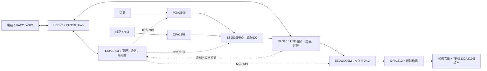

# ASIO-CARD：直播声卡设计入口

更新时间：2026-09-16。当前是**原生原理图草稿与 XMOS 固件原型阶段**，尚无通过完整电气核对、ERC/DRC 和实板验证的声卡工程。用户已确定单 USB-C 供电，采购选型与查价暂停。

这次整理把旧方案、器件核查、真实实现与环境配置分开管理。先看下面三份资料，再进入原来的逐模块草案；旧文档中的价格、性能宣传和“已确认”不能替代数据手册或实测。

| 要了解什么 | 从这里读 |
|---|---|
| 正在绘制的原生工程、实际进度与未完成项 | [Rev A 工程状态](hardware/asio-card-reva/README.md)；12页框架已建，逐页填充，不能据此发板 |
| 精确电压、引脚、时钟及全部datasheet核验 | [38份datasheet核验总表](docs/datasheet-audit/README.md)；XU316核心0.900V，正常范围0.855–0.945V |
| 阻容感怎么选／先画通用符号再补料号 | [小件选型规格](docs/passive-parts-spec.md)与[56条可回填CSV](docs/passives-spec.csv)；MPN/C编号可后补 |
| 整体架构、硬件错误、设计优先级 | [整体设计整理与硬件审阅](docs/design-review-2026-09-05.md) |
| 固件真正完成了什么、检查结果和缺陷 | [固件实现审阅](docs/firmware-review-2026-09-05.md) |
| AI 如何操作立创 EDA、启动和检查环境 | [EasyEDA AI 环境](docs/easyeda-ai-environment.md) |
| 原始模块方案、网络名与画图顺序 | [原理图草案目录](docs/schematic/README.md)、[画图流程](docs/hardware-design-flow.md) |
| 零件候选与原厂证据 | [候选 BOM](docs/BOM.csv)、[数据手册索引](docs/datasheets/README.md) |
| 编译、烧录与 Windows 主机准备 | [固件指南](firmware/README.md)、[主机资料](host/README.md) |

## 产品与架构

目标是带话筒输入、备用线路/乐器输入、直播混音与回环的 USB 声卡。**物理输入为 2 路、DAC 输出为立体声 2 路；6 进 6 出是 USB 逻辑通道规划。线路输出和耳机共享同一对 DAC 信号。**

采样率最高 192 kHz、32 bit USB 格式属于目标/固件配置；端到端延迟、动态范围、耳机功率、多独立 Windows 设备和 ASIO 可用性仍需硬件及驱动验证。

## 先处理的关键事项

1. **重定电源树和逻辑电平。** XU316-QF60A 的 IO 为 1.8V；旧稿 3.3V IO、Flash 和直连接口不能沿用。5V 输入经 LM27762 不能保证受载稳压 ±5V，而话放/耳放有最低供电要求。
2. **按已补齐的 ESS 官方手册重画 ADC/DAC。** ADC 缺 4.5V 模拟参考供电；两颗芯片的 DVDD 是内部 1.2V 域，不能把旧稿的 1.8V/3.3V 外供接上。DAC 是 QFN-32，MCLK 上限 50MHz；192k异步还要求至少约24.96MHz，不能直接改成24.576MHz。
3. **打通跨 tile 控制。** 固件镜像证实两个 tile 拥有各自的全局变量副本，当前 UART 控制和 DSP 并未通过这些变量实现通信。另有 VU 计算、异常串口帧和采样率通知缺陷。
4. **补齐 USB 供电及驱动验证。** 500mA 描述符与约 0.9A 典型预算冲突；原生 UAC2 多通道不等于 Windows 自动出现三对独立设备。

具体证据、影响及处理顺序见两份审阅报告。本轮保留旧设计作为追溯资料；未冻结的电源、引脚和时钟决策不作为自动生成原理图的输入。

## 后续实施顺序

EDA 连通与基本绘图已在[独立测试工程](hardware/ai-smoke/README.md)完成验收，保存重开后的逐脚网表一致，原生DRC保留两条单引脚网告警。接下来冻结电源/电平/芯片引脚表，完成 USB + XU316 最小系统，再逐页加入 ADC、DAC、话放和耳放，最后接入 ESP32 面板控制。每页保存原生工程、导出网表/BOM并核对原厂引脚；整机完成后再做 ERC/DRC 和实板测试。
