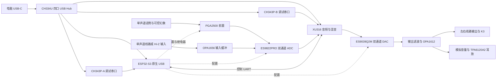

# ASIO-CARD 整体设计整理与硬件复核

> 参数后续更新：2026-09-06已完成[38份datasheet逐文件核验](datasheet-audit/README.md)并回写部分旧模块。本报告的旧稿行号与“尚未回写”状态为2026-09-05快照，最新数值/条件请沿新报告的原厂版本和PDF页码查阅。

> 整理日期：2026-09-05。本文把分散设计收束为一条实施路线，并记录已由原厂手册证实的错误。当前是**系统方案与原理图草稿阶段，尚不具备按现有文档直接投板的条件**。本文不代表已经完成电路重设计、ERC、PCB DRC 或实物验证。
>
> 阅读顺序：先看 §1–3 理解产品，再按 §4 修正工程，最后按 §6 推进。旧稿保留为设计历史；发生冲突时先查本文列出的原厂证据，不能因为旧稿写了“已核对”“必守”“直接照抄”就跳过复核。

固件实现与二进制验证另见[固件审阅](firmware-review-2026-09-05.md)；已配置的专业版插件/MCP及真实绘图验收见[AI环境说明](easyeda-ai-environment.md)。本文件集中说明硬件方案。

## 1. 产品到底要做什么

这是一台面向直播、监听和录音的 USB 声卡。XU316 负责 USB 音频、采样流、混音与回环；ESP32-S3 负责屏幕、旋钮、按键、前置增益、转换器寄存器与继电器。模拟输入只有两路：一路话筒，一路线路/乐器；模拟输出由一颗双通道 DAC 产生，再分别送线路输出和耳机放大。



依据：`docs/schematic/README.md:11`、`:78`；`docs/schematic/04-dac-outputs.md:11`；`docs/schematic/07-usb-c.md:13`。

### 1.1 物理通道与 USB 通道必须分开说

| 维度 | 当前方案 | 对用户的实际含义 |
|---|---|---|
| 物理模拟输入 | 2 个单声道 ADC 通道 | Mic 1 路，Line/Hi-Z 1 路；不是 6 个模拟输入 |
| 物理 D/A 转换 | 2 个 DAC 通道 | 一组立体声内容送往线路输出和耳机放大 |
| 线路与耳机 | 线路左右 + 耳机左右 | 目前共用 DAC 内容；耳机可有独立模拟音量，但没有独立的另一组 DAC 混音输出 |
| USB 播放 | 6 通道，即 3 组立体声源 | Main、Backing、Game，送入设备内部混音 |
| USB 录音 | 6 通道 | Mic、Line 两个干声 + Stream Mix 立体声 + Host Loopback 立体声 |
| Windows 设备拆分 | 目标是 3 个播放端点、3 个录音端点 | 取决于驱动、描述符和宿主适配；不能仅凭“6 进 6 出”断言会自动出现 |
| 采样规格 | 目标最高 192kHz、32-bit USB 容器 | 32 位传输不等于 32 位模拟有效精度；目标仍须以固件运行与整机测量证明 |

来源：`docs/schematic/README.md:80`、`:84`、`:92`；`docs/schematic/04-dac-outputs.md:60`。同一 DAC 的数字音量也会同时影响线路与耳机；现有 RV1 是耳机路径的模拟衰减，不能从两联音频电位器直接推断 MCU 已能读出旋钮位置。

### 1.2 可以保留的总体方向

- XU316 做实时音频，ESP32 做低速控制；两个处理器的职责比较清晰。
- 一个 USB-C 配内部 Hub，同时提供音频、ESP32 维护和双调试串口。
- 四层板、连续地平面、按信号与电源功能分区。
- 先跑通电源、最小主控与双通道音频，再加完整面板和直播路由。
- 原厂芯片指标作为选型参考，整机 EIN、DNR、THD+N、延迟作为样机验收结果。

这些属于设计方向，并不意味着已有器件电源、引脚或外围取值正确。对应决策见 `docs/schematic/README.md:67` 至 `:76`。

## 2. 当前资料怎样使用

| 资料 | 实际用途与可信边界 |
|---|---|
| 本文 | 当前整理入口：确认架构、列明已证实错误和下一步；不替代逐引脚电路设计 |
| 原厂 datasheet 与参考设计 | 电源范围、引脚、封装、接口时序的第一依据，必须匹配精确型号和封装 |
| `docs/schematic/01~07` | 分模块设计意图；存在可导致过压或无法工作的旧接法，不能直接生成生产网表 |
| `docs/hardware-devices-design.md` | 一次器件审查记录，已发现 XU316/PGA2500 等问题，但自身仍残留 ESS 封装、电源、100MHz 时钟等错误 |
| `docs/BOM.csv` | 早期选型与预算草表；不是可直接用于 SMT 的逐位号生产 BOM |
| `docs/hardware-design-flow.md` | 画图流程参考；只有在器件与电源修正后，才适合用它安排图页 |
| `docs/schematic/fig/*.svg` | 解释设计关系的示意图；不是具有元件 UUID、管脚、网络和封装约束的 EDA 工程 |

旧稿同时出现总纲 v1.0、器件汇总 v1.0 和 USB 模块 v2，没有统一的硬件发布基线。USB Hub 已进入器件汇总和 USB 页，但总纲顶部框图仍直接从 USB 连 XU316；这属于文档更新不同步，不应理解为两套同时有效的硬件方案。证据：`docs/schematic/README.md:5`、`:11`、`:76`；`docs/hardware-devices-design.md:5`、`:18`；`docs/schematic/07-usb-c.md:3`。

## 3. 电源与接口需要建立的新基线

下面只列**已经核实的负载要求**，不提前冻结新的稳压器或把候选取值冒充已完成设计。

| 负载 | 已核实要求 | 对现有方案的影响 |
|---|---|---|
| XU316-QF60A 核与 PLL | 标称 0.9V | 保留 V0V9 方向，落实启动、复位与精度 |
| XU316-QF60A 全部 GPIO 域、OTP | 1.8V | VDDIOL/R/T/B18 都应是 V1V8；USB PHY 的 3.3V 不能类推为 GPIO 电压 |
| XU316 Flash | 与 1.8V QSPI 兼容 | 原 W25Q16JV 必须重选；还需核对启动就绪时间、QE 和烧录支持 |
| ES9822PRO | AVDD=3.3V；AVCC、AVCC_L/R=4.5V；DVDD 为内部 1.2V | 新增/设计合规 4.5V 参考供电；DVDD 不能接 V1V8 或 V3V3D |
| ES9039Q2M | AVDD、VCCA、AVCC_DAC1/2 约 3.3V；DVDD 为内部 1.2V | 按实际管脚重画，内部核心节点不能外灌 3.3V |
| 两颗 ESS 的数字 IO | 随 AVDD=3.3V，VIH 最小为 AVDD/2+0.4V | 3.3V 时门槛约 2.05V，XU316 的 1.8V 输出不保证识别；须设计有方向的电平转换 |
| PGA2500 | VA+、VA−、VD− 要求约 ±5V；无 VD+ | 负数字电源和直流伺服必须落实；SDO 返回 MCU 也需核对 5V→3.3V 电平 |
| TPA6120A2 | 推荐分裂供电最低 ±5V | 从受损耗的 USB 5V 直接经 LM27762 得到稳压 ±5V，缺乏余量 |

原厂证据：本地 `XU316-1024-QF60A.pdf` PDF 第 9 页；`ES9822PRO_ESS.pdf` 第 9、52、58 页；`ES9039Q2M_ESS.pdf` 第 11、50、51 页；`PGA2500.pdf` 第 3、11 页；`TPA6120A2.pdf` 第 4 页。

## 4. 已证实的冲突与投板阻断项

**P0 表示在相关模块按生产用途画图/投板前必须解决。** 可以先生成带明确待定标记的工程骨架；不能用这些未关闭的连接直接出制造文件。下表引用历史草案，是在指认已否定或未闭合的内容，不是在推荐这些接法。Markdown 行号已计入本轮新增的两行审阅提示；BOM 保持行号，若对应行已改为待核标记，应以更正后记录为准。

| 编号 | 优先级与结论 | 旧稿证据 | 原厂/电路依据与必须完成的修正 |
|---|---|---|---|
| H01 | P0：XU316 的 3.3V GPIO、复位和 Flash 接法不兼容 | `docs/schematic/02-xu316-core.md:34`、`:55`、`:69`；`docs/BOM.csv:22` | XU316 PDF 第 9 页：QF60A 全部 IO 域仅 1.8V。旧器件汇总 §5.1 的修正方向正确，但审阅时尚未形成一致工程。统一 1.8V、重选 Flash、完成 UART/I2S 电平转换与复位设计 |
| H02 | P0：ES9822PRO DVDD 外供 1.8V/3.3V 会超过其 1.4V 绝对最大值；缺 4.5V 轨 | `docs/schematic/03-adc-frontend.md:78`；`docs/hardware-devices-design.md:326` | 新收录 ADC PDF 第 9、52、58 页：DVDD 内部 1.2V；AVDD=3.3V；AVCC/AVCC_L/R=4.5V。重画 ADC 全部电源、去耦及电源树，不能继续保留“待定 1.8/3.3V” |
| H03 | P0：ES9039Q2M 封装和核心供电均写错 | `docs/schematic/04-dac-outputs.md:20`、`:33`；`docs/BOM.csv:44`；`docs/hardware-devices-design.md:336` | DAC PDF 第 10–12、50–51 页：32-QFN，EPAD 为 pin33；DVDD(pin9) 内部 1.2V，绝对最大 1.4V；AVDD(pin10) 才是 3.3V 调节器供电。不要照 ES9038 的 DVCC 命名平移 |
| H04 | P0：ES9039Q2M 的 100MHz 主时钟超规格 | `docs/schematic/README.md:73`；`docs/schematic/04-dac-outputs.md:34`；`docs/BOM.csv:47` | DAC PDF 第 54 页 Max MCLK=50MHz。重定不超过上限的振荡器及 ASRC/时钟配置表；“100MHz 任意采样率都锁得住”不能保留为工程结论 |
| H05 | P0：ADC 输入共模不匹配 | `docs/schematic/03-adc-frontend.md:54`、`:56`、`:72` | ADC PDF 第 61 页要求输入 DC 共模为 AVCC_L/R÷2，典型 2.25V；PGA/OPA 输出目前以 0V 为中心并直连。参照 ADC 第 129–130 页及 PGA 第 11–13 页，选择交流耦合与偏置或合规共模驱动，重算满幅、负载与抗混叠网络 |
| H06 | P0：模拟电源缺稳压余量，不只是峰值电流问题 | `docs/schematic/01-power.md:70`；`docs/hardware-devices-design.md:124`；`docs/schematic/04-dac-outputs.md:62` | LM27762 正路是 LDO，负路是反相电荷泵+LDO；需考虑输入保护压降、泵内阻与 dropout。PGA 需至少约 ±4.75V，TPA 推荐最低 ±5V。选定真实输入范围后重构模拟供电并作轻载/峰值/热态预算，不能仅添加反馈电阻就宣布完成 |
| H07 | P0：USB 取电策略与功耗不闭合 | `docs/schematic/01-power.md:116`、`:118`；`docs/schematic/07-usb-c.md:28`、`:64` | 旧预算典型 910mA、峰值 1560mA，却用 1A 限流，并称声明 500mA 即合规。CC 的 Rd 只表明连接角色，不代表已确认 1.5A/3A。需明确 USB-C 电流公告检测/协商、功率限制或外部电源路线，按实际电源路径重算；不能假设插 USB3 口就自然获得足够电流 |
| H08 | P0：PGA2500 电源和数字返回口遗漏 | `docs/schematic/03-adc-frontend.md:54`、`:55`；`docs/hardware-devices-design.md:279`、`:287` | PGA PDF 第 3、11 页：VD− 接负电源；CS1/CS2 伺服与 DCEN 需落实。其 SDO 的 VOH 规格基于 VA+，5V 供电时可高于 ESP32 3.3V 容限；至少为 SDO 加正确接收电平方案。不能把“ESP32→PGA 输入可识别 3.3V”类推为双向全直连 |
| H09 | P0：Hi-Z/线路输入阻抗与偏置拓扑不完整 | `docs/schematic/03-adc-frontend.md:62`、`:68`、`:69`、`:72` | 1MΩ 或 10kΩ 串在 JFET 跟随器输入前，并不自动形成同数值的对地输入阻抗；输入开路时也没有明确 DC 回路。需要正确的对地偏置/负载网络、两刀继电器连接和未用运放处理，明确滤波位置。旧稿“JFET 输入自动 0V 偏置”错误 |
| H10 | P0：时序文本没有落实为可工作的复位与静音电路 | `docs/schematic/04-dac-outputs.md:71`；`docs/schematic/06-system.md:38`；`docs/schematic/07-usb-c.md:38` | DAC PDF 第 51 页给出 AVDD→VCCA(约200µs)→AVCC→CHIP_EN；ADC PDF 第 59 页要求供电/时钟稳定后使能。旧稿一处在复位保持期间写 I2C、另一处先释放复位；须统一。V5D 在外部 DC 供电时保持为高，不能代表 USB 主机 VBUS。按真实 VUSB 检测并实现掉电动作 |

### 4.1 不应遗漏的下一层修正

| 项目 | 已知问题/待完成工作 | 证据 |
|---|---|---|
| 话筒幻象保护 | BAV99 不能直接替代原厂推荐的浪涌功率钳位；6.81k 电阻约 0.34W 是 48V 对地短路工况，旧稿称“正常功耗”不准确。确定长期短路的功率额定、降额、耦合电容和功率钳位 | `docs/hardware-design-flow.md:21`；`docs/hardware-devices-design.md:283`、`:294`；PGA PDF 第 12 页 |
| 幻象升压 | 5V→48V 理想占空比约 89.6%，已逼近旧手册所列最大占空比；还要考虑最低 V5D、损耗、启动和电感饱和。不能仅凭公式算出 48.2V 就认定整个输入范围可用 | `docs/schematic/01-power.md:83`；`docs/hardware-devices-design.md:149` |
| AP7361C 前级 | 3.6→3.3V 只有 0.3V 裕量，应按负载、温度、输入容差和最大 dropout 决定前级电压，不应把典型压差当保证值 | `docs/hardware-devices-design.md:111`；`docs/datasheets/AP7361C.pdf` |
| 输出级 | 原 ASCII 差分放大器图不能当网表照抄；要按 DAC 实际 390Ω 输出阻抗、共模及官方输出电路重算增益/滤波。参考图是否采用同样电路要明确记录 | `docs/schematic/04-dac-outputs.md:46`；DAC PDF 第 54、98–99 页 |
| 耳机防爆音 | K3 只串在线路路径，耳机从 K3 前分支；常开线路继电器并不能兜底耳机上掉电瞬态。为耳机明确硬件静音/保护与实测条件 | `docs/schematic/04-dac-outputs.md:11`、`:12`、`:60`、`:75` |
| xSYS2 与调试 | 审阅前 BOM 为 2×3，主控文档为 1.27mm 2×5/2×10。普通 CH343P UART 日志与 XTAG/xLINK 的现代 xSCOPE 必须分别定义 | `docs/BOM.csv:32`；`docs/schematic/02-xu316-core.md:13`、`:33`；`docs/schematic/07-usb-c.md:73` |
| 被动件与启动 | LM27762 缺/误写飞跨电容、CCP、反馈电阻、NR；TPS7A20 没有 NR/SS；GM1205 的 PGFB、EN、ILIM 需正确落实；这些旧审查已发现但未进入一致工程 | `docs/hardware-devices-design.md:126`、`:137`、`:138`、`:463` |
| USB 入口电容 | USB 页要求入口≤4.7µF，器件汇总又要求 SY6280 输入增加10µF；总线上多个 Buck/Boost 输入电容与限流软启动也要一起核算，不能逐条机械叠加 | `docs/schematic/07-usb-c.md:35`；`docs/hardware-devices-design.md:91` |
| 物料规范 | 审阅前 U14 数量2却只给一个位号；有“1套/若干/淘宝/立创搜”等采购描述，缺位号、精确封装、料号与装配选项。K4 第二路幻象不等于已具备第二路话筒前置 | `docs/BOM.csv:19`、`:35`、`:37`、`:41`；`docs/schematic/03-adc-frontend.md:25` |

## 5. 需要验证的内容，不能提前写成保证

1. **USB/Windows 行为**：ASIO 驱动适配、WDM 端点拆分、实际通道名、192kHz 全双工与回环路由；这些不能由模拟框图证明。
2. **实时音频能力**：最终 pin/port/tile 分配、MCLK 回送、I2S 电平转换传播延迟、混音负载、USB 反馈和稳定连续运行。不能按“约 32 个 IO”做最终预算，应有逐 pin/port 的唯一映射表。
3. **性能指标**：ADC 原厂双通道 DNR 125dB、DAC 130dB 是指定条件下的器件指标，不等于整机保证；以约定频宽、加权方式、采样率、输出电平、负载分别验收。旧稿 123dB/125dB 可以保留为历史预算，不能视为实测。
4. **输入动态范围**：旧预算假设 ADC 满幅 +8dBu；现手册给 3.2Vrms，约 +12.3dBu。输入驱动、共模、电阻衰减与前置摆幅未定，整机增益/过载预算须重算。
5. **USB Hub 与 UART 桥**：补齐 CH334U/CH343P 原厂完整手册，核对封装、供电、时钟、Hub 模式与操作系统驱动；“全免驱”“零影响”应转换为明确验证项目。
6. **布局与整机**：电源纹波串扰、地环、EMI、ESD、48V 插拔、耳机插拔和断电瞬态，都需要实物。连续地平面是合理起点，不是噪声达标的充分条件。

对应旧稿：`docs/schematic/README.md:74`、`:106`；`docs/schematic/02-xu316-core.md:36`；`docs/schematic/03-adc-frontend.md:104`；`docs/schematic/07-usb-c.md:20`、`:76`。器件性能原文：ADC PDF 第 61 页、DAC PDF 第 54 页。

## 6. 收束后的实施路径

| 阶段 | 具体交付物 | 完成判据 |
|---|---|---|
| A：冻结系统约束 | 物理与 USB 通道表；真实输入供电范围；耳机目标负载/电平；需保留的接口；本表 H01–H10 的解决记录 | 不存在凭同系列推测的核心供电、封装或时钟；确定预算适用边界 |
| B：建立可信元件库 | XU316、ES9822、ES9039、PGA2500、电源关键件逐引脚表；符号/封装/EPAD/立创料号映射 | 每个引脚与同型号原厂手册逐项对应；重复位号与未知封装为零 |
| C：生成专业版工程骨架 | 封面/电源/主控USB/ADC前端/DAC输出/控制 六个功能部分；页间端口和网名；待定项显式标记 | EDA 中真实元件、管脚与网络可读可编辑；不是只有 SVG 图片 |
| D：完成首版原理图 | 先冻结电源与数字接口，再闭合 ADC 共模、输出级与静音；统一硬件/固件引脚表、时序表和 BOM | H01–H10 全部关闭；ERC 问题逐项处理，生成逐位号 BOM 与网络检查记录 |
| E：最小样机与电源验证 | 先电源负载测试，再 USB Hub/XU316 最小系统，再 ADC/DAC 双通道基本采放，最后模拟前端与面板 | 每个阶段有供电、波形、枚举或采放证据；时钟/电平不合规时不继续装后级 |
| F：完整功能与制造准备 | 混音/回环/UI、驱动适配、性能测试、PCB/结构、装配数据 | 约定验收通过后再生成 Gerber、坐标、生产 BOM 和下单包 |

不建议这一轮同时引入备用主控、THAT 前置升级、第二路幻象、数字隔离、平衡输出等分支。先把已经选定的两进两出模拟架构做成可工作的首版，备选器件放入独立备选清单，避免进入同一份生产 BOM。

原 11 页划分可以在工程变密后再拆；页数本身不是完成度。原最小系统调试步骤只写焊 XU316+Flash+USB 口，已经落后于内部 Hub 架构：若音频 USB 经 Hub，最小可枚举装配必须包含 Hub 及其时钟/电源，或有明确的直连旁路。证据：`docs/hardware-design-flow.md:57`；`docs/schematic/06-system.md:63`；`docs/schematic/07-usb-c.md:13`。

## 7. 本次新增原厂资料与证据完整性

已从 ESS 当前官网产品页的真实下载链接取得以下完整 PDF，并使用 PDF 解析器确认文件头、标题和页数。页码指 PDF 第几页，也是这两份文件的印刷页码。未将搜索摘要或 404 页面保存成 datasheet。

| 本地文件 | 原厂版本与页数 | 原始来源 |
|---|---|---|
| [ES9039Q2M_ESS.pdf](datasheets/ES9039Q2M_ESS.pdf) | v0.2.3，109 页，3,318,918 bytes | [ESS 官方 PDF](https://www.esstech.com/wp-content/uploads/2026/05/ES9039Q2M_Datasheet_v0.2.3.pdf) |
| [ES9822PRO_ESS.pdf](datasheets/ES9822PRO_ESS.pdf) | v0.5.2，144 页，2,907,461 bytes | [ESS 官方 PDF](https://www.esstech.com/wp-content/uploads/2025/04/ES9822PRO_DS_v0.5.2.pdf) |

SHA-256：

```text
ES9039Q2M_ESS.pdf  98352e53b5fc19b849c44e841f0624e888e207dc017a1274487bc213227b088a
ES9822PRO_ESS.pdf  dd7b92be2634186ec3839bbf9c7208be919ddd800ebfd75797c1c0a3db282a39
```

其他关键官方来源：

- [TI LM27762 datasheet](https://www.ti.com/lit/ds/symlink/lm27762.pdf) 与 [TI 关于 ±5V 输入余量的说明](https://e2e.ti.com/support/power-management-group/power-management/f/power-management-forum/659023/lm27762-lm27762)：正 LDO dropout 与负电荷泵内阻都应计入余量。
- [USB-IF 电源合规说明](https://compliance.usb.org/index.asp?Format=Standard&UpdateFile=Policies) 与 [USB Type-C R2.4 规范，TI 官方托管](https://e2e.ti.com/cfs-file/__key/communityserver-discussions-components-files/196/USB-Type_2D00_C-Spec-R2.4-_2D00_-October-2024.pdf)：标准 USB 2.0 取电上限及 Type-C 更高电流公告/监测要求。
- [XMOS XTC 15.3 xSCOPE 文档](https://www.xmos.com/documentation/XM-014363-PC/html/tools-guide/tools-ref/xscope/index.html)：现代 xSCOPE 通过 xLINK 传输，应与单独 UART 日志口区分。

本复核子任务新增这份整理稿与两份 ESS 手册。旧文档入口及 BOM 勘误由主整理任务同步维护；这不等于已完成原理图重设计。本次未执行实际焊接、实测或制造。
