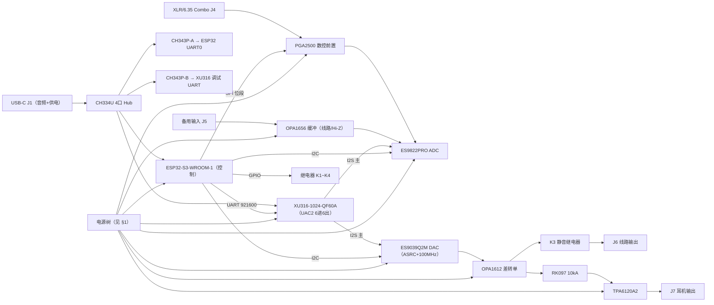
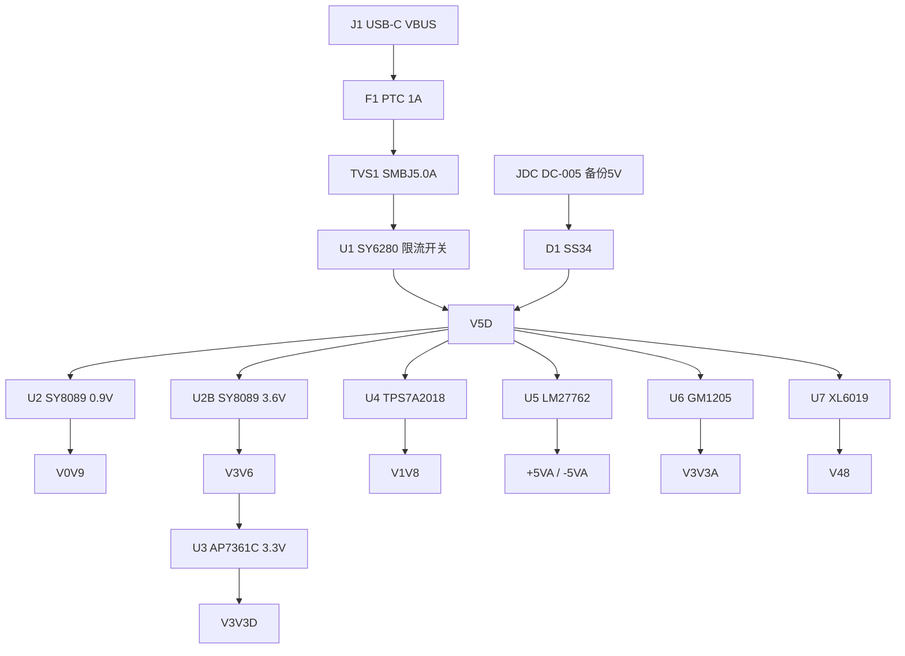

# ASIO-CARD 全机器件与外围电路设计汇总

> **历史核查记录，已由2026-09-06的[38份datasheet核验](datasheet-audit/README.md)取代参数权威地位。** 下文仍保留已否定的供电、时钟、引脚和指标推断，仅供追溯；不得直接用作生成原理图的输入。已核参数见新报告，架构历史见[整体设计整理](design-review-2026-09-05.md)。

> 版本 v1.0 · 依据：`docs/datasheets/` 全部 35 份 datasheet（PDF 已提取文本）、分模块设计文档 `docs/schematic/01~07`、`docs/BOM.csv`、`docs/hardware-design-flow.md`、`firmware/DESIGN.md`。
> 本文是"器件手册推荐电路 ↔ 本设计实际外围"的对照汇总，供画图（建 symbol、画外围、核对清单）与打样验证使用。所有引脚号以 datasheet 最终核对为准。

## 阅读方法

- 每个器件一节，固定四段：**定位**（型号/位号/用途/封装）→ **datasheet 推荐电路**（典型应用图与取值，标注出处）→ **本设计采用**（实际外围）→ **对照检查**（✓ 一致 / ⚠ 差异或风险 / ⏳ 待核对）。
- 缺失 datasheet 的器件（ES9822PRO / ES9039Q2M / NZ2520SD / HFD4 / ST7789 / CH334U / CH343P）在正文 §5~§10 各节中标注 ⏳，汇总见 §12.2；其中 ES9822/ES9039 的待核对点最影响画图，见 §8.1/§8.2。
- 电源网名约定：`VUSB`(5V 原始) → `V5D`(保护后主轨) → `V3V6`(3.6V 中间轨) → `V3V3D`(3.3V 数字)；`V0V9`(0.9V 核)、`V1V8`(1.8V)、`+5VA/−5VA`(±5V 模拟)、`V3V3A`(3.3V 超低噪模拟)、`V48`(48V 幻象，经 K1 后为 `PH48`)；`AGND=GND` 单平面；`CHASSIS` 机壳网。

## 0. 系统总览

**关键指标目标**：ADC 通道 123dB DNR（ES9822PRO）；DAC 约 125dB（ES9039Q2M）；话放 EIN 约 -126dBu；整机 12ch × 192kHz × 32bit（USB2.0 HS 的 ~15% 带宽）；典型功耗 0.9A@5V、峰值 1.5A@5V。

## 1. 电源树总览（器件细节见 §2~§4）

| 轨 | 器件 | 电压 | 负载 |
|---|---|---|---|
| V5D | SY6280（输入保护后主轨） | 5V | 全部电源芯片、继电器线圈（PGA2500 的数字电源 VD− 走 −5VA，见 §7.1） |
| V0V9 | SY8089（U2） | 0.9V | XU316 VDD 核、PLL_AVDD（磁珠+2.2µF+0.1µF） |
| V3V6→V3V3D | SY8089（U2B）+ AP7361C（U3） | 3.6V→3.3V | ESP32、ES9039 DVDD（待核，见 §8.2）、CH334U/CH343P、屏幕、ESP32 侧所有 3.3V 逻辑 |
| V1V8 | TPS7A2018（U4，必贴） | 1.8V | **XU316 全部 IO 域（VDDIOL/R/T/B18）+ OTP_VCC、USB_VDD18、1.8V QSPI Flash**、ES9822 DVDD（待核） |
| ±5VA | LM27762（U5） | ±5V | PGA2500 VA±、OPA1656/OPA1612、TPA6120A2 |
| V3V3A | GM1205（U6，LT3045 备选） | 3.3V | ES9822 AVDD、ES9039 AVCC_L/R+VCCA、Y20 100M 晶振 |
| V48 | XL6019（U7） | ~48.2V | K1 → PH48 → 6.81k×2 幻象馈电 |

上电/断电时序（完整版见 §11.2）：
`V5D → (V3V3D, V1V8 最早组) → (V0V9, ±5VA, V3V3A) → XU316/ESP32 启动 → V3V3A PG=OK 后使能 XL6019（缓启）→ 100ms → 可闭 K1 → ES9822/ES9039 RST 释放 → I2C 初始化 → DAC 音量 -60dB → 500ms → 闭 K3 → ramp 默认音量`；
断电：`VBUS 掉电检测 → 开 K3 → ramp -60dB → 开 K1 → 关 XL6019`。

---

## 2. 输入保护与主轨 V5D（J1 / JDC / F1 / TVS1 / D1 / U1 SY6280）

### 2.1 输入链（USB-C VBUS → V5D）

**链路**：`J1.VBUS(A4/A9/B4/B9) → F1(1812 自恢复 1A) → TVS1(SMBJ5.0A 单向) → U1(SY6280) IN → V5D`；`JDC(DC-005) → D1(SS34) → V5D` 双输入 OR-ing（电压高者供电）。顺序有讲究：**PTC 必须最靠连接器、在 TVS 之前**（持续过压时 PTC 限流保护 TVS——TVS 只扛脉冲）。

| 器件 | 规格 | 本设计取值/接法 | 对照 |
|---|---|---|---|
| F1 自恢复保险丝 | 1812，Ihold=1A / Itrip=2A | 与 U1 串联双保险；Ihold 须高于典型 0.9A，远离热源（60°C 降额） | ✓ 符合功率预算（典型 0.91A/峰值 1.56A） |
| TVS1 SMBJ5.0A | 单向 TVS，5V 档 | VBUS 入口、PTC 之后 eFuse 之前，就近 J1 | ✓ USB-C 热插拔浪涌钳位 |
| D1/D1B SS34 | 肖特基 3A/40V | JDC 输入 OR-ing | ✓ |
| C_VBUS | 入口电容 | **≤4.7µF（1µF+0.1µF），22µF 放 eFuse 之后** | ✓ USB 浪涌电流限制要求 |
| V5D 储能 | MLCC | 2×22µF/10V X5R 1206 + 0.1µF×4 | ✓ 偏置衰减超配；不用钽（热插拔浪涌 + MnO2 起火模式） |

### 2.2 U1 SY6280AAC（限流开关，SOT23-5）

- **定位**：U1 / VUSB→V5D 的限流开关 / SOT23-5。
- **datasheet 推荐电路**（Silergy AN_SY6280）：引脚 1=OUT、2=GND、3=ISET、4=EN、5=IN；**Ilim(A)=6800/Rset(Ω)**，Rset 从 ISET 到 GND；EN 高有效、**不得悬空**；2.4~5.5V；关断自动放电 OUT、反向阻断、过温关断自动重试；Rds(on) 超低。
- **本设计采用**：IN←F1/TVS1；OUT→V5D；EN 经 100k 上拉 VBUS（常开，高>2V 有效）；OUT 侧 2×22µF/10V 在 eFuse 之后。
- **对照检查**：
  - ⚠ **必补 Rset**：datasheet Ilim(A)=6800/Rset(Ω)，1A 限流取 **Rset=6.8kΩ(1%)**（设计文档未给出，画图必补）；
  - ⚠ **必补输入电容**：datasheet 要求 U1 IN 就近 ≥10µF 陶瓷抑制热插拔输入振铃（IN 瞬态 >6V 会超绝对最大值）——设计只写了输出侧电容，需在 F1 后、U1 IN 前加 10µF；
  - ⚠ 1A 限流 vs 峰值预算：全开峰值 1.56A@5V 会触发限流。缓解：USB 描述符 500mA、固件限耳机最大音量、JDC 备份 5V；若实测频繁限流可 Rset=4.7k→1.45A（与 F1 Itrip 配合核算）；
  - ✓ 反向阻断与 D1 SS34 的 OR-ing 逻辑一致；关断自动放电 V5D。

## 3. 直流降压与 LDO（U2/U2B SY8089、U3 AP7361C、U4 TPS7A20、U5 LM27762、U6 GM1205/LT3045、U7 XL6019）

### 3.1 U2 / U2B SY8089AAAC（2A Buck，SOT23-5）

- **定位**：U2→V0V9（0.9V 核）；U2B→V3V6（3.6V 中间轨）。
- **datasheet 推荐电路**：`VOUT=0.6×(1+R1/R2)`（R1=上分压，FB 接分压中点）；1MHz 开关频率；2A 连续/3A 峰值；输入 2.5~5.5V；EN 高有效；输出电容 ≥22µF 级；低纹波小外挂电感。
- **本设计采用**：
  - U2：R1=100k、R2=200k → 0.9V ✓；L=2.2µH/3A（SWPA4030）；CIN=10µF，COUT=22µF+0.1µF。
  - U2B：R1=150k、R2=30k → 3.6V ✓；L=2.2µH/3A；CIN=10µF，COUT=22µF+0.1µF；EN→VIN。
- **对照检查**：✓ 分压计算与 datasheet 公式一致（0.9V/3.6V）；✓ 1MHz/2A 能力匹配；⚠ **COUT 标耐压**：datasheet 要求有效值 >22µF，22µF 需选 10V 耐压（6.3V 偏置后不足）；⚠ **U2(V0V9) 的 EN 未定义**——若 EN→VIN 则 V0V9 随 V5D 立即建立，与上电时序（V1V8/V3V3D 最早）冲突，建议 EN 接 V5D 并按时序控制（或经 PG 级联）；⚠ V0V9 核压精度按 XU316 要求（0.855~0.945V）→ 反馈电阻 1%；⚠ SW 节点环路面积最小、FB 走线远离 LX、远离模拟区（见 §11）。

### 3.2 U3 AP7361C-33（3.3V/1A LDO，SOT-223）——两级降压的第二级

- **定位**：U3 / V3V6→V3V3D / SOT-223。
- **datasheet 推荐电路**：输入 2.2~6V；**输出电容 ≥2.2µF（MLCC/电解/钽均可稳定）**；1A、压差 360mV。
- **本设计采用**：CIN=1µF，COUT=4.7µF/10V+0.1µF（2.2µF/6.3V 在 3.3V 偏置下仅剩 ~1.3µF 不达标 → 超配）；无 EN 上电即开；功耗 0.3V×0.6A≈0.18W。
- **对照检查**：✓ 满足最小 COUT（偏置修正后）；✓ LDO 功耗低无散热焦虑；✓ 两级降压使 1.2MHz 开关纹波被 PSRR 再压 20~30dB；⚠ **压差裕量**：datasheet 3.3V/1A 时 dropout 典型 340mV > 设计压差 0.3V——1A 满载不保证稳压；本机峰值 600mA 可用，但必须保证 U2B 带载时 V3V6 不跌落（必要时 U2B 输出调 3.7~3.8V）。

### 3.3 U4 TPS7A2018（1.8V 低噪 LDO，**必贴**）

- **定位**：U4 / V1V8（XU316 VDDIOB18 + USB_VDD18、ES9822 DVDD）/ 300mA。
- **datasheet 推荐电路**：CIN=1µF、COUT=1µF（EC 表条件值，有效值 0.47~200µF、ESR≤100mΩ）；**无 NR/SS 引脚**（上电延迟只能做在 EN 脚 RC）；EN 高有效（阈值 0.9V/0.3V）；7µV 噪声；限流典型 520mA。
- **本设计采用**：VIN=V5D；CIN=1µF，COUT=2.2µF/10V（1µF 标称偏置后仅 ~0.5µF，故超配到 2.2µF）；**EN 接 V5D（可串 RC）保证 V1V8 随 V5D 最早建立**；负载电流几十 mA（XU316 全 IO 域 + OTP_VCC + 1.8V Flash，见 §5 修订后负载略增，300mA 仍充裕）。
- **对照检查**：✓ 输出电容达标（有效值 0.47~200µF 带内）；✓ EN 接法满足时序要求；⚠ **datasheet 无 NR/SS 引脚**——设计文档"NR/SS 电容按 datasheet"是错误项，应删除；若需上电延迟只能做在 EN 脚 RC（注意 EN 高阈值 0.9V）；⚠ 固定 1.8V 尾缀未写全（如 TPS7A2018PDQNR/DQNR，下单时按封装选）；✓ 国产替 SGM2036-1.8 亦可（须按典型图补 CBP=0.01µF、EN→IN）。

### 3.4 U5 LM27762DSSR（±5V 低噪电荷泵+双 LDO，WSON-12）

- **定位**：U5 / +5VA、−5VA / 12 脚 WSON 带散热焊盘。
- **datasheet 推荐电路**（TI ZHCSFJ0C）：**可调输出 ±1.5~±5V**：正路 VOUT+=1.2×(R1+R2)/R2、负路 VOUT−=−1.22×(R3+R4)/R4，**R2/R4≥50kΩ**；外部电容 5 只——CIN（典型 4.7µF）、**飞跨 C1=0.47~1µF/10V 低 ESR（禁极化）**、**电荷泵输出 CCP=4.7µF 低 ESR（最小 2µF）**、COUT±≥2.2µF 陶瓷即稳定；电荷泵 2MHz 低噪；EN+（正 LDO）/EN−（电荷泵+负 LDO）分别高有效（>1.2V）；**PGOOD 开漏：不用时接地**；VIN 2.7~5.5V；工作输出 0~250mA/路；OUT 对 GND 短路 1s 不损坏；Layout 全部电容顶层紧贴器件、GND 汇到散热焊盘。
- **本设计采用（修正后）**：CIN=10µF（贴 VIN）；C1=1µF/16V X5R（飞跨）；**CCP=4.7µF/10V（设计文档漏列，必补）**；COUT±=4.7µF/10V；**FB 分压必补：+5V 取 R2=50k、R1≈158k；−5V 取 R4=50k、R3≈155k（1% 电阻，R2/R4≥50k）**；EN+/EN− 接 V5D（或按 §11.2 时序控制）；PGOOD 不用→接地；负载=PGA2500/OPA1656/OPA1612/TPA6120A2。
- **对照检查**：
  - ⚠ **"固定 ±5V"与 datasheet 不符**：LM27762 是可调型，必须外接 4 只 FB 电阻，设计文档未给——画图必补（上表取值）；
  - ⚠ **电容网络两处错误**：设计文档写"飞跨 C1/C2×2"且未单列 CCP——实际是飞跨 C1 一只 + CCP 一只；且 **LM27762 无 NR 引脚**，"NR 脚 10nF"为错误项，应删除；
  - ✓ CIN/COUT± 超配并做了偏置修正；⚠ TPA6120A2 大动态峰值电流可触 250mA/路限流（设计文档已列 TPS65130 ±12V 二期方案）；✓ 无国产 pin-to-pin 同类，保持。

### 3.5 U6 GM1205（V3V3A 超低噪 LDO，DFN-10；LT3045 为 pin-to-pin 备选）

- **定位**：U6 / V3V3A（ES9822 AVDD、ES9039 AVCC/VCCA、Y20 晶振——全机指标地板）/ DFN-10。
- **datasheet 推荐电路**（共模 GM1205）：1.8µVRMS 噪声、PSRR 120dB@100Hz；**SET 脚 100µA±1% 电流源，单电阻设输出电压**（VOUT=100µA×RSET）；SET 对地 CSET 电容改善噪声/PSRR；500mA；输入 20V 级；可并联降噪。
- **本设计采用**：VIN=V5D（压差 1.7V 充足）；**RSET=33kΩ(1%) → 3.30V**（datasheet 表推荐 33.2kΩ，33k 在 ±1% SET 容差内可用，建议按表用 33.2kΩ）、CSET=4.7µF；CIN=10µF，COUT=22µF/10V+1µF（最低 10µF 偏置修正；须 ESR<50mΩ、ESL<2nH 低阻 MLCC）；PG 开漏→ESP32 上电监测；每个负载脚串 BLM18 磁珠+10µF+0.1µF。
- **对照检查**：
  - ✓ RSET 公式与 SET=100µA 成立（33k→3.30V）；✓ 与 LT3045 pin-to-pin、SET 同构（LT3045 发烧备选可直接替换，但其 ILIM 标度不同——见下）；
  - ⚠ **ILIM 计算修正**：GM1205 标度 **278mA·kΩ/RILIM**——600Ω 只得 ≈463mA；要 500mA 应取 **RILIM≈556Ω**（选 560Ω 标称）。**LT3045 标度是 150mA·kΩ/RILIM——500mA 需 300Ω**，换片时 ILIM 电阻必须同时换；
  - ⚠ **PG/PGFB 不完整**：PG 开漏必须配 OUT-PGFB-GND 分压（阈值=0.295×(1+RPG2/RPG1)，RPG1<30k）才有意义，且 **PGFB 接法同时决定快速启动**（CSET=4.7µF 时：接快速启动约 7ms 达 90%，不接约 550ms）——设计文档未给，画图必补；
  - ⚠ **EN/UV 不可浮空**：不用时接 VIN（高阈值 1.07V/迟滞 100mV；LT3045 为 1.24V，分压 UVLO 不能沿用）；
  - ✓ COUT 偏置修正到位；⚠ 该轨即 ADC/DAC 底噪地板：布局远离 XL6019/SY8089 开关环路、不穿越开关电源区（§11）。

### 3.6 U7 XL6019E1（48V Boost，TO263-5）

- **定位**：U7 / V48 幻象 / TO263-5。
- **datasheet 推荐电路**：`VOUT=1.25×(1+R2/R1)`（**R2=上分压、R1=下分压**）；典型应用 L=47µH（5A 级电感）、输出 47µF 电解；FB 参考 1.25V；EN 控制；5A 开关。
- **本设计采用**：**R2(上)=124k(1%)、R1(下)=3.3k(1%) → 48.24V**；L=47µH/2A（CD75）；COUT=47µF/63V 电解 + 10µF/63V MLCC；续流 D7=SS110（100V/1A，耐压≥60V）；输出再串 L8 磁珠+10µF/63V（LC 后滤波，纹波目标 <2mV@V48、<1mV 到幻象）；**EN 软启动：EN 经 100k 上拉 V5D、EN 对地 10µF（≈0.5~1s 缓启），ESP32 GPIO 经 10k 接同节点**（高阻=使能，拉低=断电）；V48 后可选 100mA 自恢复保险。
- **对照检查**：
  - ✓ 分压数值正确（48.24V）；⚠ **公式命名注意**：datasheet 的 R1/R2 与设计文档 1.3.7 相反（124k 是上分压）；
  - ⚠ **工作点超出 datasheet 示例**：datasheet 48V 应用输入为 20~40V，**5V→48V 占空比 ≈89.6%，逼近 90% 上限**——必须实测最小关断时间/SW 波形/效率，必要时改两级 boost 或电荷泵方案（预留）；
  - ⚠ **L=47µH/2A 偏弱**：datasheet 全部示例用 47µH/5A；幻象负载小，但启动与瞬态峰值需核算，建议按 47µH/5A（或至少 3A）选型；
  - ⚠ **缺本地输入电容**：datasheet 要求 VIN-GND 并联电解（示例 220µF）抑制输入纹波，设计只有 V5D 总线电容——需在 U7 VIN 就近加大容量电解/MLCC；
  - ⚠ **COUT 偏小**：47µF+10µF 远小于示例 220µF/63V；幻象电流小 + 后级 LC 滤波可弥补，但纹波达标（<2mV）须实测，不达标再加 220µF/63V 或固态聚合物；
  - ⚠ D7=SS110（1A）耐压 100V 够，但反向恢复与峰值电流需实测；示例用 FSV10100；
  - ✓ EN 缓启逻辑可行（EN 高阈值 1.4V/低 0.8V，内置软启动）；✓ 幻象电流由 6.81k×2 天然限流（每路 ≤7mA），短路安全；✓ K1 闭合前先充好 V48（时序 §11.2）。

### 3.7 SGM2036（备选 LDO，SOT-23-5）

- **定位**：备选（原 V3V3D 方案，现为 V1V8 的国产替身之一）。
- **datasheet 要点**：300mA 级低压差 LDO（SGM2036-1.8 固定 1.8V/3.3V 型号），输出电容 1µF 级、40µV 级噪声；SOT-23-5。
- **对照检查**：✓ 作 V1V8 替代（数字/PHY 轨，噪声不敏感）可行；作 V3V3D 已弃用（1A 电流需求下热阻受限 → 现方案两级降压）。

## 4. 电源侧无源外围与规范

- **MLCC 通用规则**（全板执行）：耐压 ≥2× 工作电压；标称容量 ≥2~3× 最小需求（X5R/X7R 直流偏置衰减 40~80%）；1µF 及以上 MLCC 用 0805+（TPA6120 贴身 1µF 例外）；信号路径电容一律 C0G。
- **磁珠**：统一 BLM18 系列（600Ω@100MHz）；模拟轨每个负载引脚一颗；PLL_AVDD（XU316）按 datasheet 用 600Ω@100MHz(DCR<1Ω)+1µF 低通（设计 2.2µF+0.1µF 兼容）。
- **电感**：SY8089 用 SWPA4030 2.2µH/3A 一体成型；XL6019 用 CD75 47µH/2A。
- **电容取值速查**：见 §12 附录表（与 01-power §1.4 一致）。

## 5. 主控与存储（U10 XU316 / U11 Flash / U30 ESP32-S3 / 备选 XU208）

### 5.1 ⚠⚠ 头号结论：XU316-1024-QF60A 的全部通用 IO 域是 1.8V，不是 3.3V

> datasheet 原文（QF60A 信号表页）：**"All IO domains are 1.8V only. Other packages of this product offer programmable voltages for some of the IO domains."**

| 供电脚 | datasheet 要求 | 现有设计文档（02-xu316-core） | 结论 |
|---|---|---|---|
| VDD（核） | 0.855~0.945V（标称 0.9V） | V0V9 | ✓ |
| VDDIOL/VDDIOR/VDDIOT/VDDIOB18（全部 GPIO 域） | **1.62~1.98V（标称 1.8V），绝对最大 1.98V** | 设计写"VDDIO=V3V3D" | ✗ **必须改接 V1V8** |
| OTP_VCC | 1.8V（绝对最大 1.98V） | 未提及 | ✗ 补：接 V1V8 |
| PLL_AVDD | 0.855~0.945V，600Ω@100MHz 磁珠(DCR<1Ω)+1µF 低通 | V0V9 经磁珠+2.2µF+0.1µF | ✓ 兼容（磁珠按 600Ω@100MHz 选型） |
| USB_VDD18 | 1.62~1.98V | V1V8 经磁珠 | ✓ |
| USB_VDD33 | 3.0~3.6V | V3V3D 经磁珠 | ✓（PHY 模拟 3.3V，与 GPIO 域无关） |

**由此带来的连锁修正**（画图前必须全部落实）：

1. **VDDIO 全部四域 ← V1V8**（V3V3D 不再接任何 XU316 数字 IO 脚）；
2. **RST_N 上拉改 10k→V1V8**（RST_N 在 IOB=1.8V 域，上拉到 3.3V 会永久过压）；
3. **QSPI Flash 换 1.8V 器件**（W25Q16JV 是 3V 器件不能直连——见 5.3），Flash VCC←V1V8；
4. **VBUS_SENSE 分压重算**：datasheet 推荐 220k 串联 + 100k/47k 分压（1.8V 域，得约 1.6V）+ 1~10µF；现有 2×100k 得 2.5V 越限。**或直接把该检测交给 ESP32（3.3V，2×100k 正好）——推荐此方案，省 3 个元件；**
5. **对外数字接口电平重审**（见 5.4 电平转换矩阵）；
6. 上电时序表述修正（见 §11.2：datasheet 图 27 的准确规则是"VDDIOL/T/R 必须在出复位前有效"，"VDDIOB18 不得最后上电"只是其近似说法）。

### 5.2 U10 XU316-1024-QF60A-C24（QFN-60）

- **定位**：U10 / USB 音频主控（双 tile×8 核，UAC2 6进6出 192k/32bit）/ QFN-60。
- **datasheet 推荐电路要点**（XMOS XU316-1024-QF60A datasheet）：
  - 供电域如上表；电源必须**单调上升**、VDD 与 VDDIO 建议 50ms 内彼此完成爬升；
  - 复位：内部 POR（VDD 阈值 0.722~0.798V、VDDIOB18 阈值 1.425~1.575V）；RST_N 最小脉冲 5µs；释放后 T(INIT) 295~480µs 开始启动；**多电源域时：要么所有 VDDIO 同一 1.8V 电源（内部 POR 自洽），要么 RST_N 保持低直到 VDDIOL/T/R 有效（且释放沿够快满足 USB 时序）**——本设计 V1V8 单轨供全部 IO 域，满足前一种；复位期间所有 GPIO 内部下拉；
  - 晶振：**24MHz ±500ppm**（USB 只支持 12/24MHz）；datasheet 参考：CL=12pF、Cl1/Cl2=22pF、**Rd=680Ω、Rf=1MΩ**、ESR≤60Ω——现有设计写"18pF 级"且未列 Rd/Rf，**按 datasheet 表改**；
  - 去耦：VDD ≥8 颗 100nF 低感 MLCC、VDDIO 每电源脚一颗 100nF 0402、VDD/VDDIO 各 ≥10µF bulk；中心 GND 焊盘 16 个过孔（4×4）到地平面，每个 VDD paddle 下 4 个 VDD 过孔；器件下方除地过孔外尽量少打孔；
  - Boot：X0D04/05/06 复位后弱下拉采样，000=QSPI；QSPI 固定引脚 X0D01=SS、X0D04=D0、X0D05=D1、X0D06=D2、X0D07=D3、X0D10=SCLK；发 Quad I/O READ 0xEB；**Flash 必须 300µs 内就绪（否则用 RST_N 压住），必须处于 quad 模式（QPI 会启动失败）**；
  - xSYS2（1.27mm、1.8V、仅 XTAG4）：半尺寸 pin1=VDDIOB18(就近去耦)、pin2=TMS、pin3/5/7/9=GND、pin4=TCK、pin6=TDO、pin8=TDI、pin10=RST_N；全尺寸加 pin11=VDDIOR、pin12/14=XL0 in、pin16/18=XL0 out（43Ω 近芯片）、pin13/15/17/19/20=GND/DEBUG_N（**设计文档未提，补齐**）；
  - GPIO：默认驱动 4mA；**同一多 bit 端口不要混用输入输出**；X0D04~07 为输出专用。
- **本设计采用（修正后）**：电源按上表；24MHz 晶振按 datasheet 表（Rd 680Ω/Rf 1MΩ）；QSPI→1.8V Flash；RST_N 10k→V1V8 + 100nF + SW1；VBUS_SENSE 移交 ESP32；xSYS2 半尺寸 2×5；I2S/UART 电平转换见 5.4。
- **对照检查**：见 5.1 修正清单；其余（I2S 主模式、MCLK 反馈双引脚接法 PORT_MCLK_IN/PORT_MCLK_IN_USB、22Ω 串阻、QSPI 串阻）与固件 DESIGN.md 事实 #6/#7 一致，保留。

### 5.3 U11 QSPI Flash（W25Q16JV → **需换 1.8V 器件**）

- **定位**：U11 / XU316 固件存储（16Mbit QSPI）/ SOIC-8。
- **datasheet 推荐电路要点**（W25Q16JV，Winbond）：pin1=/CS、pin2=DO(IO1)、pin3=/WP(IO2)、pin4=GND、pin5=DI(IO0)、pin6=CLK、pin7=/HOLD 或 /RESET(IO3)、pin8=VCC；Quad 指令需 SR2 的 **QE 位=1**（IQ/JQ 尾缀出厂=1）；支持 Fast Read Quad I/O EBh（与 XU316 boot 命令一致）；/CS 上电/掉电应跟踪 VCC（可加上拉）；tPUW=5ms；VCC 2.7~3.6V、VIH≥0.7×VCC。
- **本设计采用（修正后）**：**换 1.8V QSPI Flash**（候选：Winbond W25Q16JW、兆易 GD25LE16 等 1.65~1.95V 器件），VCC←V1V8；CS/CLK/D0~D3 直连 XU316（同域 1.8V，CLK 串 22Ω）；/WP、/HOLD 上拉 10k→V1V8；**xflash 支持列表须实测（xflash --list-devices）**。
- **对照检查**：⚠ 原 BOM W25Q16JVSNIQ 与 1.8V 域不兼容（VIH/VOH 双向都不满足）；⚠ 新器件型号/封装/出厂 QE 位须重新核对；✓ QSPI 引脚定义与 XU316 boot 固定引脚一致。

### 5.4 XU316 对外数字接口电平转换矩阵（1.8V 域设计要点）

| 接口 | XU316 侧（1.8V） | 对端 | 直接相连？ | 处理方案 |
|---|---|---|---|---|
| I2S 出：ADC_MCLK/BCLK/LRCK、DAC_BCLK/LRCK/DIN（6 线） | 1.8V 输出 | ES9822/ES9039 数字脚（3.3V 域，VIH≈0.7×3.3=2.31V） | ✗ 1.8V 达不到 VIH | **方案 A**：74AVC4T245×2（双电源 1.8/3.3V 电平转换，方向固定）；**方案 B**：若 ES9822/ES9039 数字域允许 1.8V 供电（ES9038Q2M 的 DVCC 支持 1.8V；ES9822 DVDD 待查）→ 直连 |
| I2S 入：ADC_DOUT（1 线） | 1.8V 输入（max VDDIO+0.5=2.48V） | ES9822 3.3V 输出 | ✗ 3.3V 过压 | 方案 A：74AVC4T245（方向 B→A）；方案 B：ES9822 数字域 1.8V → 直连 |
| CTRL_TX/RX（UART 2 线） | 1.8V | ESP32 3.3V | ✗ 双向均不满足 | TXS0102（自动双向电平转换，2 位） |
| DEBUG_TX/RX（2 线） | 1.8V | CH343P（3.3V，VIO 以沁恒手册为准） | ✗ | TXS0102（或 CH343P 若支持 1.8V VIO 则直连——需查沁恒手册） |
| QSPI（6 线） | 1.8V | 1.8V Flash | ✓ | 直连（见 5.3） |
| xSYS2 | 1.8V | XTAG4 | ✓ | 直连 |
| RST_N | 1.8V 域 | ESP32 开漏拉低（3.3V 容忍的开漏输出） | ✓（只拉低，不拉高） | ESP32 侧用开漏/OD 模式，上拉在 1.8V 侧 |

**建议**：拿到 ES9822PRO/ES9039Q2M 卖家版 datasheet 后先定其数字域电压；若两者都支持 1.8V 数字域，方案 B 最省料（I2S 直连，仅 UART×2 加 TXS0102）；否则方案 A（2×74AVC4T245 + 2×TXS0102）。PCB 预留转换器焊盘位置。

### 5.5 U30 ESP32-S3-WROOM-1-N8R8

- **定位**：U30 / 管理 MCU（屏幕/旋钮/继电器/I2C/UART 协议）/ 41 脚 SMD 模组，PCB 天线，8MB Flash+8MB PSRAM。
- **datasheet 推荐电路要点**（乐鑫）：VDD33=3.0~3.6V，外部电源 ≥0.5A（Wi-Fi 满功率 TX 可达 355mA）；**EN 不得悬空**，上电须等电源稳定 ≥50µs 再拉高（推荐 EN 上 RC：R=10k、C=1µF）；IO 3.3V 域（VIH≥0.75×3.3V）；GPIO19=D−/GPIO20=D+（native USB Full-Speed）；GPIO43/44=U0TXD/U0RXD；**GPIO0/GPIO46 strapping 决定下载模式（Joint Download Boot 需 GPIO0=0、GPIO46=0）**；GPIO3 无内部上下拉、须外部给定；天线区净空（尺寸以 Hardware Design Guidelines 为准）。
- **本设计采用**：V3V3D 供电（10µF+0.1µF 贴脚）；EN 10k 上拉+1µF 到地+按键 ✓；native USB←CH334U 下游2；UART0←CH343P-A；I2C 2.2k 上拉 V3V3D 挂 ES9822+ES9039；SPI 位段驱动 PGA2500；GPIO→2N7002 驱动继电器。
- **对照检查**：✓ 供电/EN/引脚映射正确；⚠ **补 GPIO0 下载按键/跳线**（否则无法进下载模式刷机）；⚠ **补 GPIO3 上下拉**（无内部拉，须外部定电平）；⚠ Wi-Fi 默认关闭（设计决策 D9，天线区远离模拟区+外壳屏蔽）；⚠ ESP32 3.3V 与 XU316 1.8V 的 UART 加 TXS0102（见 5.4）。

### 5.6 备选主控 XU208-128-QF48（不做首选，记录差异）

- **datasheet 要点**：核 1.0V（0.95~1.05V）、**VDDIO=3.3V**、USB_VDD=1.0V、PLL_AVDD=1.0V（4.7Ω+100nF 滤波）；RST_N 上电后保持低 ≥100ns、VBUS 上电后 10ms 内释放；QSPI 引脚同 XU316；**USB_VBUS 对地 2.2µF、USB_RTUNE 对地 43.2Ω(1%)**；老 xSYS 3.3V JTAG。
- **对照检查**：⚠ 与现有电源树不兼容（需 1.0V 核/USB_VDD 新轨，V1V8 不再需要）；优点是 3.3V IO 与 Flash/ESP32/ESS 全直连、无需电平转换——**若不想做 1.8V 电平转换，换 XU208 是"电源改、接口不改"的另一条路线**；⚠ 性能/固件差异（XU208 非 XU316，sw_usb_audio 固件同一套但 XN/时序不同）。

## 6. USB 链与保护（U40 CH334U / U41-42 CH343P / U12 PRTR5V0U2X / 备选）

### 6.1 U40 CH334U（4 口 USB2.0 HS Hub，QSOP-28）——datasheet 未收录

- **定位**：U40 / 单 USB-C 分 4 口（下游1=XU316、2=ESP32 native USB、3/4=CH343P×2）。
- **本设计采用**：VDD=3.3V←V3V3D（10µF+0.1µF）；12MHz 晶振+负载电容（**按沁恒手册**）；上游 D±←ESD；下游差分 90Ω、XU316 那对最短；下游 VBUS 直连 V5D；PWREN/OVCUR 按手册拉定。⏳ **CH334U datasheet 未在 docs/datasheets/ 收录，画图前从沁恒官网下载核对晶振负载电容与电源脚**。

### 6.2 U41/U42 CH343P（USB 转串口 ×2，免晶振）——datasheet 未收录

- **定位**：U41→ESP32 UART0（GPIO43/44）；U42→XU316 DEBUG_TX/RX（xSCOPE）。VDD=3.3V←V3V3D，各 0.1µF+1µF；UART TTL 3.3V 各串 22Ω。⏳ 需沁恒手册核对：**VIO 是否支持 1.8V**（若支持，XU316 调试串口可免 TXS0102）；免晶振确认；Windows 免驱 CDC。备选 CH342F（双串口单芯片，可省一个下游口）。

### 6.3 U12 PRTR5V0U2X（UMW/友台，USB D± 双通道 ESD，SOT143）

- **定位**：U12 / J1 上游 D± ESD（距 J1 ≤10mm）/ SOT143。
- **datasheet 要点**（UMW 版）：双向 rail-to-rail；**Cj=0.35pF typ（IO-IO）、0.65pF（IO-GND）**；VRWM=5V；VC≈10V@3.5A；IEC 61000-4-2 ±15kV 接触/±20kV 空气；40W（8/20µs）；**该 PDF 引脚图为图像**——按 TI/Nexperia 原版核对：**1=GND、2=IO1、3=IO2、4=VCC**；本 PDF 未给应用电路与去耦值。
- **本设计采用**：D± 各一路；VCC 接 **V3V3D+0.1µF**（信号主人电源域；禁止接 V5D——会把钳位门槛抬到 5.7V 并引入 5V 轨能量）；CC1/CC2 不加 ESD（5.1kΩ 下拉即泄放路径）；VBUS 由 TVS1 单独保护。
- **对照检查**：✓ 结电容 <1pF 对 480Mbps 无影响（设计文档写"~1pF"略保守）；⚠ 引脚定义与 VCC 接法在本 PDF 无文字依据——按原厂图复核（本汇总已按 TI/Nexperia 原版核对为 1=GND/2=IO1/3=IO2/4=VCC，与设计文档一致）；✓ rail-to-rail 逻辑正确（3.3V 信号域）。

### 6.4 TPD4E05U06（TI，弃用备选——对照）

- 4 通道单向 TVS（**无 VCC 脚**、GND 参考），USON-10；线电容 0.5pF；接触 ±12kV/空气 ±15kV；V_IO 0~5.5V；**无需供电与去耦**；Layout：贴连接器、受保护走线远离未保护走线。与 PRTR5V0U2X 是两种架构（单向 GND 钳位 vs 双 rail 钳位），本机不采用。

### 6.5 CA-IS3720（川土微数字隔离器，地环备选——**预留焊盘不贴**）

- **datasheet 要点**：2 通道**正向**隔离器，DC~150Mbps；VDD 2.375~5.5V；两侧各一个 **0.1µF~1µF 旁路**即可工作；传播延迟 8ns typ/脉宽失真 ≤4.5ns；HW 尾缀=5kVrms/8mm 爬电、故障安全输出高；真值表：输入侧掉电→默认输出，输出侧掉电→不确定。
- **对照检查**：⚠ **单片只有 2 路正向、无反向**——完整隔离 I2S（3~4 路正向 + 1 路反向）需 2×CA-IS3720 + 1×CA-IS3721/3722 或换多通道双向器件，通道映射必须先补齐；⚠ **必须两侧地/电源分离才有效**——与本机单地平面策略冲突，预留焊盘若转正需配套局部割地与隔离电源；✓ 150Mbps 对 I2S（BCLK≤24.576MHz）裕量充足；⚠ HW 默认输出高，评估后级静态电平。

### 6.6 USB-C J1 无源外围

- CC1/CC2：各 5.1kΩ 1% 薄膜 0603 到 GND（UFP 声明）；SBU 悬空；屏蔽壳 0Ω→GND（宽连接+多过孔，预留换磁珠位）；CMC（顺络 SDCW2012-2-900TF）默认 0Ω×2、EMI 超标再贴；上游差分 90Ω±10%。

---

## 7. 模拟前端（U13 PGA2500 / U14 OPA1656 / 幻象网络 / 继电器 / THAT 备选）

### 7.1 U13 PGA2500IDBR（数控话筒前置，SSOP-28）

- **定位**：U13 / 0dB 或 10~65dB（1dB 步进）数控前置 / SSOP-28。
- **datasheet 推荐电路要点**（TI SBOS289A，图 6/图 7）：
  - 供电：VA+=+5V、VA−=−5V（±4.75~±5.25V）；**数字电源只有 VD−=−5V（pin14，1~2mA）——本芯片没有 +5V 数字电源脚**；
  - 去耦（图 6）：VA+/VA− 各 **0.1µF X7R + 4.7µF 低 ESR 钽**（就近）；VD− 0.1µF，经 **10Ω 串阻接 VA−**；
  - **DC servo 电容（必接）**：CS1 接 CS11-CS12（pin24/23）、CS2 接 CS21-CS22（pin22/21），推荐 **1µF X7R**（最大 4.7µF）；DCEN（低有效）接 DGND 使能伺服；
  - VCOMIN（pin25，0~+2.5V）：接 AGND 时装 **0Ω 跳线**；接直流共模源时改 0.1µF X7R；VCOMIN=0V 时 THD+N 指标最佳（VCOMIN=+2.5V 时输出摆幅减半）；输入脚直流偏置=VCOMIN−0.65V → **输入必须交流耦合**；
  - 输入电路（图 7）：XLR 平衡输入；每输入脚 ≥50pF 到地（图 7 用 1000pF EMI）；幻象 +48V 经 **6.81kΩ 0.25W ×2** 馈电（必须在耦合电容之前）；隔直 **10~47µF/63V**（50V 为最低、63V 推荐）；**浪涌钳位用功率肖特基到 VA+/VA−（浪涌额定 ≥10A，推荐 MBRA120LT3）**——47µF 隔直电容短路时可产生 >4.5A 瞬态；可选串联限流电阻（加噪声）；
  - 输出：驱动 600Ω 差分；**容性负载稳定性保证值 100pF**；输出到 ADC 推荐交流耦合+单极点抗混叠 RC，或 DC 耦合（VCOMIN 接 ADC 的 VCOM）；
  - 控制：16 位控制字，四线 CS/SCLK/SDI/SDO（SCLK 0~6.25MHz，VIH≥2.0V）；ZCEN 拉高使能过零切换（延迟最多 16ms）、拉低立即切换；0dB 专用引脚；GPO1~4 可驱动继电器/指示。
- **本设计采用（修正后）**：
  - 供电：VA±=±5VA ✓；**VD−（pin14）← −5VA（⚠ 设计文档 3.3.1 写"VD+ 接 V5D"是错的，本芯片无 VD+ 脚）**；**补 CS1/CS2=1µF X7R**；DCEN→DGND；VCOMIN→AGND（0Ω 跳线）；去耦按图 6（0.1µF+4.7µF）；
  - 输入链：FB(600Ω) → 220pF RF → 6.81k 0.1%×2（幻象，注意功率：48V 下短路约 0.34W，**0.25W 档不够，用 0.5W/1206**）→ 47µF/63V 双极性 → 100k 泄放 → PGA2500 IN±；ESD 钳位 BAV99→±5VA（**浪涌保护另加功率肖特基，见对照**）；
  - 输出：VOUT± 各串 100Ω → ES9822 ch1；470pF 对地；
  - 控制：ESP32 软件 SPI（≤1MHz ≪ 6.25MHz）；上电写 20dB；换挡"静音档→目标档"或靠 ZCEN 过零（ZCEN 接高，接受 ≤16ms 延迟）。
- **对照检查**：
  - ✗ **"VD+ 接 V5D"→ 改 VD− 接 −5VA**；✗ **"VCOM 接 AGND"→ VCOMIN(pin25) 经 0Ω 接 AGND**；⚠ **补 CS1/CS2 两只 1µF DC servo 电容**（否则输出直流偏置超标）；
  - ⚠ **470pF 输出负载 > 100pF 保证值**——100Ω 串阻隔离后可用，但须实测无振铃；若去掉 470pF 按图 8 做 RC 抗混叠更稳妥；
  - ⚠ **BAV99 不能替代浪涌钳位**：datasheet 要求 ≥10A 浪涌功率肖特基（MBRA120LT3 级）；建议：输入对 ±5VA 各加 MBRA120LT3（保留 BAV99 作 ESD 二级）；或把耦合电容降到 10µF 档降低短路电荷；
  - ⚠ **6.81k 功率**：datasheet 0.25W 为最小档，短路持续 0.34W → 用 0.5W 封装；
  - ✓ 6.81k/47µF63V/220pF/100k 泄放/幻象先于耦合电容——与图 7 结构一致（EMI 220pF 满足 ≥50pF 最小要求，弱于图 7 的 1000pF，直播环境可加大）；
  - ✓ 增益范围/步进/SPI/VIH（3.3V 逻辑满足 ≥2.0V）一致。

### 7.2 幻象供电网络（48V → PH48，借鉴 PGA2500 图 7 + THAT1510 图 5）

- **结构**：`V48 → K1 → PH48 → 6.81k 0.1% ×2 → 耦合电容 47µF/63V 双极性 ×2 → PGA2500 IN±`；每输入 220pF RF 对地 + 100kΩ 泄放；J4.XLR pin1 → CHASSIS（AES48 最短路径）。
- **THAT1510 datasheet 借鉴对照**（THAT 图 5）：6.8kΩ 馈电 ✓ 一致；隔直 22µF（本机 47µF 更足）✓；**R3/R4≥10Ω 故障限流——本机缺**；**D1~D4=1N4004GP 低漏整流钳位（抗浪涌）+ D5/D6=1N4148——本机用 BAV99 偏弱**；THAT 不推荐 zener+桥式（需 R≥51Ω 损噪声）。**建议按 THIS 图 5 补 10Ω 限流 + 功率钳位二极管**。

### 7.3 备用输入（U14 OPA1656 ×2，SOIC-8）

- **定位**：U14 / 线路（10kΩ 平衡）/Hi-Z（1MΩ 吉他）双模缓冲。
- **datasheet 要点**（TI OPA1656）：±2.25~±18V；JFET 输入 pA 级偏置（跟随器 0V 偏置免隔直 ✓）；每电源脚 **0.1µF 低 ESR 去耦**（设计文档未明示，**BOM 落实每颗 U14 两个 0.1µF**）；UGBW 20MHz；可驱 600Ω~2kΩ。
- **本设计采用**：±5VA；线路模式 Tip/Ring 各 10k→跟随器；Hi-Z 模式 Tip 经 1M→跟随器、IN− 1k 到地；输入各并 100pF RF；BAV99 钳位 ±5VA。
- **对照检查**：✓ 供电/跟随器接法成立；⚠ **100pF 位置红线**：若 100pF 在 1MΩ 之后并联到地，极点 1MΩ×100pF≈1.59kHz，吉他高频全灭——100pF 必须放在 1MΩ 之前的入口侧（或减小到 10pF 级）；⚠ 补 0.1µF 电源去耦。

### 7.4 THAT 升级候选族（未采用，要点速查）

| 器件 | 供电 | 增益/结构 | 与本机关系 |
|---|---|---|---|
| THAT1510/1512 | ±5~±20V | 单电阻增益前置，RG 交流耦合 3300/6800µF | 幻象图 5 结构借鉴（见 7.2） |
| THAT1570 | ±5~±18V | CFA 模拟增益块，RA≥2k 稳定，0~70dB | 与 5173 配套升级 PGA2500；±5VA 可用但 +27dBu 满幅缩水 |
| THAT5173 | VCC/VEE ±4.75~±17V + VDD 3.3V | 数字增益控制器 0~60dB/3dB、SPI、4×GPO、过零+伺服 | 若采用：VDD=3.3V、AGND-DGND ≤0.3V、SPI 各 ≥100Ω 隔离、伺服电容≈增益电容一半 |
| THAT5171 | 同上 | 5.6dB 或 13.6~68.6dB/1dB、可寻址 SPI | 与 1580 配套 |
| THAT1580 | ±5~±18V | CFA 增益块 0~>60dB | 与 5171 配套；幻象结构同 1570 |
| THAT626x | VA±±5V、VAD+5V、VD+3.3V | 双通道前置+ADC 驱动、SPI 7.5MHz | 集成 ADC 驱动可省缓冲，但三组电源+QFN-48 改动大 |

## 8. ADC 与 DAC（U15 ES9822 / U20 ES9039 / 时钟 / 备选）

### 8.1 U15 ES9822PRO —— ⏳ datasheet 缺失（最优先获取）

- **本设计采用（以 03 模块文档为准）**：AVDD←V3V3A（磁珠+10µF+0.1µF）；DVDD←V1V8（**若 datasheet 实为 3.3V 则改 V3V3D**）；VREF 10µF+0.1µF；I2S 从模式（MCLK/BCLK/LRCK←XU316 22Ω 串阻、DOUT→XU316）；I2C→ESP32（2.2k 上拉，地址与 ES9039 错开）；RST_N→ESP32（10k 上拉、上电低 10ms）。
- **拿到 datasheet 后必核对**：① DVDD 电压与数字域电平（决定 I2S 直连还是电平转换，见 5.4）；② I2C 地址脚；③ 差分输入共模/偏置——**PGA2500 VCOMIN=0V 时输出以 AGND 为中心，直流耦合进 ES9822 是否兼容，否则按 PGA2500 图 8 交流耦合**；④ VREF/VCM 电容值；⑤ 32-bit I2S 与 MCLK 支持；⑥ 输入满幅与 PGA2500 输出摆幅匹配（设计预算按差分满幅 +8dBu 估算，以 datasheet 复核）。

### 8.2 U20 ES9039Q2M —— ⏳ datasheet 缺失（用 ES9038Q2M 同族参考，引脚差异待核）

- **本设计采用（04 模块为准）**：AVCC_L/R、VCCA←V3V3A（各磁珠+10µF+0.1µF）；DVDD←V3V3D；MCLK←Y20 100MHz（V3V3A 供电）经 33Ω；I2S 从模式 22Ω 串阻；I2C→ESP32（ADDR 与 ES9822 错开）；RST_N→ESP32 10k 上拉；数字音量 2ms/步 ramp；差分电压输出→220Ω+2.2nF→OPA1612。
- **ES9038Q2M datasheet 参考要点（同族，供 9039 核对）**：VCCA=3.3V±5%、AVCC_L/R=3.3V±5%、**DVCC=1.8/3.3V 输入**、**DVDD=内部 LDO 输出的 1.2V（对地 4.7µF X5R 6.3V 0402 去耦，不是 3.3V 输入脚）**；XI≤100MHz；ADDR 0/1→I2C 0x90/0x92，**I2C 不支持多字节读**（驱动用单字节读）；RESETB 在全部电源+外部时钟稳定后 ≥1ms 再释放；电压模式差分输出每腿 0.906×AVCC Vp-p（约 5.98Vp-p 差分≈2.1Vrms）、输出阻抗 RDAC=774Ω、共模 AVCC/2。
- **对照检查（对 9039 而言全部为待核对，但给出判据）**：
  - ⚠ **最大疑点：DVDD 接法**——若 9039 沿用 9038/9018 结构，"DVDD←V3V3D 磁珠+10µF"是错的（DVDD 应对地 4.7µF，3.3V 输入脚是 DVCC）；**以卖家版 datasheet 为准**；
  - ✓ 电压输出无需 I/V 运放（Q2M 系列内置输出级）——与设计一致；✓ 100MHz 在 XI 上限内；✓ 220Ω+2.2nF（fc≈330kHz）滤波合理（与 774Ω 输出阻抗分压仅 −0.2dB 级）；✓ 上电状态机满足"RESETB 保持到电源稳定后 ≥1ms"；✓ 音量 ramp 与 click-free 特性一致；
  - ⚠ 9039 为 **QFN-40**（9038Q2M 为 30-QFN、9018K2M 为 28-QFN）——引脚定义、供电脚名必须按卖家版重画。

### 8.3 Y20 100MHz 有源晶振（NZ2520SD / 国产扬兴 OT2520 可替）——⏳ datasheet 缺失

- **要求（由 ES9039 ASRC 架构反推，以 9039 datasheet 复核）**：100MHz、CMOS 输出、3.3V 供电；**供电必须走 V3V3A**（相噪地板）；33Ω 串阻→MCLK 脚；晶振紧贴、包地。⏳ NDK 相位噪声参数以官网/卖家为准。

### 8.4 备选转换器件（不进主 BOM，记录判据）

| 器件 | 用途 | 关键判据（datasheet 已核对） |
|---|---|---|
| CS4272（Cirrus，28-TSSOP） | 送人版全集成 codec | VA 只能 5V（4.75~5.25V）；VL/VD 3.3V；VCOM 电容 ≤1µF；晶振 20pF 基频/负载 40pF×2 或外部 MCLK（单速 256Fs≈12.288MHz——**与 100MHz 方案不兼容**）；差分输出最小负载 3kΩ/容性 ≤100pF——**仍需要后级缓冲，不能直驱线路**；MUTEC 低有效可省 K3 |
| ES8156（顺芯，QFN-20） | 国产 DAC+耳放 | 1.8~3.3V 供电；MCLK 上限 49.2MHz（与 100MHz 不兼容）；输出仅 1Vrms@3.3V（低于 2Vrms 线路标准，需 +6dB）；集成耳机驱动（可省 TPA6120A2，便携级） |
| ES7210（顺芯，QFN-32） | 国产 4ch ADC | **是 ADC 不是 DAC**（与 ES8156 配套组成国产方案）；MCLK 上限 51.2MHz；SNR 102dB（远低于 ES9822 的 123dB，只适合送人版） |
| ES9018K2M（ESS，28-QFN） | DAC 再降档 | 与 9038Q2M 同构：DVDD 对地 2.2µF；**MCLK>50MHz 需外部 1.3V DVDD**；RDAC=806Ω；DNR 127dB；功耗 76mW 更高 |

## 9. 输出级（U21 OPA1612 / U22 TPA6120A2 / K3 / RV1 / 连接器）

### 9.1 U21 OPA1612AIDR（差分转单端，SOIC-8）

- **定位**：U21 / ES9039 差分电压输出 → 2Vrms 线路电平（G=1）。
- **datasheet 要点**（TI）：±2.25~±18V；**每电源脚 0.1µF 低 ESR 就近**；GBW 40MHz、单位增益稳定；输入共模 (V−)+2~(V+)−2（±5V 下 ±3V）；容性负载隔离示例串阻 **50Ω**；反馈电容做低通是 datasheet 认可接法（p.18 图 35）。
- **本设计采用**：四电阻 2.2k + Cf 330pF（fc≈219kHz）；±5VA；输出 10Ω→K3→J6。
- **对照检查**：✓ G=1/2.2k/Cf 稳定；✓ 去耦 0.1µF（±5VA 轨另有 bulk）；⚠ **输出 10Ω < 示例 50Ω**——后级是继电器+线缆容性，建议实测过冲，必要时 47~50Ω；⚠ Cf 330pF 的 219kHz 只滤带外尖峰，192kHz 带内平坦（符合设计意图）。

### 9.2 U22 TPA6120A2DWPR（耳机功放，HSOP-20 PowerPAD）

- **定位**：U22 / 立体声耳机驱动（CFA）。
- **datasheet 要点**（TI SLOS431B）：CFA，**Rf 800Ω~10kΩ（typ 1kΩ）**、增益由 Ri 定（G=Rf/Ri）、**反馈回路禁电容**；输出串阻 Ro 10~100Ω（**≥10Ω 硬要求**）；**4 只电源脚各 0.1µF 低 ESR + 板级 bulk**（"10µ+1µ+0.1µ 三级"是设计文档自己的加严表述，datasheet 原文只有 0.1µF×4+bulk——加严无害，但 10µF MLCC 要选 ≥16V 耐压）；两声道电源必须同电位、**两声道 VCC− 必须同电位**；PowerPAD 必须焊接；未用声道须反馈成闭环+25Ω 输出终结；±5V 应用 TI 实测最优 **Rf=806Ω、Ro=39.2Ω、G=1**；每通道输出电流 typ 700mA；Layout：Rf/Ro/Ri 极度贴近引脚、Ro 用 0603、DWP 输入输出脚下不铺地。
- **本设计采用**：±5VA；Rf=Ri=1k（G=2）；输入 RV1(10kA)→1k+470pF→+IN；输出 10Ω→J7；插入检测→ESP32。
- **对照检查**：✓ Rf=1k 在推荐带内（=典型值）；✓ 700mA 驱 32Ω 足够（2.5Vrms/32Ω 峰值仅 ~110mA）；⚠ **Ro=10Ω 是下限**——TI ±5V 优化 39.2Ω，建议按 32Ω 实测或改 39.2Ω；⚠ 470pF 输入旁路不在 datasheet 典型应用内（+IN 高阻、不在反馈环，风险低但需实测）；⚠ 限流瓶颈在 LM27762（250mA/路，见 §3.4）；✓ 三级去耦满足且超过 datasheet；⚠ PowerPAD/60 过孔/热设计照 §11 布局红线。
- **备选 SGM8262-2**（圣邦，SOIC-8）：VFB 运放（Rf=1k/G=2 合法、无 CFA 限制），0.1µF 贴 3.2mm 内 + 10~22µF 钽；轨到轨摆幅优于 TPA；但峰值电流 310mA < TPA 700mA、无 PowerPAD 散热差；±5V/32Ω 可用、16Ω 谨慎。BOM 里"U22 备注 SGM8264-2"型号与备选行"SGM8262-2"不统一，**下单前统一型号**。

### 9.3 输出侧外围

- **K3 静音继电器**（宏发 HFD4/5 2C，⏳ 无 datasheet）：常开接法，上电默认断、DAC 稳定后闭合；线圈 V5D、2N7002 驱动+SS14 续流（见 §10）。
- **RV1 ALPS RK097 双联 10kA**：模拟保底音量，信号线远离 XL6019/继电器线圈。
- **J6 线路 TRS ×2 / J7 耳机 TRS（带插入检测）**：sleeve→GND（不接 CHASSIS）；J7 检测→ESP32（拔出静音）。

---
## 10. 面板与控制（EC11 / 按键 / 继电器驱动 / LED / 屏幕）

### 10.1 SW2/SW3 EC11 旋转编码器（ALPS EC11L1525E05，图像版 datasheet 已 OCR）

- **定位**：SW2（耳机音量）/ SW3（话筒增益），带按键。
- **datasheet 要点（OCR 自图像版 PDF）**：编码器 **30 棘爪、15 脉冲/转（2 click/1 pulse）**、A/B 两相 + C 公共端；额定 **DC5V 10mA（最小 1mA）**；**datasheet 测试电路：A/B 各 5kΩ 上拉到 5V、C 接地**；抖动 ≤3ms、滑动噪声有规范；按键 **SPST(push-on)、DC5V 0.1A**、行程 0.5±0.3mm、按力约 2.5N；寿命 15000 转 / 按键 20000 次；**本体无螺纹——必须由前面板固定**；焊接 350°C≤3s（手焊）/260°C 波峰 5s；工作温度 −40~+85°C。
- **本设计采用**：A/B 各 10k 上拉 V3V3D + 100nF 滤波（或软件消抖）、C 接地；按键接 ESP32 内部上拉；编码器1 选通道/菜单、编码器2 调值。
- **对照检查**：✓ 上拉+公共端接地是标准接法（datasheet 测试电路即上拉结构）；⚠ **10k×100nF=1ms 时间常数**——快速转动可能丢步，建议 RC 减到 1~10nF 或以软件消抖为主（datasheet 只给出 3ms 抖动规范，未规定 RC）；⚠ 面板固定件必须考虑（无螺纹）；✓ 3.3V 上拉供电符合 5V/10mA 额定（小电流档）。

### 10.2 按键 / LED / 继电器驱动（Q1~Q4 2N7002 + D10~13 SS14）

- SW4~7 轻触按键：ESP32 内部上拉，对地触发。
- 继电器驱动（HFD4/5 5V 线圈，⏳ 宏发 datasheet 未收录，线圈参数按立创商品页）：GPIO→**1k**→2N7002 栅极（栅源并 **100k 下拉**，防上电毛刺误动）→线圈负端；线圈正端接 V5D；线圈并 **SS14 续流**（阴极接 V5D）。HFD4 双刀用于 K1（幻象）、K2（线路/Hi-Z 切换）、K3（静音）、K4（备用输入幻象，可选）。
- LED1~4（绿绿红蓝）：电源/48V/USB/过载指示，各串 1k 限流。
- ⏳ ST7789 1.3" SPI 屏：控制器 datasheet 未收录（淘宝模块附带），接线按模块定义：SCK/MOSI/CS/DC/RST/BL（PWM 背光），3.3V 供电。

## 11. 全局约束（时序 / 地 / 布局红线）

### 11.1 单地平面与机壳地

- AGND=DGND 电气同一（单地平面），物理分区实现隔离；4 层板：L1 信号、L2 完整地、L3 电源分区、L4 信号。
- XLR pin1→CHASSIS（座体根部最短路径，AES48）；6.35 sleeve→GND；USB-C 屏蔽壳→GND（0Ω 位，可换磁珠）；CHASSIS 在 USB 入口单点接 GND。
- 塑料机壳：CHASSIS=连接器座体+电位器外壳+内壁导电铜箔；65dB 前置对 RF 敏感，铜箔接 GND。

### 11.2 上电/断电时序（按 datasheet 复核后的最终版）

上电：V5D → (V3V3D, V1V8 最早组；V1V8 含 XU316 全部 IO 域+OTP_VCC+1.8V Flash)
     → (V0V9, ±5VA, V3V3A) → XU316/ESP32 启动
     【XU316：VDD 与 VDDIO 可独立爬升，建议 ≤50ms 内；因全部 VDDIO 同一 1.8V 电源，
       内部 POR 自洽；多电源域时须保证 VDDIOL/T/R 在出复位前有效 + RST_N 释放沿满足 USB 时序】
     → ESP32 读 V3V3A PG=OK（PGFB 分压+PG 上拉，见 §3.5）→ 使能 XL6019（EN 10µF 缓启 0.5~1s）
     → 100ms → 可闭 K1（若开幻象）→ ES9822/ES9039 RST 释放（9039：电源+时钟稳定后 ≥1ms）
     → I2C 初始化 → DAC 音量 -60dB → 500ms → 闭 K3 → ramp 默认音量
断电：VBUS 掉电检测（ESP32）→ 开 K3 → ramp -60dB → 开 K1 → 关 XL6019
     （常开继电器在电源跌落时天然断开，兜底防爆音）

### 11.3 布局红线汇总（器件级）

1. XL6019/SY8089 的 SW 环路面积最小、远离 PGA2500 输入与 ES9822；LM27762 电容顶层贴件、GND 汇散热焊盘；
2. V3V3A（GM1205）走线不穿越开关电源区；每个模拟负载脚 BLM18 磁珠；
3. XU316：晶振贴脚（Rd 680Ω/Rf 1MΩ 落地）；PLL_AVDD 磁珠+电容贴近引脚；QSPI CLK 短；中心 GND 焊盘 16 过孔；USB D± 90Ω 等长；xSYS2 排针 1.8V；
4. PGA2500：6.81k/耦合电容/220pF 围绕 J4 紧凑对称；输出差分对等长紧耦合；CS1/CS2 电容贴脚；V48 走线远离输入对；
5. TPA6120A2：**Rf/Ro/Ri 毫米级贴脚；Ro 用 0603；PowerPAD 焊接；1µF 贴电源脚毫米级；输入输出脚下不铺地**；
6. ES9039：晶振紧贴 MCLK、包地、供电走 V3V3A；AVCC 去耦贴脚；ES9822：VREF 电容贴脚、底部地焊盘密集过孔；
7. 上游 USB：ESD 距 J1 ≤10mm；差分 90Ω；CH334U 置数字区中央，到 XU316 差分最短；
8. RV1 信号线远离 XL6019/继电器线圈；继电器驱动成组走线不经过输入区；ESP32 天线区净空。

## 12. 附录

### 12.1 电容取值速查（已含 MLCC 偏置修正，画图直接用）

| 轨 | 输入 | 输出/负载侧 |
|---|---|---|
| V5D | — | 2×22µF/10V + 0.1µF×N（不用钽） |
| V3V6 | 10µF | 22µF/10V + 0.1µF |
| V0V9 | 10µF | 22µF/10V + 0.1µF |
| V3V3D | 1µF | 4.7µF/10V + 0.1µF |
| V1V8 | 1µF | 2.2µF/10V |
| ±5VA | 10µF + 飞跨 1µF/16V + CCP 4.7µF/10V | 4.7µF/10V ×2 |
| V3V3A | 10µF | 22µF/10V + 1µF + CSET 4.7µF |
| V48 | U7 本地电解（建议 ≥100µF，见 §3.6） | 47µF/63V + 10µF/63V + 磁珠+10µF/63V |

通用规则：耐压 ≥2× 工作电压、标称容量 ≥2~3× 最小需求；信号路径电容 C0G；1µF 及以上 0805+。

### 12.2 datasheet 缺失清单（获取途径见 docs/datasheets/README.md）

| 器件 | 影响 | 获取 |
|---|---|---|
| **ES9822PRO** | I2C 地址/DVDD 电压/输入共模/32-bit I2S | ESS 官网人工下载 / 淘宝卖家 |
| **ES9039Q2M** | **QFN-40 引脚、DVDD vs DVCC 接法（当前最大疑点）、输出模式寄存器、MCLK 上限** | 同上（画图前必须拿到） |
| NZ2520SD 100MHz | 相噪/封装/负载 | NDK 官网 / 卖家；国产 OT2520 可替 |
| HFD4 继电器 | 线圈电流/触点/封装 | 立创商品页 / 淘宝卖家 |
| ST7789V | 屏模块引脚 | 淘宝模块卖家 |
| CH334U / CH343P | 晶振负载电容、VIO 是否支持 1.8V、电源脚 | 沁恒官网 |

### 12.3 BOM/设计必改清单（本次 datasheet 对照的全部结论，按优先级）

| # | 位置 | 现状 | 必改 |
|---|---|---|---|
| 1 | XU316 全部 VDDIO 域 | V3V3D | **改 V1V8**（QF60A IO 只有 1.8V） |
| 2 | XU316 OTP_VCC | 未接 | 接 V1V8 |
| 3 | RST_N 上拉 | 10k→V3V3D | 10k→**V1V8** |
| 4 | VBUS_SENSE | 2×100k→XU316（2.5V 越限） | 移交 ESP32（2×100k 正确）或改 220k+100k/47k |
| 5 | QSPI Flash | W25Q16JV（3V） | 换 1.8V（W25Q16JW/GD25LE16 等），VCC←V1V8，xflash 实测 |
| 6 | 晶振外围 | 只写 24MHz/18pF 级 | 按 datasheet：CL=12pF、Cl1/Cl2=22pF、Rd=680Ω、Rf=1MΩ |
| 7 | I2S×2 + UART×2 | 3.3V 直连 | 加电平转换（5.4 矩阵：方案 A/B 待 ES datasheet 定） |
| 8 | PGA2500 | VD+ 接 V5D、VCOM 接 AGND | **VD−(pin14)←−5VA**；VCOMIN(pin25)→AGND 经 0Ω；补 CS1/CS2=1µF；DCEN→DGND |
| 9 | PGA2500 输入保护 | 仅 BAV99 | 补 MBRA120LT3 级功率肖特基到 ±5VA；6.81k 用 0.5W |
| 10 | LM27762 | 固定 ±5V、C1/C2 飞跨、NR 10nF | 可调型：补 FB 电阻（R2/R4=50k、R1≈158k、R3≈155k）；补 CCP=4.7µF；删 NR 项；EN±/PGOOD 接法 |
| 11 | TPS7A20 | NR/SS 电容按 datasheet | 无此引脚，删除该条 |
| 12 | GM1205 | ILIM=600Ω→500mA、PG 直接接 | RILIM=560Ω（500mA）；补 PGFB 分压（PG+快速启动）；EN 接 VIN |
| 13 | SY6280 | 无 Rset、无 IN 电容 | Rset=6.8k(1%)；U1 IN 前加 10µF |
| 14 | XL6019 | 电感 2A、COUT 47µF、无本地 CIN | 按 §3.6 警示复核（电感 ≥3A、U7 本地电解、COUT 视实测加大） |
| 15 | ESP32 | 无 GPIO0/GPIO3 处理 | 补 GPIO0 下载键、GPIO3 上下拉 |
| 16 | OPA1656 | 无去耦、100pF 位置 | 补 0.1µF×2/颗；100pF 移到 1MΩ 之前 |
| 17 | TPA6120A2 Ro | 10Ω | 保留可，但按 39.2Ω 复核/实测（32Ω 负载） |
| 18 | U2(SY8089) EN | 未定义 | 明确 EN 接法（V5D/PG），对齐时序 |
| 19 | ES9039 DVDD | ←V3V3D 磁珠+10µF | **待卖家版 datasheet**：若同族结构则为 DVDD 对地 4.7µF、DVCC←3.3V |
| 20 | xSYS2 全尺寸 | 未提 13/15/17/19/20 | 补齐 GND/DEBUG_N 定义 |

### 12.4 器件结论速查表

| 器件 | 位号 | 结论 |
|---|---|---|
| SY6280 | U1 | ⚠ 补 Rset=6.8k + IN 10µF；1A 限流 vs 峰值预算 |
| SY8089×2 | U2/U2B | ✓ 分压正确；⚠ U2 EN 未定义、COUT 标耐压 |
| AP7361C | U3 | ⚠ 压差 0.3V 对 1A 满载不足（600mA 可用） |
| TPS7A2018 | U4 | ⚠ 删 NR/SS 错误项；其余 ✓ |
| LM27762 | U5 | ⚠ 可调型：必补 FB 电阻 + CCP 4.7µF |
| GM1205 | U6 | ⚠ ILIM 560Ω、补 PGFB/PG、EN 接 IN；LT3045 替换时 ILIM 300Ω |
| XL6019 | U7 | ⚠ 5V→48V 超示例：电感/电容/占空比需复核实测 |
| XU316-QF60A | U10 | ⚠⚠ **IO 全 1.8V**：VDDIO/复位/Flash/VBUS 分压全改 + 电平转换 |
| W25Q16JV | U11 | ⚠ 换 1.8V Flash |
| ESP32-S3-WROOM-1 | U30 | ✓；补 GPIO0/GPIO3 |
| CH334U/CH343P | U40~42 | ⏳ datasheet 未收录，按沁恒手册补晶振/去耦/VIO |
| PRTR5V0U2X | U12 | ✓（引脚按原厂图复核）；VCC=V3V3D+0.1µF |
| CA-IS3720 | 预留 | ⚠ 通道/方向不足 + 需割地，仅预留 |
| PGA2500 | U13 | ⚠⚠ VD− 接法错误 + 补 DC servo + 保护二极管升级 |
| OPA1656 | U14 | ✓；补去耦、100pF 位置 |
| ES9822PRO | U15 | ⏳ datasheet 缺失：DVDD/地址/共模待核 |
| ES9039Q2M | U20 | ⏳ datasheet 缺失：**DVDD/DVCC 接法最大疑点**，引脚差异待核 |
| OPA1612 | U21 | ✓；10Ω 隔离 vs 50Ω 示例 |
| TPA6120A2 | U22 | ✓ Rf=1k/G=2；⚠ Ro 10Ω 下限、去耦表述、470pF 实测 |
| EC11 | SW2/3 | ✓ 接法标准；⚠ RC 时间常数、无螺纹固定 |

---
> 本文由 docs/datasheets/ 35 份 PDF 文本提取 + 5 组并行对照 + 主控人工复核（XU316/PGA2500/TPA6120A2/LM27762/PRTR5V0U2X/EC11-OCR 等关键件逐条核对原文）汇编而成。与 docs/schematic/01~07 的冲突点全部集中在 §12.3 表格；该表未列出的事项视为两方一致。
