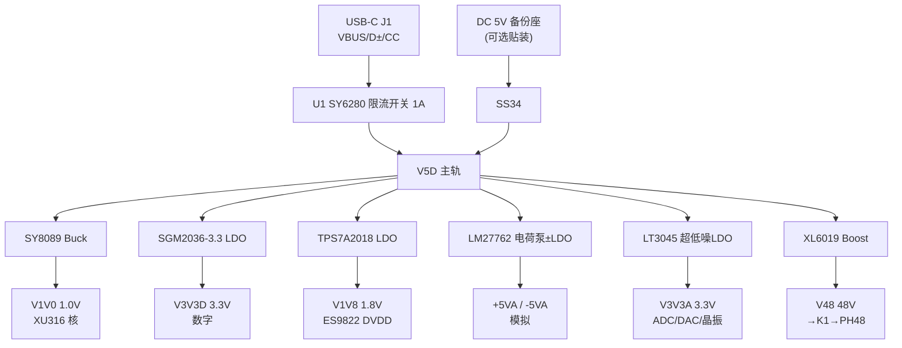

# 模块一：电源树（Power Tree）

## 1.1 框图

## 1.2 器件清单

| 位号 | 型号 | 关键参数/封装 | 立创 | 参考价 |
|---|---|---|---|---|
| J1 | USB-C 16P 母座（板载沉板） | 数据+供电 | 立创有 | ¥1.5 |
| JDC | DC-005 5.5/2.1 电源座 | **可选贴装**，备份 5V | 立创 | ¥0.5 |
| D1/D1B | SS34 | 肖特基 3A/40V，VUSB 与 DC 输入 OR-ing | 立创 | ¥0.15 |
| F1 | 自恢复保险丝 1812 1A | 次级保护（可选，与 U1 二选一） | 立创 | ¥0.3 |
| U1 | SY6280AAC | 限流开关 1A，SOT23-5 | 立创 | ¥0.5 |
| U2 | SY8089AAAC | Buck 2A，SOT23-5，Vref=0.6V | C80125（item 80125） | ¥0.47 |
| L2 | 一体成型电感 2.2µH/3A | SY8089 储能 | 立创 SWPA 系列 | ¥0.8 |
| U3 | SGM2036-3.3YN5G/TR | LDO 500mA，SOT23-5 | item 93595 | ¥0.8 |
| U4 | TPS7A2018（尾缀按需 2033） | LDO 1.8V 低噪 7µV | 立创（选尾缀） | ¥0.77 |
| U5 | LM27762DSSR | 低噪正负电荷泵+LDO，±5V | item 480126 | ¥4.28 |
| U6 | LT3045EDD#PBF | 超低噪 LDO 0.8µV/500mA，DFN-10 | item 695860 | ¥42.21 |
| U7 | XL6019E1 | Boost，TO263-5，Vref=1.25V | item 74131 | ¥2.32 |
| L7 | 47µH/2A 功率电感 CD75 | XL6019 储能 | 立创 | ¥1.2 |
| D7 | SS110（100V/1A） | Boost 续流，耐压≥60V | 立创 | ¥0.3 |
| — | 电解/MLCC 若干 | 见 1.4 取值表 | | ¥10 |

## 1.3 关键电路设计

### 1.3.1 输入保护（J1 → V5D）
- VBUS：→ 保险 F1（1A）→ U1 SY6280 的 IN；U1 EN 经 100k 上拉到 VBUS（常开）。
- USB D+/D− 与 CC 的 ESD 在 **02-xu316-core** 里处理；CC1/CC2 各接 **5.1kΩ 下拉**（声明 UFP，取电 5V）。
- JDC 备份输入：DC-005 → D1 SS34 → 与 U1 输出汇合为 V5D。双输入同时存在时电压高者供电，无冲突。
- V5D 上放 22µF 钽/MLCC + 0.1µF×4（每个下游芯片入口再补 0.1µF）。

### 1.3.2 V1V0（XU316 核，SY8089）
- Vout = 0.6 × (1 + R1/R2)，取 **R1=100k，R2=150k → 1.0V**。
- L=2.2µH（≥3A 饱和），CIN=10µF，COUT=22µF + 0.1µF。
- ⚠️ 核压精度要求以 XU316 datasheet 为准（±3% 级），必要时 R1 用 1% 电阻。
- 布局：输入输出环路最短，SW 节点铜皮最小化。

### 1.3.3 V3V3D（SGM2036-3.3）
- CIN=1µF，COUT=2.2µF+0.1µF，EN 接 IN（上电即开）。
- 负载：XU316 VDDIO、ESP32-S3、ES9039 DVDD、ES9822 DVDD(若 3.3V)、Flash、屏幕逻辑。
- 典型 350mA（预算见 1.5），SGM2036 500mA 有裕量；**若加 WiFi 功能持续高负载，可把 ESP32 拆到独立 LDO**（预留第二颗 SGM2036 焊盘）。

### 1.3.4 V1V8（TPS7A2018）
- 仅 ES9822 DVDD 用。**先确认 ES9822PRO datasheet 的 DVDD 是 1.8V 还是 3.3V**：1.8V 就贴 U4（尾缀 2018），3.3V 就不贴（DVDD 接 V3V3D）。
- CIN=1µF，COUT=1µF，NR/SS 电容按 datasheet。

### 1.3.5 ±5VA（LM27762）
- 接法按 TI datasheet 典型图：CIN=10µF（贴 VIN 引脚），C1/C2 飞跨电容 =1µF/16V X5R ×2，COUT+=2.2µF、COUT−=2.2µF（就近），可选 NR 脚 10nF。
- 输出固定 ±5V（若所选版本为可调型，按 FB 电阻配置到 ±5V）。
- 负载：PGA2500、OPA1656×2、OPA1612、TPA6120A2。**TPA6120A2 大动态时峰值电流可能触顶 250mA/路限流**——直播监听电平无碍，全功率压榨 32Ω 耳机时会把 ±5V 拉塌；若实测不够，升级方案：TPS65130 出 ±12V 再二次 LDO（见 04 模块备注）。

### 1.3.6 V3V3A（LT3045，全机指标关键）
- VIN=V5D（压差 1.7V，LT3045 260mV 裕量充足）。
- **RSET=33kΩ（1%）→ Vout≈3.30V**（Vout=100µA×RSET）；CSET=4.7µF（低噪）；ILIM=600Ω→500mA。
- CIN=10µF，COUT=10µF+1µF；PG 脚开漏 → ESP32 上电监测。
- 供电对象：**ES9822 AVDD、ES9039 AVCC_L/R 与 VCCA、100MHz 晶振**。每个负载脚位串一颗磁珠（BLM18，600Ω@100MHz）+10µF+0.1µF 形成局部隔离。
- ⚠️ 这路就是 DAC/ADC 的底噪地板，布局时远离 XL6019 与 SY8089 的开关环路。

### 1.3.7 V48 幻象（XL6019）
- Vout = 1.25 × (1 + R1/R2)，取 **R2=3.3k（1%），R1=124k（1%）→ ≈48.2V**。
- L=47µH/2A，COUT=47µF/63V 电解 + 10µF/63V MLCC；续流 D=SS110。
- 输出再串 **L8 磁珠 + 10µF/63V**（LC 滤波，幻象纹波目标 <1mV）后为 V48。
- **EN 软启动**：EN 经 100k 上拉到 V5D，EN 对地 10µF（≈0.5~1s 缓启）；ESP32 GPIO 经 10k 接到同一节点，平时置高阻，需要断电时拉低。
- 幻象电流由 **6.81k×2 限流电阻天然限制**（每通道 ≤7mA），短路安全；K1 继电器闭合前先充好 V48。
- 保险加固：V48 后串 100mA 自恢复保险（可选贴装）。

## 1.4 电容取值速查

| 轨 | 输入 | 输出/负载侧 |
|---|---|---|
| V5D | 22µF | 0.1µF ×N |
| V1V0 | 10µF | 22µF + 0.1µF |
| V3V3D | 1µF | 2.2µF + 0.1µF |
| V1V8 | 1µF | 1µF |
| +5VA/−5VA | 10µF | 2.2µF ×2 |
| V3V3A | 10µF | 10µF + 1µF（另 CSET 4.7µF） |
| V48 | 47µF/63V | 47µF+10µF/63V + 磁珠+10µF |

## 1.5 功率预算（@V5D，典型/峰值）

| 负载 | 典型 mA | 峰值 mA | 说明 |
|---|---|---|---|
| XU316（1.0V 核 + IO） | 350 | 500 | 换算到 5V 侧 |
| ESP32-S3 + 屏幕背光 | 120 | 350 | 蓝牙/WiFi 关 |
| ES9822 + ES9039 | 90 | 120 | 3.3V 轨 |
| 模拟 ±5V（前置+运放+耳放空闲） | 80 | 250 | 耳机大动态 |
| 幻象 48V（1 路） | 160 | 160 | 14mA@48V，效率 85% |
| 继电器/LED | 40 | 80 | 2 只同时吸合 |
| **合计** | **~840** | **~1460** | 单位 mA@5V |

**结论**：典型 0.8A、全开峰值 1.5A。USB 描述符声明 500mA（合规），**实际插 PC 的 USB-C/USB3 口（≥900mA）可稳定工作**；老 USB2 口开幻象+大音量耳机可能掉电 → 解决：贴 JDC 备份 5V 输入，或降低耳机音量设定。若想彻底解决，二期上 **沁恒 CH224K（PD 诱骗 12V）+ SY8089 前级**（PD 充电头供电，改动仅电源模块）。

## 1.6 布局红线

1. XL6019 / SY8089 的 **SW 节点环路面积最小**，且物理远离 PGA2500 输入与 ES9822；
2. LM27762 与 LT3045 尽量贴近各自负载；
3. V3V3A 走线不穿越任何开关电源区域，必要时包地；
4. 磁珠统一 BLM18 系列，模拟轨每个负载引脚一颗。
