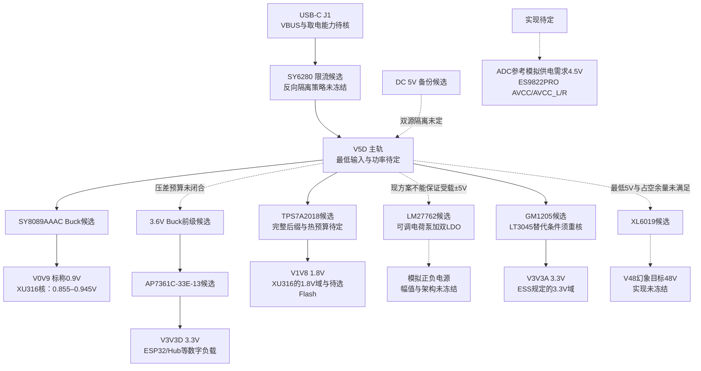

# 模块一：电源树（Power Tree）

> **2026-09-16：RevA已改为单USB-C 5V输入，本页以下旧拓扑作废，仅保留追溯。** 当前设计输入请用[RevA电源设计基线](reva-power-design.md)及[逐脚/候选值清单](../../hardware/asio-card-reva/power-pin-candidatevalues.json)。旧DC备份、SY6280输入路径、3.6V+AP7361C、LM27762直接生成受载±5V、XL6019从USB直升48V等内容不再用于RevA落图。新基线明确Default仅AON、1.5A默认数字功能、3A为完整模拟目标条件；仍须关闭XU CORE_EN/RESET监测、DAC逐轨开关、PGA幻象注入轨吸收、TPA掉电输入静音等事项，不能据已画图宣称可投板。
>
> 以下保留2026-09-06的历史勘误记录。[全量数据手册核验入口](../datasheet-audit/README.md)、[电源参数审计](../datasheet-audit/power.md)和[整体设计整理](../design-review-2026-09-05.md)用于追溯参数来源；旧采购候选和历史功耗不覆盖新设计。

## 1.1 框图

以下保留原方案的功能划分；虚线表示实现或兼容性尚未闭合，不代表已选定新电源路线。

**负载边界**：ES9822PRO 与 ES9039Q2M 的 DVDD 是内部约1.2V核心节点，不能接外部 V1V8 或 V3V3D。XU316-QF60A 的全部 GPIO 电源域为1.8V，不能并入3.3V数字IO轨。ADC的4.5V参考模拟供电必须单独落实；本页不选择新的稳压芯片。

## 1.2 器件候选清单

料号映射、供货状态和价格均需采购前复核；不沿用旧稿库存和“直接替换”结论。

| 位号 | 候选型号 | 已确认参数/封装与未决项 | 历史立创映射（未作本轮商品核验） |
|---|---|---|---|
| J1 | USB-C 16P母座 | 数据与供电；CC检测、入口保护和电流能力待定 | 未锁定 |
| JDC | DC-005 5.5/2.1座 | 可选备份输入；不能据插座标称就保证双源不反灌 | 未锁定 |
| D1/D1B | SS34 | 双源隔离候选；具体二极管手册/压降/拓扑须核 | 未锁定 |
| F1 | 1812自恢复保险丝，原选1A | 与主动限流开关功能不同，不作为无条件二选一；保持/动作电流、温度降额待核 | 未锁定 |
| U1 | SY6280AAC | SOT23-5；6.8k设置1A **typ**，手册范围0.75–1.25A；反向阻断仅关断时明确 | C55136 |
| U2 | SY8089AAAC | SOT23-5；2.7–5.5V、1MHz typ、2A连续能力受热限制；0.6V反馈参考 | 电源旧页C80125，BOM C78988，冲突待核 |
| L2 | 2.2µH电感 | V0V9候选；需具体Isat/Irms/DCR及温度条件 | SWPA系列未锁定 |
| U2B | SY8089AAAC | 3.6V前级为旧候选，最差压差尚不支持批准下游3.3V LDO | C78988 |
| L2B | 2.2µH电感 | 与U2B工作点一起核算 | 未锁定 |
| U3 | AP7361C-33E-13 | 固定3.3V/SOT223；1A能力、340mV typ@1A；无EN，非ER脚序 | C500795 |
| U4 | TPS7A2018，完整后缀待定 | 固定1.8V/300mA；封装、精度、压差、P版放电行为不同，须锁定 | 未锁定 |
| U5 | LM27762DSSR | WSON-12；可调正负输出，工作0–250mA/路；5V输入不能保证受载稳压±5V | C473398 |
| U6 | GM1205ACPZ-R7 | DFN-10；500mA能力/1.8µVrms typ有测试条件；LT3045非无条件替换 | C53924061 |
| U7 | XL6019E1 | TO263-5L；推荐输入5–40V，5A为开关限流typ，金属tab=SW | C73018 |
| L7 | 47µH电感，原选2A | 额定2A是否足够须核启动、满载峰值与限流工况；不先冻结新额定 | CD75未锁定 |
| D7 | SS110候选 | 需核精确料号、反压、峰值电流、损耗和温度；未完成二极管手册签核 | 未锁定 |
| — | 电解/MLCC | §1.4仅为候选值；未完成料号级有效容量核验 | 未锁定 |

## 1.3 关键电路设计

### 1.3.1 输入保护（J1 → V5D，双源策略未冻结）

- 旧路径为VBUS→F1→SY6280 IN，EN经100k上拉VBUS；仍需联合确定PTC、TVS、限流及上电策略，不能把它称为已合规的USB取电电路。
- SY6280AAC引脚：1OUT、2GND、3ISET、4EN、5IN。ISET到地电阻满足 ILIM(A)=6800/RSET(Ω)；6.8k对应0.75/1/1.25A（min/typ/max，指定测试条件），不是精准1A。
- CC1/CC2的5.1kΩ Rd表示受电端连接角色，不能单凭Rd推断已获1.5A/3A。USB数据/CC接口另见[USB模块](07-usb-c.md)。
- **SY6280的OUT→IN反向阻断只在disabled状态明确保证。** JDC经SS34并到V5D，在USB仍使能且外部DC电压更高时不能据此保证不反灌。双源隔离/选择实现保持待定。
- U1 IN就近10µF是原厂强烈推荐，以抑制热插拔/短路振铃；它不自动满足USB入口浪涌要求。V5D原候选2×22µF/10V加0.1µF须连同整板入口容量、充电电流与控制时序核算。
- 电容介质、耐压与浪涌性能按具体料号和工况选择，不再规定“不用钽”或“容量倍增后必然足够”的通用结论。

### 1.3.2 V0V9（XU316核，标称0.900V）

- XU316核电源推荐范围为 **0.855V min / 0.900V typ / 0.945V max**。不设置未经手册支持的挂起降压档。
- SY8089AAAC反馈公式 VOUT=0.6×(1+R上/R下)；100k/200k得到0.900V标称。参考0.588–0.612V及两只1%电阻组合约0.8762–0.9242V，尚未计动态纹波、布线压降和其他误差。
- L=2.2µH、CIN=10µF、COUT=22µF+0.1µF保留为候选。电感饱和/温升额定和电容有效值未核，不能写“≥3A即保证”。
- EN高>1.5V开启、低<0.4V关闭，不悬空；SY8089无PG。核电源与1.8V域的时序须按XU316精确型号要求实现并测量，不能仅以EN接VIN宣称满足。
- 输入环路最短、LX铜皮控制面积、FB远离开关节点；供电完整性包括负载端电压和瞬态，不能只看反馈电阻计算。

### 1.3.3 V3V3D（3.6V Buck + 3.3V LDO仍为待评估组合）

- U2B的150k/30k得到3.6V标称；仅参考和1%电阻已给出约 **3.4698–3.7338V**。这一级最低值必须进入LDO压差预算。
- `AP7361C-33E-13`为SOT223固定型：1IN、2GND、3OUT，无EN。输入近端建议1µF、输出有效至少2.2µF；4.7µF/10V+0.1µF只是待验证候选。
- **压差未闭合**：3.3V/300mA时90mV typ、140mV max（25°C）；1A表内340mV typ且max空白，首页另写360mV typ。不能据典型曲线批准600mA/0.3V压差。最差前级减去LDO输出正偏差后甚至仅约136.8mV，尚未扣动态压降。
- 负载包括ESP32-S3、Hub/串口桥、屏幕等经各自手册确认的3.3V域；XU316的USB 3.3V供电按其引脚表单列。**不包括XU316全部GPIO电源、待选1.8V Flash，也不包括两颗ESS内部DVDD。** ESS的3.3V域供电归属见§1.3.6，避免重复计入。
- 旧350/600mA只是历史预算，须重算。若实际输入/输出为3.6/3.3V且600mA，功耗约0.18W；用手册SOT223 θJA110°C/W估约20°C温升，不是11°C或散热保证。
- 此型号开关频率为1MHz typ；AP7361C的PSRR表在1V压差等条件下测得，不能宣称本组合会在1MHz额外衰减固定20–30dB。新前级目标或LDO型号本轮不冻结。

### 1.3.4 V1V8（1.8V需求明确，稳压器后缀与负载预算未冻结）

- 负载应包括XU316-QF60A的 **VDDIOL18/VDDIOR18/VDDIOT18/VDDIOB18、OTP_VCC、USB_VDD18** 及待选1.8V Flash；逐引脚/去耦与时序以主控审计为准。**ES9822PRO DVDD不得外接此轨。**
- TPS7A2018需选完整订货号和封装。1.8V精度为DQN等±30mV、DBV±40mV max；300mA压差为200mV/DBV205mV max，不能套3.3V档140mV。
- CIN1µF、COUT2.2µF/10V为候选；TPS7A20规定输出有效0.47–200µF、ESR≤100mΩ。**无NR/SS脚，也无PG脚**；P版本才有主动输出放电。
- EN独立控制不需要时可接IN，但这不能证明1.8V“最早建立”；EN门槛、内部启动、负载、上游斜率和其他轨必须联合核对，不能先用任意RC冻结时序。
- 5→1.8V/300mA会耗约0.96W，不能按“芯片300mA”推断满载可用。GPIO/Flash与负载端去耦仍需实算，逐脚磁珠不作统一强制。

### 1.3.5 模拟正负电源（原目标±5VA，LM27762方案未冻结）

- LM27762是**可调正LDO加负电荷泵/LDO**，并非固定±5V器件。工作VIN2.7–5.5V、每路0–250mA；正输出可设1.5–5V，负输出可设−1.5至−5V，仍受压差和热限制。
- 外部电容共五类：CIN、**单只C1飞跨电容（C1+ pin10与C1− pin9之间）**、**CP pin5对地的CCP储能电容**、COUT+、COUT−。没有NR脚。原候选CIN10µF、C1=1µF/16V非极化、CCP4.7µF/10V、COUT±各4.7µF/10V须做有效值验证；原厂LDO输出各2.2µF陶瓷可稳定，重载CIN/CCP要求另核。
- 正反馈1.2×(1+R1/R2)，负反馈−1.22×(1+R3/R4)，R2/R4≥50kΩ。原158k/50k约+4.992V、155k/50k约−5.002V只是计算值，不能补上这些电阻就认为原供电目标达成。
- **5V输入不能保证受载稳压±5V**：正路需要LDO压差，负路还有电荷泵内阻损耗。PGA2500、TPA6120A2等最低电压、静态/峰值电流及上掉电行为尚需共同闭合，不再承诺“直播监听无碍”。本轮不选新的正负电源芯片或升压路线。
- PGOOD开漏**低有效**（0=电源好）；不用时接地。EN+与EN−分开控制；如接MCU，PG上拉域、电压兼容和时序须明确。

### 1.3.6 V3V3A（GM1205候选；LT3045替代须重新核验）

- GM1205首页输入2.6–20V；完整精度条件从2.7V起。其180mV与LT3045的260mV均为典型压差，不能用单值替代最坏余量/负载/结温预算。
- SET电流标称100µA，RSET33kΩ得到3.300V typ，33.2kΩ得到3.320V typ；CSET4.7µF是低噪候选。**GM1205 RILIM600Ω对应463.3mA typ，不是500mA；560Ω约496.4mA typ，也不保证500mA。** ILIM标度缺min/max，实际负载余量须厂家数据支持。
- CIN10µF、COUT22µF/10V+1µF保留候选；GM要求输出有效≥10µF、ESR<50mΩ、ESL<2nH。OUTS Kelvin连接输出电容/负载、CSET地与COUT地直连，裸焊盘接地。
- PG为开漏，需上拉并完成OUT–PGFB–GND分压；PGFB同时影响快启。GM EN约1.07V、PGFB约295mV；手册PGFB迟滞表20mV/正文60mV等差异待澄清，不能以典型数值冻结精确延时。
- 供电需求包括ES9822PRO AVDD=3.3V及ES9039Q2M规定的3.3V电源域（AVDD、VCCA、AVCC_DAC1/2），具体分轨/滤波/上电顺序待核；两者DVDD仅按手册内部节点处理。**ES9822PRO AVCC、AVCC_L/R的4.5V供电另行实现，当前电源树未补齐。**
- 晶振型号与频率未冻结，不能保留向ES9039Q2M送100MHz的旧选择（其MCLK上限50MHz）。每个电源脚的去耦/磁珠按负载及动态条件设计，不统一“一脚一磁珠”。
- GM1205ACPZ-R7与LT3045 DD十脚信号顺序匹配，但**不是无条件替换**：ILIM标度278与150mA·kΩ不同、EN/PG阈值不同、LT要求COUT ESR<20mΩ，反向保护/裸焊盘尺寸/启动亦不同。必须形成替代BOM与验证记录。

### 1.3.7 V48幻象（48V目标，XL6019可行性未冻结）

- 按XL6019原图命名，VOUT=1.25×(1+R2/R1)，R2为上分压、R1为下分压；124k/3.3k得到约 **48.2197V标称**。参考与电阻容差需计入，48.2V不是保证值。
- **XL6019推荐输入最小5V**；USB经线缆/PTC/开关压降后可能低于推荐范围。5→48V理想占空已约89.6%，而手册90%只是typ；损耗和最低输入还会降低余量。不能在此条件下确认选型通过。
- L47µH/2A、COUT47µF/63V电解+10µF/63V MLCC、SS110为原候选；启动/短路峰值、温升、反压和环路稳定性均未验证。手册47µH/5A、220µF示例也不能直接升级成所有负载的硬性最小值。U7 VIN需近端输入电容，具体值随路线重新核算。
- 原L8磁珠+10µF后滤波只表示降纹波意图；纹波目标和测量带宽待统一，不能宣称已经达到1mV或2mV。
- **EN端RC是延迟候选，不是输出软启动保证**。100k/10µF须计EN漏电和阈值分散；5V上拉EN经10k接3.3V ESP32还需核验反灌、钳位和掉电状态。芯片内置软启动不由该RC直接设定。
- 6.81kΩ每支路在48V对地短路时约7.05mA、约0.338W，两支合计约14.1mA；这不证明整个幻象电路“短路安全”。电阻功率降额、48V储能、输入浪涌钳位、继电器和泄放均需检查。
- 普通Boost在EN关闭后仍存在VIN经电感/二极管到输出的路径，关闭EN不等于输出隔离或电容放电。TO263 **金属tab为SW**，不得接地。

## 1.4 电容候选值与核验边界

| 轨/节点 | 原输入候选 | 原输出/负载侧候选 | 必须核验的条件 |
|---|---|---|---|
| V5D | U1 IN近端10µF建议 | 2×22µF/10V+0.1µF×N | USB入口总容量、浪涌、最低输入、热插拔尖峰 |
| V3V6 | 10µF | 22µF+0.1µF | SY8089高负载性能建议、偏置与阶跃；3.6V轨未冻结 |
| V0V9 | 10µF | 22µF+0.1µF | 核端电压范围、稳定/纹波、实际电容和电感 |
| V3V3D | 1µF | 4.7µF/10V+0.1µF | AP输出有效≥2.2µF、ESR及最差压差 |
| V1V8 | 1µF | 2.2µF/10V及芯片侧去耦 | TPS输出有效0.47–200µF、ESR≤100mΩ；改SGM需重核0.5–10µF边界 |
| 模拟正负轨 | CIN10µF；C1=1µF；CCP4.7µF | COUT±各4.7µF/10V | 五只电容功能不能混淆；有效值/电荷泵余量/输出目标待定 |
| V3V3A | 10µF | 22µF/10V+1µF；CSET4.7µF | 输出有效≥10µF；GM ESR<50mΩ，LT<20mΩ；实际总去耦与Kelvin连接 |
| ADC 4.5V参考模拟轨 | 待定 | 按ADC手册落实 | 稳压实现、精度、噪声、去耦和时序尚未冻结 |
| V48 | U7近端值待算 | 47µF电解+10µF/63V及后滤波候选 | 输入范围/Boost稳定性、容量降额、纹波、启动和泄放 |

> 这些是**名义候选值**，不是已通过偏置修正的BOM。X5R/X7R不能代表确定的直流偏置保容率；须选具体制造商料号，证明在工作电压、容差、温度和老化下满足有效容量及ESR/ESL要求。耐压和容量倍数只能作初筛，不能代替曲线与系统验证。

## 1.5 功率预算（历史估算，须重算）

下表保留旧方案按5V侧折算的数值，以便追溯冲突；**不是当前负载的datasheet保证值或实测值**。ESS4.5V轨、不同转换效率、耳机负载、Hub模式和Flash选型未闭合，不能据合计签核取电能力。

| 历史负载项 | 历史典型mA@5V | 历史峰值mA@5V | 当前核验要求 |
|---|---|---|---|
| XU316核+IO | 350 | 500 | 分电压域核算动态电流与Buck效率 |
| ESP32-S3+屏幕背光 | 120 | 350 | 明确无线状态、背光和瞬时负载，不能把禁用无线当已完成约束 |
| ES9822PRO+ES9039Q2M | 90 | 120 | 按实际3.3V/4.5V域重算；不能全部算作3.3V外供DVDD |
| 模拟正负电源 | 80 | 250 | 依据最终电源架构、静态及耳机动态负载重算 |
| 幻象48V一路 | 160 | 160 | 原按14mA@48V、85%效率估算；该效率未在工作点验证 |
| 继电器/LED | 40 | 80 | 线圈型号、同时吸合状态和驱动损耗待核 |
| Hub+串口桥×2 | 90 | 120 | 按精确型号和工作模式重算 |
| **按原行重算** | **930** | **1580** | 逐项相加所得；旧表910/1560mA均有算术错误 |

**预算未闭合**：即使只按旧表各项重算为典型930mA，也与USB声明500mA不符，不能同时宣称合规且可稳定工作；峰值更高。USB-C/USB3接口名称不等于已获得足够电流，须明确主机提供能力、CC/协议检测与设备功率约束。外部DC和限载均只是待评估策略，不是本轮选定的修正方案。

旧“CH224K取12V + SY8089前级”不可直接沿用：**SY8089推荐VIN最高5.5V、绝对最高6V，不能接12V**；SY6280及其他低压器件也要重新审查。若保留PD候选，必须另作完整电源路径与器件额定评估，本页不选择新的高压Buck或供电路线。

## 1.6 布局与验证要求

1. SY8089和XL6019开关电流环路紧凑，FB远离LX/SW；XL6019 tab=SW，散热铜也要按开关节点处理。
2. LDO、电荷泵输入/输出电容按各自手册就近；GM/LT的OUTS、CSET地与COUT必须落实Kelvin连接，裸焊盘按精确封装接地。
3. 模拟小信号走线与开关环路/电感保持距离；屏蔽或包地不能替代回流路径分析。
4. 磁珠型号和位置按直流电阻、电流、谐振、负载阶跃及芯片建议逐项选，取消“所有模拟脚统一一颗BLM18”的强制规则。
5. 验证每轨最低/最高值、启动/掉电顺序、负载阶跃、温升、USB反灌和幻象储能；不得用“保护会动作”代替持续工作范围设计。

## 1.7 电源替代评估边界

国产化是可讨论的目标，不等于当前器件都需要替换，也不等于同封装直接兼容。

| 轨/用途 | 历史候选 | 已核实的替代边界 | 当前状态 |
|---|---|---|---|
| V3V3A | GM1205ACPZ-R7 / LT3045 DD | 十脚信号顺序匹配；ILIM、EN/PG阈值、输出ESR、反向额定、裸焊盘尺寸及启动不同 | 须单独BOM和验证，不是随时直接换片 |
| V1V8 | TPS7A2018 / SGM2036-1.8 | SOT23-5时pin4为NC/BP差异；SGM 1.8V压差、精度、热、噪声、EN和输出容量上界均不同 | 不可直接互换；具体封装及负载决定可行性 |
| 模拟正负轨 | LM27762 / 其他架构 | 当前5V→受载±5V无余量，先解决供电目标；是否存在合适替代须按准确手册比较 | 未冻结，不先宣布“保持LM27762” |
| 其他低噪候选 | CJ6216、TPL8033、SGM3204、LT3094、RY1175等历史条目 | 本轮没有这些精确料号的完整手册核验与系统设计，旧噪声/电流/价格比较不作为结论 | 保留名称作检索线索，不进入生产选型 |

GM的1.8µVrms与LT的0.8µVrms均有负载、带宽、CSET和输出条件。没有完整电源噪声耦合模型与整机测量，不能断言换片“不影响123dB达成”或某一电源轨“唯一决定底噪”。

## 1.8 开关电源对音频的影响与待测项

| 电源域 | 需要关注的影响 | 验证方向 |
|---|---|---|
| ESS模拟/参考供电 | 3.3V与ADC4.5V的噪声、共模、上电顺序，芯片内部DVDD处理 | 按精确手册核对电源脚；测轨噪声及模拟输出表现 |
| 模拟正负轨 | 前置/运放/耳放最低电压、瞬态与掉电爆音 | 先闭合电源架构，再按实际负载测量 |
| XU316核/PLL | 0.855–0.945V范围、动态电流、PLL电源完整性 | 负载端瞬态、时钟与音频连续运行；不以“数字无感”略过 |
| 3.3V数字/1.8V IO | 逻辑容限、复位时序、无线/背光负载阶跃、地回流耦合 | 不用固定10mV纹波数字推断无影响 |
| V48幻象 | 升压可行性、共模与差模噪声、匹配误差、储能、插拔 | 先按最低输入与实际负载验证；CMRR不能自动消除所有电源纹波 |

开关电源与LDO的组合需要按效率、噪声、瞬态、热和布局共同评估。本页完成的是参数勘误回写，尚未完成电源树重设计或硬件验收。
