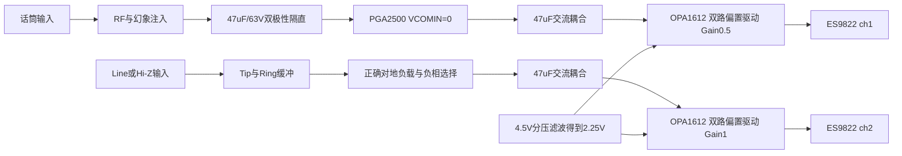
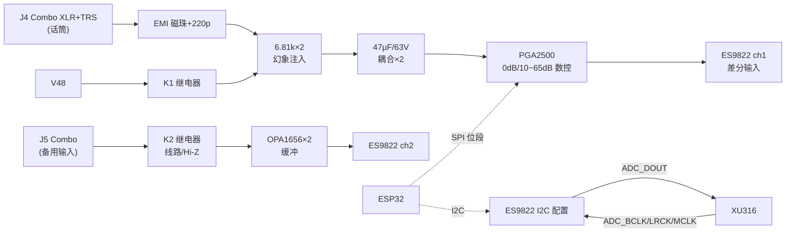

# 模块三：ADC 前端（话筒/幻象/备用输入/ES9822）

<!-- reva-audio-sync-20260916 -->

> **2026-09-16 Rev A：按下列信号拓扑绘制草图。** 完整连接、计算与原厂页码见[Rev A音频设计](reva-audio-design.md)和[逐管脚表](../../hardware/asio-card-reva/audio-pin-net-plan.json)。下方折叠区保留原文件内容；其旧ASCII、价格、备用器件和性能推断不再作为Rev A网表依据。

## Rev A 输入与ADC路径



- **PGA2500 U13**：VA+18/19→V5P_AFE，VA−15/20→V5N_AFE，VD−14经10Ω接V5N_AFE；VCOMIN25经0Ω接GND；CS11/CS12与CS21/CS22各1µF。DCEN7、0dB8接GND；ZCEN9上拉到PGA正轨。SDO13需5V容忍接收，0dB不作为静音。
- **幻象**：仅J4一路，K1断开控制；两只6.81k/≥1W/≥100V，配对目标≤0.1%。47µF/63V双极性各一只、10Ω初始限流及每腿对正负轨功率肖特基（≥10A浪涌级）。轨吸收/精密钳位仍待闭合，BAV99不可替代。
- **Line/Hi-Z**：U14=OPA1656的Tip/Ring跟随；U18A由10k/10k生成−Tip，U18B闭环接地。两路输入各100Ω串联、1MΩ对地。K2.A在线路模式接入Tip的10.1k对地负载，Hi-Z断开；Ring固定10.1k对地。K2.B选Ring缓冲或−Tip。约10k/1M输入阻抗来自真实对地网络，不来自串联电阻。
- **ADC驱动U16/U17**：各新增一颗OPA1612，非反相端接AVCC_L/R分别10k/10k分压与10µF+100nF滤波产生的共模，不能取内部VREF作外部电源。每腿47µF耦合、Rin2k，Mic Rf1k/Cf680pF，Aux Rf2k/Cf330pF；正负源交叉进入反相器保持整体极性。输出36Ω隔离，100pF跨ADC差分脚。
- **供电**：ADC AVCC5、10、21为4.5V，AVDD30为3.3V；DVDD29内部1.2V仅1µF去耦；VREF9/22各4.7µF；RT1=40与EPAD41接GND。运放使用V5P_AFE/V5N_AFE。
- **接口**：MODE3与ADDR1/2=27/28接地；I2C普通7-bit0x20、同步0x24，器件侧网`ADC_I2C_SDA/SCL`各2.2k上拉到V3V3_ADC_DIG，经数字页TCA9517A隔离到MCU侧。BCLK39、LRCK38为输入，DOUT选择GPIO4=36；GPIO3=37禁用输出。XIN8接外MCLK，XOUT7/ACLK4不用。
- **配置与同步**：Reg11=0x81、Reg12=0x20、Reg13=0x21及GPIO方向是部分接口设置；先通过同步窗口启用时钟。22/24或45/49MHz频率选择与内部模拟分频、MCLK下降沿/BCLK相位、电平转换传播/偏斜必须一起核验，不以“同频”替代同步约束。
- **保守信号预算**：PGA暂用3.5Vrms差分工作点→驱动1.75Vrms；Line2Vrms差分或Hi-Z1Vrms单端→驱动约2Vrms差分。PGA0dB输入存在每腿电压/DC偏置限制，不能把4Vrms通用于所有档。OPA1612在ADC430Ω采样负载下的摆幅/稳定性尚未取得数据表保证，ADC3.2Vrms满幅不是本前端已经保证的范围。

K4改为耳机静音，不再给J5预留第二路幻象。继电器必须非保持、先断后接，精确脚序和线圈最小吸合电压由最终型号确认。当前阶段不宣称整机DNR、EIN或THD已实现。

<details>
<summary>保留的原有内容：2026-09-06及之前草案，不作为本版网表</summary>


> **2026-09-06 已回写关键参数，拓扑仍未冻结。** 逐项证据见[转换器核验](../datasheet-audit/converters.md)和[模拟器件核验](../datasheet-audit/analog.md)。旧图中的输入保护、偏置/共模、Hi-Z切换与滤波还须重画，不作为生产网表。

## 3.1 框图



## 3.2 器件清单

| 位号 | 型号 | 说明 | 立创 | 参考价 |
|---|---|---|---|---|
| J4/J5 | Neutrik NCJ6FI-S-0（或国产 combo 座） | XLR+6.35 二合一 | 淘宝/立创 | ¥15/¥4 |
| K1 | 宏发 HFD4/5-SR（2C，5V 线圈） | 幻象开关 | 淘宝 | ¥2.5 |
| K2 | 同上 | 线路/Hi-Z 切换（DPDT 用满两刀） | 淘宝 | ¥2.5 |
| K4 | 同上（**可选贴装**） | ch2 幻象开关（送人版插第二支麦） | 淘宝 | ¥2.5 |
| U13 | PGA2500IDBR | 数控话筒前置，SSOP-28 | item 565056（C544405） | ¥64.44 |
| U14 | OPA1656IDR ×2（或一颗双通道分两半） | 备用输入缓冲，SOIC-8 | item 1940244 | ¥5.26×2 |
| U15 | ES9822QPRO | 2ch ADC 123dB，QFN-40 | 淘宝/嘉立创 C5221647 | ¥28 |
| FB×4 | BLM18SG601 | 输入 EMI 磁珠 | 立创 | ¥0.1 |
| — | 电容/电阻 | 见 3.3 | | ¥10 |

## 3.3 关键电路

### 3.3.1 话筒链路（ch1）

信号顺序（**顺序不能乱**，与 THAT 应用笔记一致）：

```
J4.XLR2 ──FB──┬──220pF─GND      ┌──6.81k 0.1%──PH48(经K1)
               ├──6.81k──┐      │
               └──47µF/63V 双极性──► PGA2500 IN+
J4.XLR3 ──FB──┬──220pF─GND      └──6.81k 0.1%──PH48(经K1)
               └──47µF/63V 双极性──► PGA2500 IN−
J4.XLR1 ──► CHASSIS 网（AES48：pin1 于座体根部最短路径直连机壳网；CHASSIS 在 USB 入口单点接 GND，见 06）
```

- **FB**：600Ω@100MHz 磁珠 ×2；**220pF**：射频旁路（抑制手机/对讲机干扰，直播现场关键）；
- **6.81kΩ 0.1%** ×2：幻象馈电兼电流限制（7mA/路），**必须在耦合电容之前**；
- **47µF/63V 双极性**（Nichicon UES 或两电解背靠背）：隔 48V 直流；耐压余量按 63V。**不可换固态/聚合物电容**（极性+电源向参数）；发烧升级路径：22~47µF/63V 聚丙烯薄膜；
- 耦合电容之后各加 **100kΩ 泄放到 GND**（防开机冲击、建立偏置）；
- **ESD 钳位（塑料机壳必备）**：PGA2500 IN+/IN− 各对一只 **BAV99**（SOT-23 双二极管，阳极→IN、阴极分别钳到 +5VA/−5VA）——几 pF 结电容对音频无影响，防插拔话筒时的静电打穿输入级。

**PGA2500**：
- VA+为+4.75～+5.25V（pin18/19），VA−为−5.25～−4.75V（pin15/20）；**VD− pin14接负电源，器件没有VD+**；VA−与VD−动态压差<300mV。VCOMIN pin25的0V仅原候选；它与ADC输入共模需联合设计。
- 控制：`CS/SCLK/SDI/SDO` 四线 → **ESP32 GPIO 位段驱动**（软件 SPI，≤1MHz，改动最小）；上电默认写 20dB，旋钮调节 **0dB 或 10~65dB（1dB 步进）**；
- 输出驱动：原100Ω/470pF为候选，不能直接连接不同共模的ADC输入；ES9822要求约2.25V共模，须冻结交流耦合/偏置或合规驱动方案。PGA伺服电容CS11–CS12、CS21–CS22各1µF典型，DCEN/ZCEN按手册接入。
- **0dB是直通，不是静音档**。ZCEN使能过零时最大等待16ms，仍不保证任意增益跳变无瞬态；另设计系统静音。SDO/OVR/GPO为约5V输出，回ESP32时需降电平；ESP32向PGA输入的3.3V只有在VOH满足VIH≥2V时才成立。

### 3.3.2 备用输入（ch2，线路/Hi-Z 双模）

> 下图保留结构意图；串联10k/1M不等于对地输入阻抗，原图缺少明确DC偏置回路，不能直接照连。

```
J5.Tip ──┬──10k──► U14A 跟随 ──┐                    ┌──► ES9822 ch2 IN+
         └──1MΩ──► U14B 跟随 ──┴── K2 刀1(公共端) ──┤
J5.Ring ──10k──► U14C 跟随 ──── K2 刀2 ─────────────┴──► ES9822 ch2 IN−
J5.Sleeve ──► AGND
```

- **线路模式目标**：平衡输入；实际输入阻抗由对地/差分终端和偏置网络决定，不能把图中的串联10k当输入阻抗。
- **Hi-Z模式目标**：约1MΩ输入阻抗；需重画对地偏置、继电器两刀和ADC共模参考，原串联1M接法未通过核验。
- 两个跟随器输入各并 **100pF** 到地（RF）；
- 耦合：ch2 也串 **47µF/63V 双极性**（可选贴装 K4 幻象时必需；平时可短接 0Ω 电阻代替）；
- OPA1656低偏置电流不会自动建立0V输入；须有确定的DC回路，隔直/偏置取决于前端外来直流和ADC共模要求。
- **增益**：Hi-Z 固定 0dB（吉他典型 100mV~1V 足够），不够时用 ES9822 内部 PGA（按 datasheet 支持范围）或数字增益；
- ch2 缓冲输出（=ES9822 ch2 输入脚）同样加 **BAV99×2 钳位**到 ±5VA。

### 3.3.3 ES9822PRO（核心）

- **电源**：AVDD pin30为3.3V；AVCC pin5、AVCC_L10/AVCC_R21为4.5V（新电源轨待设计，推荐表未给容差，不能擅写±5%）。DVDD29是内部1.2V节点，参考图为1µF对地，**不得接1.8/3.3V**；若考虑外部1.2V，须另取得原厂适用依据。VREF_L9/VREF_R22是内部参考，标准图4.7µF对地；RT1 pin40接DGND，EPAD41接DGND。
- **I2S 从模式**：`ADC_BCLK/LRCK/MCLK` ← XU316（22Ω 串阻），`ADC_DOUT` → XU316；MCLK=24.576/22.5792MHz 自动跟随采样率族；
- **I2C**：SDA25/SCL26，3.3V IO域；普通7-bit地址0x20–0x23，同步控制窗口0x24–0x27。2.2k为待核上拉，需计总线电容、速度与灌电流。
- **CHIP_EN pin23**：实际使能脚，不把旧泛称RST_N当库符号脚名；按电源和时钟稳定后的原厂时序释放。
- **初始化**：先通过不依赖MCLK的同步控制窗口启用/配置时钟，再进入普通控制窗口。24.576MHz可配置192k，双通道32bit BCLK=12.288MHz；从模式还需满足MCLK下降沿与BCK的相位窗口。全部I2S往返需核对1.8↔3.3V电平与传播延迟。
- 差分输入脚对 GND 各加 **100pF**（RF），输入满幅按 datasheet（PGA2500 输出摆幅与之匹配即可）。

### 3.3.4 升级候选 B：THAT1570 + THAT5173（数字前置套片，[官方页](https://thatcorp.com/that-1570-5173-digitally-controlled-microphone-preamplifier/)）

- **结构**：THAT1570（模拟增益块，QFN-16）+ THAT5173（数字增益控制器，QFN-24），SPI 直连 ESP32，0~60dB/3dB 步进；
- **指标**：EIN -127dBu（60dB/Rs=150Ω）、THD+N 0.001%、+27dBu 最大输入（±17V 供电）、内置过零检测+差分伺服（**换挡无爆音**）；
- **优点**：噪声比 PGA2500 低 1~2dB；增益切换天生顺滑；5173 的 4 路 GPO 可直接驱动幻象/衰减继电器；
- **代价**：两片、3dB 步进、满规格需 ±15/17V 轨（本机 ±5VA 下 +27dBu 余量缩水，话筒电平无影响）、立创无货走 Mouser/e络盟（约 $5/片）；
- **决策**：v1 用 PGA2500（单片+立创现货）；若二期追话筒通道极限，替换成本模块 U13 为 1570+5173，其余链路不动。

## 3.4 指标预算（自检目标）

| 链路点 | 预期指标 | 测量方法 |
|---|---|---|
| PGA2500 自身噪声 | EIN ≈ -126dBu（60dB 档） | 输入端短路，输出接 AP/RMAA |
| 幻象纹波 | <1mV @V48 | 示波器 AC 耦合 |
| ADC 实测 DNR | ≥120dB（-60dBFS 法） | RMAA/AP，输入端接 0.5µV 级低噪源或短路+增益法 |
| 40dB 增益档整机 EIN | ≤ -125dBu | 前置+ADC 联测 |

> 说明：40~60dB 高增益档下所有商用声卡的 SNR 都会跌到 100~110dB 级（受前置噪声主导），**这属正常物理规律**；123dB 的 ADC 天花板体现在 0~30dB 档和线路输入。

### 3.4.1 动态范围预算表（DR ≈ 满幅输入 − 增益 − EIN；假设 ES9822 差分满幅 ≈ +8dBu，以 datasheet 复核）

| 话放增益 | 满幅对应输入 | 动态范围 ≈ | 限制因素 |
|---|---|---|---|
| 0dB | +8dBu | ~121dB | ADC（123dB−布局损耗） |
| 10dB | −2dBu | ~121dB | ADC |
| 30dB | −22dBu | ~104dB | 前置噪声 |
| 40dB | −32dBu | ~94dB | 前置噪声 |
| 50dB | −42dBu | ~84dB | 前置噪声 |
| 60dB | −52dBu | ~74dB | EIN 主导 |
| 65dB | −57dBu | ~69dB | EIN 主导 |

- **EIN 考高增益档、DNR 考低增益档**，两个都是中高端商用声卡水平；
- 输出侧：ES9039Q2M ~125dB → 运放 → 线路出预期 ~118-122dB、耳机 ~110-118dB；
- 直播真实瓶颈在话筒自噪/房间底噪/人声动态（~40-90dB），链路 110dB+ 对直播是"数字游戏"，对录音/测量有意义。

## 3.5 布局红线

1. 幻象 48V 走线与 XL6019 远离 PGA2500 输入对；
2. 6.81k 电阻、耦合电容、220pF 围绕 J4 紧凑对称布线；
3. PGA2500 输出到 ES9822 的差分对**等长、紧耦合**；
4. ES9822 底部地焊盘密集过孔；VREF 电容紧贴引脚；
5. K1/K2 继电器线圈回路（5V/30mA 开关）加续流二极管，走线不经过输入区。

</details>
