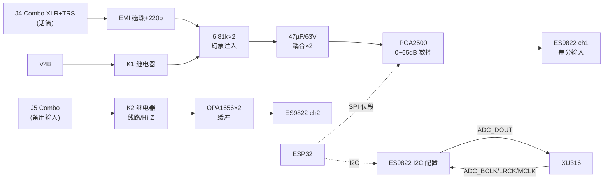

# 模块三：ADC 前端（话筒/幻象/备用输入/ES9822）

## 3.1 框图



## 3.2 器件清单

| 位号 | 型号 | 说明 | 立创 | 参考价 |
|---|---|---|---|---|
| J4/J5 | Neutrik NCJ6FI-S-0（或国产 combo 座） | XLR+6.35 二合一 | 淘宝/立创 | ¥15/¥4 |
| K1 | 宏发 HFD4/5-SR（2C，5V 线圈） | 幻象开关 | 淘宝 | ¥2.5 |
| K2 | 同上 | 线路/Hi-Z 切换（DPDT 用满两刀） | 淘宝 | ¥2.5 |
| K4 | 同上（**可选贴装**） | ch2 幻象开关（送人版插第二支麦） | 淘宝 | ¥2.5 |
| U13 | PGA2500IDBR | 数控话筒前置，SSOP-28 | item 565056（C544405） | ¥64.44 |
| U14 | OPA1656IDR ×2（或一颗双通道分两半） | 备用输入缓冲，SOIC-8 | item 1940244 | ¥5.26×2 |
| U15 | ES9822QPRO | 2ch ADC 123dB，QFN-40 | 淘宝/嘉立创 C5221647 | ¥28 |
| FB×4 | BLM18SG601 | 输入 EMI 磁珠 | 立创 | ¥0.1 |
| — | 电容/电阻 | 见 3.3 | | ¥10 |

## 3.3 关键电路

### 3.3.1 话筒链路（ch1）

信号顺序（**顺序不能乱**，与 THAT 应用笔记一致）：

```
J4.XLR2 ──FB──┬──220pF─GND      ┌──6.81k 0.1%──PH48(经K1)
               ├──6.81k──┐      │
               └──47µF/63V 双极性──► PGA2500 IN+
J4.XLR3 ──FB──┬──220pF─GND      └──6.81k 0.1%──PH48(经K1)
               └──47µF/63V 双极性──► PGA2500 IN−
J4.XLR1 ──► 机壳地（与 AGND 经 100nF+1M 并联汇接，见 06）
```

- **FB**：600Ω@100MHz 磁珠 ×2；**220pF**：射频旁路（抑制手机/对讲机干扰，直播现场关键）；
- **6.81kΩ 0.1%** ×2：幻象馈电兼电流限制（7mA/路），**必须在耦合电容之前**；
- **47µF/63V 双极性**（Nichicon UES 或两电解背靠背）：隔 48V 直流；耐压余量按 63V；
- 耦合电容之后各加 **100kΩ 泄放到 GND**（防开机冲击、建立偏置）。

**PGA2500**：
- VA+=`+5VA`、VA−=`−5VA`、VD+=`V5D`、VCOM→`AGND`；电源脚 0.1µF+10µF 就近；
- 控制：`CS/SCLK/SDI/SDO` 四线 → **ESP32 GPIO 位段驱动**（软件 SPI，≤1MHz，改动最小）；上电默认写 20dB，旋钮调节 0~65dB；
- 输出：`VOUT+/VOUT−` 各串 **100Ω → ES9822 ch1 差分输入**，输出脚对 GND 各 470pF（抗 ADC 采样毛刺）；
- 增益切换防爆音：ESP32 在**换挡瞬间先写"静音档"再写目标档**，或依赖 PGA2500 手册中的过零特性（以 datasheet 为准）。

### 3.3.2 备用输入（ch2，线路/Hi-Z 双模）

```
J5.Tip ──┬──10k──► U14A 跟随 ──┐                    ┌──► ES9822 ch2 IN+
         └──1MΩ──► U14B 跟随 ──┴── K2 刀1(公共端) ──┤
J5.Ring ──10k──► U14C 跟随 ──── K2 刀2 ─────────────┴──► ES9822 ch2 IN−
J5.Sleeve ──► AGND
```

- **线路模式**（K2 置 A）：Tip/Ring 平衡进入两个 10kΩ+跟随器（OPA1656 双通道 + 第三通道用第二颗），**输入阻抗 10kΩ，平衡输入**；
- **Hi-Z 模式**（K2 置 B）：Tip 经 **1MΩ** 进跟随器（**输入阻抗 1MΩ**，吉他/贝斯直插），IN− 侧切到 GND 参考（1kΩ 到地）；
- 两个跟随器输入各并 **100pF** 到地（RF）；
- 耦合：ch2 也串 **47µF/63V 双极性**（可选贴装 K4 幻象时必需；平时可短接 0Ω 电阻代替）；
- U14A/U14B 的偏置：OPA1656 用 ±5VA 供电，JFET 输入自动 0V 偏置，无需隔直电容；
- **增益**：Hi-Z 固定 0dB（吉他典型 100mV~1V 足够），不够时用 ES9822 内部 PGA（按 datasheet 支持范围）或数字增益。

### 3.3.3 ES9822PRO（核心）

- **电源**：AVDD←`V3V3A`（磁珠+10µF+0.1µF）；DVDD←`V1V8`（若 datasheet 为 3.3V 则接 V3V3D，不贴 U4）；VREF 引脚 10µF+0.1µF，VCM 电容按 datasheet；
- **I2S 从模式**：`ADC_BCLK/LRCK/MCLK` ← XU316（22Ω 串阻），`ADC_DOUT` → XU316；MCLK=24.576/22.5792MHz 自动跟随采样率族；
- **I2C**：SDA/SCL → ESP32 总线，上拉 2.2k 到 V3V3D；地址引脚按 datasheet 接地/拉高（注意与 ES9039 地址**错开**）；
- **RST_N**：→ ESP32 GPIO（上电拉低 10ms 再释放），10k 上拉；
- **初始化**：上电后 ESP32 写寄存器序列（采样率族、通道模式、滤波器）。**参考 E1DA Cosmos ADC 的公开配置思路**（ASR 论坛有讨论），先跑通 I2C 读写回读校验，再调滤波器；
- 差分输入脚对 GND 各加 **100pF**（RF），输入满幅按 datasheet（PGA2500 输出摆幅与之匹配即可）。

### 3.3.4 升级候选 B：THAT1570 + THAT5173（数字前置套片，[官方页](https://thatcorp.com/that-1570-5173-digitally-controlled-microphone-preamplifier/)）

- **结构**：THAT1570（模拟增益块，QFN-16）+ THAT5173（数字增益控制器，QFN-24），SPI 直连 ESP32，0~60dB/3dB 步进；
- **指标**：EIN -127dBu（60dB/Rs=150Ω）、THD+N 0.001%、+27dBu 最大输入（±17V 供电）、内置过零检测+差分伺服（**换挡无爆音**）；
- **优点**：噪声比 PGA2500 低 1~2dB；增益切换天生顺滑；5173 的 4 路 GPO 可直接驱动幻象/衰减继电器；
- **代价**：两片、3dB 步进、满规格需 ±15/17V 轨（本机 ±5VA 下 +27dBu 余量缩水，话筒电平无影响）、立创无货走 Mouser/e络盟（约 $5/片）；
- **决策**：v1 用 PGA2500（单片+立创现货）；若二期追话筒通道极限，替换成本模块 U13 为 1570+5173，其余链路不动。

## 3.4 指标预算（自检目标）

| 链路点 | 预期指标 | 测量方法 |
|---|---|---|
| PGA2500 自身噪声 | EIN ≈ -126dBu（60dB 档） | 输入端短路，输出接 AP/RMAA |
| 幻象纹波 | <1mV @V48 | 示波器 AC 耦合 |
| ADC 实测 DNR | ≥120dB（-60dBFS 法） | RMAA/AP，输入端接 0.5µV 级低噪源或短路+增益法 |
| 40dB 增益档整机 EIN | ≤ -125dBu | 前置+ADC 联测 |

> 说明：40~60dB 高增益档下所有商用声卡的 SNR 都会跌到 100~110dB 级（受前置噪声主导），**这属正常物理规律**；123dB 的 ADC 天花板体现在 0~30dB 档和线路输入。

## 3.5 布局红线

1. 幻象 48V 走线与 XL6019 远离 PGA2500 输入对；
2. 6.81k 电阻、耦合电容、220pF 围绕 J4 紧凑对称布线；
3. PGA2500 输出到 ES9822 的差分对**等长、紧耦合**；
4. ES9822 底部地焊盘密集过孔；VREF 电容紧贴引脚；
5. K1/K2 继电器线圈回路（5V/30mA 开关）加续流二极管，走线不经过输入区。
