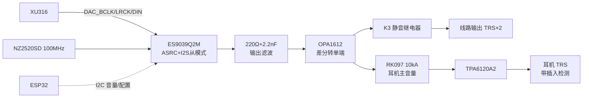

# 模块四：DAC 与输出（ES9039Q2M / 线路 / 耳机）

## 4.1 框图



## 4.2 器件清单

| 位号 | 型号 | 说明 | 立创 | 参考价 |
|---|---|---|---|---|
| U20 | ES9039Q2M | 2ch DAC，QFN-40 | item 44510869（代购）/淘宝 | ¥40~115 |
| U21 | OPA1612AIDR | 差分转单端×2，SOIC-8 | item 95788 | ¥5.22 |
| U22 | TPA6120A2DWPR | 耳机放大，HSOP-20 | item 71535 | ¥10.67 |
| Y20 | NZ2520SD 100MHz（或国产扬兴 OT2520 100M） | DAC 主时钟 | 淘宝 | ¥15 |
| K3 | 宏发 HFD4（2C） | 线路输出静音 | 淘宝 | ¥2.5 |
| RV1 | ALPS RK097 双联 10kA | 耳机模拟主音量 | 淘宝 | ¥8 |
| J6 | 6.35 TRS 座 ×2 | 线路输出 | 立创 | ¥3 |
| J7 | 6.35 TRS 耳机座（带插入检测开关） | 耳机 | 立创 | ¥3 |

## 4.3 关键电路

### 4.3.1 ES9039Q2M

- **电源**：DVDD←`V3V3D`（磁珠+10µF）；AVCC_L/AVCC_R、VCCA←`V3V3A`（各磁珠+10µF+0.1µF）。**供电脚名以 9039 datasheet 为准**（与 ES9038Q2M 结构相近：3.3V 全供电、内部 LDO 出核心压）；
- **MCLK**：Y20 100MHz 有源晶振（**由 V3V3A 供电**，这是它的相噪地板）→ 33Ω 串阻 → MCLK 脚。ASRC 常开，输入 I2S 任意速率都锁得住——**这就是全机不需要双晶振切换的原因**；
- **I2S 从模式**：`DAC_BCLK/LRCK/DIN` ← XU316（22Ω 串阻）；
- **I2C**：SDA/SCL → ESP32 总线；地址与 ES9822 错开（ADDR 引脚配置，按 datasheet）；
- **RST_N** → ESP32 GPIO，10k 上拉；
- **音量**：I2C 写数字音量寄存器（0.5dB/1dB 步进，按 datasheet），ESP32 做 **2ms/步 的 ramp**（旋钮转动时连续小步进，杜绝 zipper 噪声）；
- **输出**：`OUT_L+/−`、`OUT_R+/−` 差分**电压输出**（Q2M 系列内置输出级，无需 I/V 运放），标称摆幅按 datasheet（约 2Vrms 级）。

### 4.3.2 滤波与差分转单端（OPA1612）

每通道：

```
OUTx+ ──220Ω──┬──► R1 2.2k ────┐
               │                ├── Rf 2.2k ──┐
OUTx- ──220Ω──┴──► R2 2.2k ────┴── Cf 330pF ──┴──► OPA1612 输出 → K3 → J6
GND ────────────── R3 2.2k ───► 同相端
                        (2.2nF 于 220Ω 交汇点对 GND ×2)
```

- 220Ω+2.2nF：DAC 输出阻性隔离 + 高频泄放（fc≈330kHz，保护后级）；
- 差分放大器增益 = Rf/Rin = 1（2Vrms 线路标准电平）；Cf=330pF → 低通 fc≈219kHz（192k 内容平坦，滤除带外噪声）；
- OPA1612 双通道正好做 L/R，供电 ±5VA，输出 10Ω 串联隔离容性负载；
- K3（HFD4 双刀）**常开型**：上电默认断开，DAC 稳定后闭合（见 4.5 时序）。

### 4.3.3 耳机放大（TPA6120A2）

- 信号路径：OPA1612 输出 → RV1（10kA 双联，**模拟保底音量**）→ 1kΩ 串阻 + 470pF 到地 → TPA6120A2 同相输入；
- **反馈**：Rf=1k、Ri=1k → G=2（datasheet 推荐稳定值；CFA 结构 Rf 不能乱改）；
- 电源：VCC+=`+5VA`、VCC−=`−5VA`；**每个电源引脚 10µF+1µF(X7R)+0.1µF 三级贴身**（datasheet 硬要求，否则高频自激）；
- 输出：**10Ω 串联**（datasheet 要求，隔离耳机线容性）→ J7 Tip/Ring；
- 插入检测：J7 检测开关 → ESP32（拔出自动静音、插入恢复原音量）；
- ⚠️ 若 ±5VA 在大动态下被拉塌（LM27762 限流），二期方案：TPS65130 升 ±12V 专供 TPA6120A2，±5VA 只留给运放。

## 4.4 防爆音状态机（ESP32 实现）

| 事件 | 动作顺序 |
|---|---|
| 上电 | DAC RST 拉低 → I2C 初始化 → 音量写 **-60dB** → 释放 RST → 等 100ms → K3 闭合 → ramp 到默认 -40dB |
| 旋钮调音量 | 2ms/步 ramp，目标值由 RV1 位置与数字音量叠加（RV1 为主，数字为辅助限幅） |
| USB 断连/挂起 | XU316 通过 UART 发事件 → 先断开 K3 → 音量 ramp 到 -60dB |
| 静音键 | ramp 到 -∞ 档（保留 K3 闭合，恢复无爆音） |
| 关机/掉电 | K3 在 V5D 掉电前沿由硬件默认断开（常开继电器天然断开） |

## 4.5 布局红线

1. Y20 晶振紧贴 ES9039 MCLK 脚、包地；晶振供电必须走 V3V3A 且不经数字区；
2. ES9039 AVCC 去耦电容紧贴引脚，回流不过数字区；
3. TPA6120A2 的 1µF 电容**必须焊在电源引脚毫米级距离**；输出 10Ω 靠近芯片；
4. RV1 电位器信号线远离 XL6019/继电器线圈走线（感应哼声）；必要时信号线包地；
5. 线路输出座与耳机座布置在远离幻象 48V 与 DCDC 的一侧。
