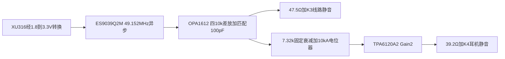
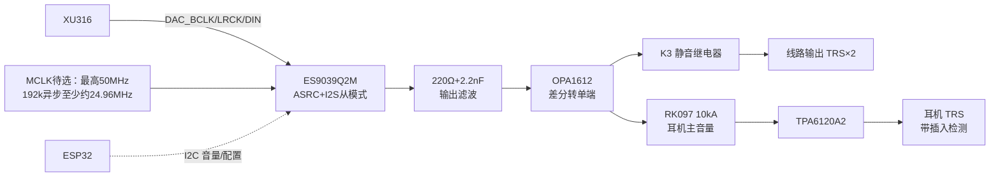

# 模块四：DAC 与输出（ES9039Q2M / 线路 / 耳机）

<!-- reva-audio-sync-20260916 -->

> **2026-09-16 Rev A：按下列输出拓扑绘制草图。** 完整管脚、元件网络、计算和失电检查见[Rev A音频设计](reva-audio-design.md)与[逐管脚表](../../hardware/asio-card-reva/audio-pin-net-plan.json)。折叠区是保留的历史内容，其旧差放ASCII、10Ω耳机输出、LM27762供电和复位顺序不再作为Rev A依据。

## Rev A DAC与输出路径



- **U20真实脚位**：QFN32/EPAD33接GND；AVCC1/8模拟3.3V，DVDD9内部1.2V仅去耦，AVDD10数字3.3V，VCCA31时钟3.3V；RT1=17接GND。DAC1/1B=3/2，DAC2/2B=7/6。
- **I2S/I2C**：BCLK12、LRCK13、DIN14；MODE29、ADDR1=19、ADDR0=20接GND→7-bit0x48，SCL15/SDA16使用`DAC_I2C_SCL/SDA`，各2.2k上拉V3V3_DAC_DIG，经数字页TCA9517A隔离。GPIO8无校准电阻时Reg34[6]=1。MCLK32取49.152MHz异步候选；最高50MHz，192k异步下限约24.96MHz。
- **电源/使能**：AVDD先起，约200µs后VCCA，随后模拟AVCC，再CHIP_EN18；先有效供电/时钟/使能，再初始化寄存器并静音，不能在复位保持期间盲写。I2C与I2S须防未供电反灌。
- **U21电压模式差放**：每路DAC_P经10k到+IN，DAC_N经10k到−IN，OUT经10k并100pF回−IN，+IN经10k并同值100pF到地。计每腿390Ω典型源阻，差分增益10k/10.39k≈0.96246，标称满幅SE约1.997Vrms；反馈极点159kHz。内阻失配/DC偏移、噪声及实际负载需验证，不继承原厂电流模式指标。
- **线路**：SE各经47.5Ω→K3.NO，K3.COM→相应J6 Tip，NC→GND；Ring/Sleeve按不平衡输出接地。左右共用一颗双OPA1612，供±5AFE。
- **耳机预算**：暂按32Ω每声道约1Vrms，不是用户已确认性能需求。每路SE经7.32k到10kA双联电位器，滑端100k回地、49.9Ω入TPA+IN；Rf=Ri=1k，反馈取39.2Ω之前的放大器输出，反馈不并电容。考虑输入负载后典型约0.981Vrms。
- **U22电源/管脚**：DWP20脚左电源3/1、右18/20接V6P_RAW/V6N_RAW（本轮约+6.45/−6.50V）；左输入4/5、输出2，右输入17/16、输出19；6–15 NC，PowerPAD焊接到GND。每电源脚就近100nF及局部1µF，轨bulk另配。
- **独立K4**：每路39.2Ω后接K4.NO，COM→J7 Tip/Ring、NC→GND；默认无音频。K3只保护线路，不能替代K4。两者非保持、先断后接，线圈供电与接点物理脚序另核。
- **失电安全尚未闭合**：TPA手册要求掉电输入峰值<600mV，输出继电器单独做不到；必须硬件输入隔离/钳低并与RAW故障门控配合。继电器毫秒级释放、AFE残存电荷、未上电数字IO、HP直流故障检测都需验收，不能把“线圈失电”当瞬时无爆音保证。

在1Vrms/32Ω预算点，每声道31.25mArms/44.19mApeak，39.2Ω约38.3mW，放大器输出需2.225Vrms/3.147Vpeak。两声道加静态电流的芯片热预算约0.61W量级，不按耳机输出62.5mW代替整级供电功耗。

<details>
<summary>保留的原有内容：2026-09-06及之前草案，不作为本版网表</summary>


> **2026-09-06 已回写DAC电源/封装/时钟参数；输出级仍未冻结。** 逐项原厂页码与模式条件见[转换器核验](../datasheet-audit/converters.md)。原ASCII滤波/运放图还需依据DAC源阻、共模及目标负载重算。

## 4.1 框图



## 4.2 器件清单

| 位号 | 型号 | 说明 | 立创 | 参考价 |
|---|---|---|---|---|
| U20 | ES9039Q2M | 2ch DAC，32-QFN 5×5mm/0.5mm，EPAD33接GND | 料号待核 | 历史¥40~115 |
| U21 | OPA1612AIDR | 差分转单端×2，SOIC-8 | item 95788 | ¥5.22 |
| U22 | TPA6120A2DWPR | 耳机放大，HSOP-20 | item 71535 | ¥10.67 |
| Y20 | 待选有源晶振，MCLK≤50MHz | 192k异步要求≥约24.96MHz；24.576MHz不可直接替换 | 待定 | 待定 |
| K3 | 宏发 HFD4（2C） | 线路输出静音 | 淘宝 | ¥2.5 |
| RV1 | ALPS RK097 双联 10kA | 耳机模拟主音量 | 淘宝 | ¥8 |
| J6 | 6.35 TRS 座 ×2 | 线路输出 | 立创 | ¥3 |
| J7 | 6.35 TRS 耳机座（带插入检测开关） | 耳机 | 立创 | ¥3 |

## 4.3 关键电路

### 4.3.1 ES9039Q2M

- **电源**：AVDD10及VCCA31推荐3.3V±5%；AVCC_DAC1 pin1/AVCC_DAC2 pin8为3.3V模拟轨，其表内±15%有ES9312Q校准脚注，不能当通用容差。**p11要求AVCC_DAC2 pin8与DVDD pin9各1µF钽去耦**，不能统一替成X7R；pin1 AVCC_DAC1和pin10 AVDD亦各要求1µF，但该两行未指定钽。DVDD9是内部1.2V，**不得接1.8/3.3V**。外供1.2V的适用条件本手册未建立，不擅自采用。RT1 pin17与EPAD33接地。
- **MCLK pin32**：最高50MHz；异步模式需≥130×Fs，192k时至少约24.96MHz。具体频率、gearing及同步/异步模式须一起冻结；100MHz超限，24.576MHz不满足192k异步要求。晶振供电/串阻/抖动由精确料号和时序核验，不能用“ASRC任意速率都锁住”代替计算。
- **I2S 从模式**：`DAC_BCLK/LRCK/DIN` ← XU316（22Ω 串阻）；
- **I2C**：SCL15/SDA16；MODE29直接GND选择I2C，7-bit地址0x48–0x4B。≤400kHz且满足内部CLK/20等时序约束，访问寄存器须已有系统时钟。
- **CHIP_EN pin18**：实际使能脚。上电按AVDD→约200µs后VCCA→AVCC→CHIP_EN，关机反序；旧泛称RST_N不得当作真实管脚名。
- **音量**：0到−127.5dB、0.5dB步进，Reg74/75和内置ramp，DAC mute为Reg86；外部控制平滑仍需实测瞬态。
- **输出**：DAC1/1B、DAC2/2B每腿源阻390Ω±15%，共模AVCC/2，摆幅0.889×AVCC Vpp；3.3V下理想无负载差分约2.07Vrms。电压取出可行，但不是低阻线路驱动；原2.2k差放及滤波须计入源阻、负载和目标噪声。

### 4.3.2 滤波与差分转单端（OPA1612）

每通道：

```
OUTx+ ──220Ω──┬──► R1 2.2k ────┐
               │                ├── Rf 2.2k ──┐
OUTx- ──220Ω──┴──► R2 2.2k ────┴── Cf 330pF ──┴──► OPA1612 输出 → K3 → J6
GND ────────────── R3 2.2k ───► 同相端
                        (2.2nF 于 220Ω 交汇点对 GND ×2)
```

- 220Ω+2.2nF：DAC 输出阻性隔离 + 高频泄放（fc≈330kHz，保护后级）；
- 差分放大器增益 = Rf/Rin = 1（2Vrms 线路标准电平）；Cf=330pF → 低通 fc≈219kHz（192k 内容平坦，滤除带外噪声）；
- OPA1612 双通道正好做 L/R，供电 ±5VA，输出 10Ω 串联隔离容性负载；
- K3（HFD4 双刀）**常开型**：上电默认断开，DAC 稳定后闭合（见 4.5 时序）。

### 4.3.3 耳机放大（TPA6120A2）

- 信号路径：OPA1612 输出 → RV1（10kA 双联，**模拟保底音量**）→ 1kΩ 串阻 + 470pF 到地 → TPA6120A2 同相输入；
- **反馈**：Rf=1k、Ri=1k → G=2（datasheet 推荐稳定值；CFA 结构 Rf 不能乱改）；
- 电源：VCC+=`+5VA`、VCC−=`−5VA`；**每个电源引脚 10µF+1µF(X7R)+0.1µF 三级贴身**（datasheet 硬要求，否则高频自激）；
- 输出：**10Ω 串联**（datasheet 要求，隔离耳机线容性）→ J7 Tip/Ring；
- 插入检测：J7 检测开关 → ESP32（拔出自动静音、插入恢复原音量）；
- ⚠️ 若 ±5VA 在大动态下被拉塌（LM27762 限流），二期方案：TPS65130 升 ±12V 专供 TPA6120A2，±5VA 只留给运放。

## 4.4 防爆音状态机（ESP32 实现）

| 事件 | 动作顺序 |
|---|---|
| 上电 | DAC RST 拉低 → I2C 初始化 → 音量写 **-60dB** → 释放 RST → 等 100ms → K3 闭合 → ramp 到默认 -40dB |
| 旋钮调音量 | 2ms/步 ramp，目标值由 RV1 位置与数字音量叠加（RV1 为主，数字为辅助限幅） |
| USB 断连/挂起 | XU316 通过 UART 发事件 → 先断开 K3 → 音量 ramp 到 -60dB |
| 静音键 | ramp 到 -∞ 档（保留 K3 闭合，恢复无爆音） |
| 关机/掉电 | K3 在 V5D 掉电前沿由硬件默认断开（常开继电器天然断开） |

## 4.5 布局红线

1. Y20 晶振紧贴 ES9039 MCLK 脚、包地；晶振供电必须走 V3V3A 且不经数字区；
2. ES9039 AVCC 去耦电容紧贴引脚，回流不过数字区；
3. TPA6120A2 的 1µF 电容**必须焊在电源引脚毫米级距离**；输出 10Ω 靠近芯片；
4. RV1 电位器信号线远离 XL6019/继电器线圈走线（感应哼声）；必要时信号线包地；
5. 线路输出座与耳机座布置在远离幻象 48V 与 DCDC 的一侧。

</details>
