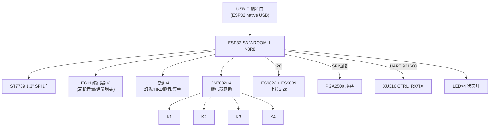

# 模块五：ESP32-S3 控制板（屏幕/旋钮/继电器/协议）

## 5.1 框图



## 5.2 器件清单

| 位号 | 型号 | 说明 | 立创 | 参考价 |
|---|---|---|---|---|
| U30 | ESP32-S3-WROOM-1-N8R8 | 管理 MCU | item 3198299 | ¥20.93 |
| J8 | USB-C 16P 母座 | 编程/日志口（native USB GPIO19/20） | 立创 | ¥1.5 |
| LCD1 | ST7789 1.3" 240×240 模块 | 电平表/参数屏 | 淘宝 | ¥18 |
| SW2/3 | EC11 编码器（国产即可） | 旋钮×2 | 立创 | ¥1×2 |
| SW4~7 | 轻触按键×4 | 功能键 | 立创 | ¥0.2×4 |
| Q1~Q4 | 2N7002 | 继电器驱动 | 立创 | ¥0.05×4 |
| D10~13 | SS14 | 线圈续流 | 立创 | ¥0.1×4 |
| LED1~4 | 0603 LED（绿×2/红×1/蓝×1） | 电源/48V/USB/过载 | 立创 | ¥0.05×4 |
| — | 10k/2.2k/1k 电阻若干 | | | ¥2 |

## 5.3 电路要点

- **供电**：V3V3D，模块脚位 10µF+0.1µF；EN 脚 10k 上拉 + 1µF 到地 + 复位按键（可选）；
- **编程**：J8 的 D± → ESP32 GPIO19/20（native USB），CC 5.1k 下拉，ESD 同 U12 规格；烧录用 Arduino/ESP-IDF 均可（LVGL 有现成 demo）；
- **屏幕**：SPI 四线（SCK/MOSI/CS/DC）+ RST + BL（GPIO PWM 调背光）；3.3V 供电，信号电平 3.3V 直连；
- **编码器/按键**：A/B 脚各 10k 上拉 + 100nF 滤波（或软件消抖），公共脚接地；按键用 ESP32 内部上拉即可；
- **继电器驱动**：GPIO → 1k → 2N7002 栅极（栅源并 100k 下拉），漏极接线圈负端，线圈正端接 V5D，线圈并 SS14 续流。**线圈用 V5D 5V**（HFD4 5V 型）；
- **I2C 总线**：SDA/SCL（用 ESP32 硬件 I2C 外设脚），2.2k 上拉到 V3V3D，挂 ES9822 + ES9039（地址按 03/04 模块错开）；PGA2500 的 CS/SCLK/SDI/SDO 用独立 GPIO 位段；
- **VBUS 检测**（可选）：V5D 分压 → GPIO，用于显示"USB 已连接/掉线"。

## 5.4 UART 协议（XU316 ↔ ESP32，921600-8N1）

帧格式（小端）：

```
| 0xAA | CMD | LEN | PAYLOAD[0..LEN-1] | CRC8(0x07, 含CMD..PAYLOAD) | 0x55 |
```

| CMD | 方向 | 名称 | PAYLOAD |
|---|---|---|---|
| 0x01 | ESP→XU | 设置混音矩阵 | 10 个电平(1B, 0~255)：源序 `Mic/Line/Main/Backing/Game`，先"→监听"5 字节再"→直播混音"5 字节；限幅阈值(1B,-dB)、限幅使能(1B) |
| 0x02 | ESP→XU | 查询状态 | 空 |
| 0x03 | ESP→XU | 恢复出厂混音 | 空 |
| 0x04 | ESP→XU | 混音预设切换 | 预设编号(1B)：0=直通 1=直播标准 2=纯监听 |
| 0x11 | XU→ESP | VU 电平（30~50Hz） | mic(2B dBFS×100)、line(2B)、streamMixL(2B)、streamMixR(2B)、monitorL(2B)、monitorR(2B)、clip标志(1B) |
| 0x12 | XU→ESP | 状态回包 | usb连接(1B)、采样率(1B: 0=44.1k族 1=48k族)、当前速率(2B, Hz)、固件版本(2B) |
| 0x13 | XU→ESP | 事件 | 0x01=USB断连 0x02=USB恢复 0x03=ASIO流启动 0x04=ASIO流停止 |

- CRC 校验失败丢弃重发（ESP→XU 命令重发一次）；
- ESP32 侧 50ms 未收到 0x11 判定通信异常，屏幕显示告警。

## 5.5 屏幕 UI（LVGL，一屏三段）

```
┌────────────────────────┐
│ USB ✓ 48V ✗  HiZ ✗  MUTE│  状态行
│  MIC ▂▄▆█▆▄▂  G:+35dB   │  话筒电平表+增益
│  MIX ▂▄▆█▆▄▂  HP:-22dB │  混音电平表+耳机音量
└────────────────────────┘
```

- 编码器1（单击选通道/长按菜单）；编码器2（调当前值）；
- **混音矩阵页**：菜单进入后可逐项调 5 源×2 目的地（Mic/Line/Main/Backing/Game → 监听/直播混音）共 10 个电平 + 限幅开关；支持 0x04 预设一键切换（直通/直播标准/纯监听）；
- 过载（clip）时屏幕红闪 + 红色 LED（直播防爆的视觉锚点）。

## 5.6 布局红线

1. I2C/UART/SPI 线远离 ±5VA 模拟走线与 48V 区；
2. 继电器驱动与线圈走线成组，远离 PGA2500 输入；
3. 屏幕 FPC 座与旋钮按键按外壳结构定位，先做 3D 模型再定坐标；
4. ESP32 天线区域（模块尾部）净空，外壳开窗或非金属。
