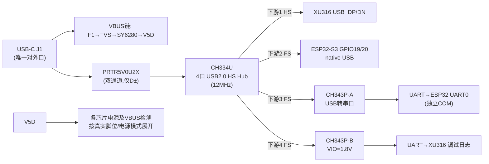

# 模块七：USB-C 具体设计（单口 + 内置 Hub 架构，v2）

> **2026-09-06 已补齐CH334/CH343手册并回写关键参数；供电与模式仍未冻结。** 证据见[USB桥核验](../datasheet-audit/usb-bridges.md)及[保护器件核验](../datasheet-audit/digital-protection.md)。普通COM日志不等于xLINK/XTAG xSCOPE。

> 架构变更（ADR D10）：**取消第二 USB-C（J8），整机只留一个 USB-C**，板载 4 口 Hub（沁恒 CH334U）分为：下游1→XU316（音频）、下游2→ESP32-S3 native USB（刷机/维护）、下游3→CH343P（USB 转串口，调试 COM 口）。

## 7.1 框图



**带宽/功耗边界**：XU链路为HS，ESP32/两颗CH343为FS；目标1HS+3FS混合负载仍需音频压力测试。CH334的85mA是4HS下游测试的typ，不是本拓扑保证最大值，不能写“零影响／合计70mA”作为验收。

## 7.2 USB-C 16P 引脚接线表（仅 J1）

| 脚位 | 名称 | 接法 |
|---|---|---|
| A1/B1、A12/B12 | GND | → GND |
| A4/A9/B4/B9 | VBUS | → F1(1A PTC) → TVS → U1 SY6280 → V5D |
| A5 | CC1 | → **5.1kΩ 1% 到 GND**（Rd，UFP） |
| B5 | CC2 | → 同上（另一颗独立 5.1kΩ） |
| A6/B6 | D+ | → ESD → **CH334U 上游 D+**（CMC 可选，默认 0Ω） |
| A7/B7 | D− | → 同上 → CH334U 上游 D− |
| A8/B8 | SBU1/2 | 悬空 NC |
| S1（外壳） | 屏蔽 | → 0Ω → GND（宽连接+多过孔） |

- VBUS 入口电容 ≤4.7µF（1µF+0.1µF），22µF 在 eFuse 之后；TVS = SMBJ5.0A；
- **顺序有讲究**：限流件 PTC 必须在 TVS 之前（持续过压时由 PTC 限流保护 TVS 不烧毁——TVS 只扛脉冲、扛不住持续功率）；PTC 与 SY6280 谁前谁后功能等价，惯例 PTC 最靠连接器（最外层无源防线）；
- CC 不加电容（二期 CH224K PD 升级留路）；Rd 两颗独立；
- **VBUS检测**：必须对应真实USB存在状态。原100k/100k产生约2.5V，不能接XU1.8V输入；XU原厂例为220k/100k。ESP32与XU不能未经门槛/耐压核对共用检测节点，V5D受DC维持时也不能识别主机拔出。

## 7.3 上游数据链

```
J1.D± ──► CMC(顺络SDCW2012-2-900TF, 可选/默认0Ω×2) ──► PRTR5V0U2X ──► CH334U 上游 D±
```

- **PRTR5V0U2X**（友台 UMW 国产版，C5158049，¥0.13，SOT143，~1pF）双通道：只保护 D±，距 J1 ≤10mm。**引脚（以 datasheet 为准）：1=GND、2=I/O1、3=I/O2（D+/D− 各占一路、电气完全对称）、4=VCC（rail-to-rail 钳位轨，接 V3V3D+0.1µF，部分设计悬空）**；D± 差分等长对称由走线保证；
- UMW本版VRWM=5V、VC=10V typ@3.5A/8–20µs；没有保证“VCC+0.7V钳位”。pin4上轨连接需配被保护Hub、吸收能力、掉电反灌和原厂应用核算；撤回“任何ESD器件都必须接3.3V/禁止5V”的通用推断。
- CC1/CC2的5.1k只是Rd，不能作为已通过ESD保护的依据；是否增加保护须按接口风险与精确保护器件验证。
- 上游差分 **90Ω±10%**（JLC04161H-7628 层叠算阻抗或下单勾阻抗控制）。

## 7.4 CH334U Hub（核心）

| 项 | 设计 |
|---|---|
| 型号/封装 | CH334U，QSOP-28（立创 C5187524，约 ¥2~3） |
| 供电 | 外部3.3V模式要求V5 pin20和VDD33 pin13/21全接3.2–3.4V；5V模式接法另按手册；不可遗漏任一供电脚 |
| 时钟 | 12MHz外晶体，芯片已有负载电容；不默认再加18/22pF，具体CL/ESR料号待核 |
| 上游 | D± ← ESD（见 7.3） |
| 下游 1 | D± → **XU316 USB_DP/DN**（HS，差分 90Ω，短而直） |
| 下游 2 | D± → **ESP32-S3 GPIO19(D−)/GPIO20(D+)**（FS） |
| 下游 3 | D± → **CH343P-A UD−/UD+**（FS，→ESP32 UART0） |
| 下游 4 | D± → **CH343P-B UD−/UD+**（FS，→XU316 调试 UART） |
| 电源模式 | CH334U仅GANG整体控制；PSELF默认self-powered，需按实际供电选择；PWREN#/OVCUR#低有效，不能因为设备内置就忽略Hub描述与电源控制 |
| 复位/过流 | RESET#/CDP上电主动高可能开启CDP并改变挂起行为；只按原厂电路拉低复位。总限流、Hub过流和USB公告需联合闭合 |

> 备选：汤铭 FE1.1s / 创惟 GL850G（同为 HS 4 口，立创有货、资料公开）——CH334U 缺货时的替换位。

## 7.5 双调试串口（下游 3/4：CH343P ×2，各自独立 COM）

| 项 | CH343P-A（下游3） | CH343P-B（下游4） |
|---|---|---|
| UART 目标 | **ESP32 UART0**（GPIO43/44） | **XU316 调试 UART**（`DEBUG_TX/RX`，1-bit 端口） |
| 用途 | ESP32日志/console | XU串口日志；不是现代xSCOPE，DEBUG_RX命令接收尚未实现 |
| 备注 | USB FS，UART50bps～6Mbps；两颗芯片分别枚举COM，CDC/VCP按实机配置验证 | 独立VIO pin1可接V1V8；须核容差/驱动/负载，nominal条件门槛匹配 |

- CH343P的VDD5 pin3/V3 pin6在外3.3V模式共同接3.0–3.6V；VIO pin1另选：A接ESP32的3.3V域，B接XU的1.8V域。不能给VDD5/V3整体供1.8V。pin9 VBUS负责真实USB检测；原生USB D±不要加额外串阻。每片IVDD typ3/max15mA，另计IO负载；COM并行与驱动仍需实测。
- 备选：CH342F（双串口单芯片，C2841530 ¥8.05，可省一个 Hub 下游口）——本设计按用户决策用 CH343P×2（¥5 更便宜）。

## 7.6 器件清单（本模块新增/变更）

| 位号 | 器件 | 参数/封装 | 立创 | 参考价 |
|---|---|---|---|---|
| J1 | USB-C 16P 母座 | 板载沉板，带屏蔽脚 | 立创搜 "TYPE-C 16P 沉板" | ¥1.5 |
| U12 | PRTR5V0U2X（友台 UMW） | 上游 ESD 双通道（仅 D±），SOT143 | **C5158049** | ¥0.13 |
| F1/TVS1/U1 | PTC / SMBJ5.0A / SY6280 | 同 01-power | C55136 | — |
| **U40** | **CH334U** | 4口 HS Hub，QSOP-28 | **C5187524** | ¥2.5 |
| Y40 | 12MHz 晶振 | 按 CH334U 手册负载电容 | 立创搜 | ¥0.6 |
| **U41** | **CH343P-A** | USB 转串口（→ESP32 UART0），免晶振 | item 3039795 | ¥2.5 |
| **U42** | **CH343P-B** | USB 转串口（→XU316 调试 UART），免晶振 | item 3039795 | ¥2.5 |
| LCMC1 | 顺络 SDCW2012-2-900TF | CMC（可选，默认 0Ω×2） | 立创搜 SDCW2012 | ¥0.5 |
| Rd1-2 | 5.1kΩ 1% 薄膜 0603 | CC 下拉 ×2 | 立创 | ¥0.05 |
| — | 0Ω×4、100k×2、10nF、去耦若干 | | 立创 | ¥0.5 |

## 7.7 布局规则

1. 上游差分 90Ω、ESD ≤10mm（同 v1）；CMC 位直排；
2. **CH334U 放数字区中央**（USB 星形拓扑的中心），到三个下游设备的差分对**尽量短**；XU316 那对（HS）优先最短+地平面连续；
3. 12MHz 晶振紧贴 CH334U、下方不穿线；CH334U 地焊盘多过孔；
4. CH343P 与调试排针远离模拟区（UART 边沿噪声）；
5. 下游 VBUS 从 V5D 各走一根 0.3mm+ 线，设备端 0.1µF 就近；
6. 屏蔽壳 0Ω 位保留（地环时换磁珠）。

## 7.8 检查清单

- [ ] ESD：PRTR5V0U2X 双通道仅接 D±；**CC 不加 ESD**（5.1k 即泄放路径）；
- [ ] VBUS 入口电容 ≤4.7µF；TVS 就近 J1；
- [ ] CH334U 12MHz 晶振 + 负载电容按手册；VDD=3.3V 去耦齐；
- [ ] 4 个下游口全用（1=XU316、2=ESP32、3=CH343P-A、4=CH343P-B）；下游 VBUS 直连 V5D；
- [ ] CH343P×2 免晶振、VDD=3.3V；A 接 ESP32 UART0、B 接 XU316 `DEBUG_TX/RX`；
- [ ] 差分 90Ω 阻抗计算/下单勾选；
- [ ] 测试点：TP-USB_D±（上游，差分探针）。
