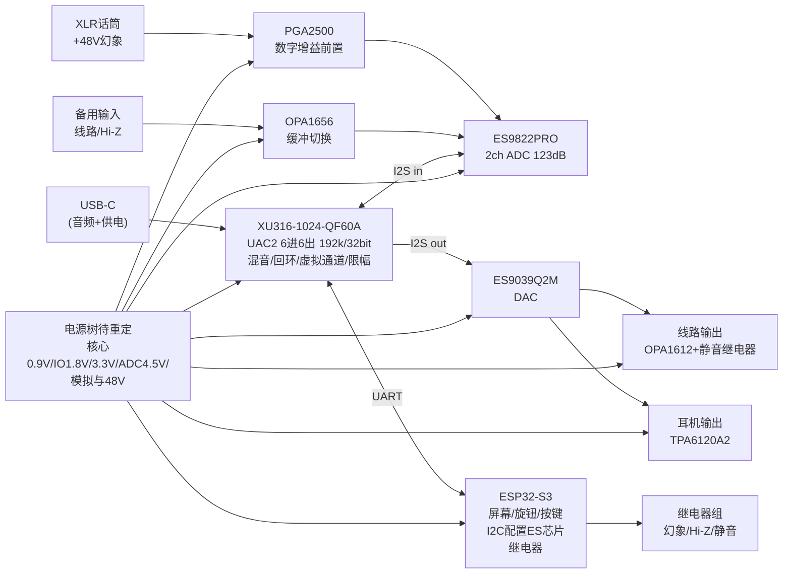

# 直播声卡 ASIO-CARD 分模块原理图设计总纲

> **2026-09-06：关键参数已按38份PDF核验并部分回写；本目录仍非可投板原理图。** 参数入口是[datasheet核验总表](../datasheet-audit/README.md)；旧图、拓扑候选及功能目标不能替代逐脚签核。

阻容感可先按[通用选型规格](../passive-parts-spec.md)与[规格CSV](../passives-spec.csv)落图，后补厂家/立创料号；特殊磁件、电解和接插件的物理封装应在PCB前落实。

> 版本 v1.0 — 设计阶段：原理图级。所有 IC 引脚号/引脚名**以对应 datasheet 为准**，本文给出的是**电路拓扑、器件取值、网络连接关系与设计约束**。转画到立创EDA/KiCad 时请逐页核对 datasheet 引脚定义。

## 1. 顶层框图



## 2. 模块文档

| 模块 | 文件 | 内容 |
|---|---|---|
| 0 | README.md（本文） | 命名规范、顶层互联、关键决策 |
| 1 | [01-power.md](01-power.md) | USB输入保护、全部电源轨、时序、功率预算 |
| 2 | [02-xu316-core.md](02-xu316-core.md) | XU316 电源/晶振/Flash/xSYS/USB/I2S/UART 连接 |
| 3 | [03-adc-frontend.md](03-adc-frontend.md) | 话筒前置+幻象、备用输入、ES9822 |
| 4 | [04-dac-outputs.md](04-dac-outputs.md) | ES9039Q2M、LPF、线路输出、耳机放大 |
| 5 | [05-control.md](05-control.md) | ESP32-S3、屏幕、旋钮、继电器、UART协议 |
| 6 | [06-system.md](06-system.md) | 整机互联、地策略、上电时序、测试点、打样验证 |
| 7 | [../hardware-design-flow.md](../hardware-design-flow.md) | 画图顺序、图页划分、每页要点、建库核对清单 |
| 8 | [07-usb-c.md](07-usb-c.md) | USB-C 具体设计：单口+内置 Hub（CH334U→XU316/ESP32/CH343P 串口） |
| 9 | [fig/](fig/) | **原理图 SVG**：[OVERVIEW-simple.svg](fig/OVERVIEW-simple.svg) 一页简图（推荐先看）+ S2~S6 五张详细图 |
| 10 | [../hardware-devices-design.md](../hardware-devices-design.md) | **全机器件与外围电路设计汇总**：35 份 datasheet 推荐电路 ↔ 本设计外围逐器件对照，冲突点集中在 §12.3 必改清单（画图前必读） |
| - | [BOM.csv](../BOM.csv) | 全机物料（含立创编号/替代型号） |

## 3. 网络命名规范

| 前缀 | 含义 | 说明 |
|---|---|---|
| `VUSB` | USB VBUS 5V（保护前） | |
| `V5D` | 保护后 5V 主轨 | eFuse/PTC 之后 |
| `V3V6` | 3.6V 中间轨 | SY8089(U2B) 输出，仅供 AP7361C（两级降压，见 01-power 1.3.3） |
| `V3V3D` | 3.3V 数字轨 | ESP32/Hub/串口USB侧等；XU316 GPIO不接此轨，ESS的内部DVDD也不接此轨 |
| `V0V9` | 0.9V XU316 核（VDD 标称 0.9V，官方手册确认） | SY8089 |
| `V1V8` | 1.8V | XU316全部IO域/USB_VDD18、待选1.8V Flash、XU调试桥VIO；不得外供ESS内部DVDD |
| `+5VA` / `-5VA` | ±5V 模拟轨 | LM27762，供前置/运放/耳放 |
| `V3V3A` | 3.3V 模拟轨 | GM1205（共模，1.8µV 超低噪；LT3045 为 pin-to-pin 发烧备选），供 ES9822 AVDD、ES9039 AVCC/VCCA、100M 晶振 |
| `V48` | +48V 幻象 | XL6019，经 K1 继电器后为 `PH48` |
| `AGND` | 模拟地 | 与数字地单平面（见 06-system） |
| `CHASSIS` | 机壳/屏蔽网 | XLR pin1、金属面板/座体；USB 入口单点接 GND（见 06-system） |
| `ADC_*` | ES9822 I2S | BCLK/LRCK/MCLK/DOUT |
| `DAC_*` | ES9039 I2S | BCLK/LRCK/DIN |
| `I2C_SDA/SCL` | ESP32 主 I2C | 接 ES9822 + ES9039（PGA2500 用独立 SPI 位段） |
| `CTRL_TX/RX` | XU316↔ESP32 UART | 921600-8N1 |
| `K1..K4` | 继电器位号 | 见 05-control |

## 4. 关键设计决策（ADR）

| # | 决策 | 理由 |
|---|---|---|
| D1 | 单地平面 + 分区布局，不做地分割 | 现代 ADC/DAC 布局实践；分割地易引入回流问题。模拟/数字区域物理隔离，地平面连续，电源分区 |
| D2 | **ESP32 承担全部慢速控制**（I2C 配置 ES 芯片、PGA2500 增益、继电器、音量 ramp），XU316 只做音频+USB+UART | XU316 QF60A 引脚有限；固件免去 I2C/SPI 库；音量/增益调节逻辑集中在一处 |
| D3 | 主控候选XU316-1024-QF60A-C24 | 2 tile/16逻辑核、600MHz；实际任务与端口预算见固件审阅，不以总核数保证音频负载 |
| D4 | 话筒前置用 PGA2500（数字增益）而非 THAT1512+继电器 | "智能管理"需求；0dB/10~65dB（1dB 步进）数控；EIN 约 -126dBu 略逊 THAT1512 的 -129dBu，但增益范围/步进/可用性全面占优 |
| D5 | 耳机主音量用**模拟电位器**（保底）+ ES9039 数字音量（智能调节）双保险 | 固件死机时物理旋钮仍能降音量 |
| D6 | USB功率公告、限流、外部供电路线待闭合 | 声明500mA不能使实际约0.9A预算自动合规，见已勘误电源页 |
| D7 | ADC按22.5792/24.576MHz等原厂配置；DAC独立MCLK重新选型 | DAC最高50MHz，192k异步至少约24.96MHz；时钟/寄存器/电平转换需一起核验 |
| D8 | USB6进6出作为路由目标，物理2输入/立体声DAC | 独立Windows端点取决于描述符/驱动，延迟与CPU开销须实测，不能承诺自动拆分或零开销 |
| D9 | 管理 MCU 最终定 **ESP32-S3-WROOM-1-N8R8**（对比 CH32H417 后确认） | LVGL 零移植、生态大；WiFi 默认关闭（射频共存：天线区远离模拟区+外壳屏蔽）；CH32H417（双核 RISC-V/896KB SRAM）记录为无射频备胎，切换只改 05 模块 |
| D10 | **单 USB-C + 内置 Hub**：CH334U（4口 HS）→ 下游1 XU316 音频 / 下游2 ESP32 native USB / 下游3 CH343P-A→ESP32 UART0 / 下游4 CH343P-B→XU316 调试 UART（xSCOPE） | 一个口解决音频+刷机+双路调试串口；取消第二 USB-C；Hub 对 HS 音频流零延迟影响 |

## 4.1 通道规划（6进6出虚拟通道）

> 固件层定义，硬件不变。Windows 侧由 Thesycon 驱动按立体声对自动拆分为多个独立设备，App 在系统"应用音量"里各指一个设备即可。

**播放（PC→设备，6ch）**

| 通道 | Windows 设备名 | 用途 |
|---|---|---|
| OUT 1-2 | Main Monitor L/R | 主监听（系统声音/浏览器） |
| OUT 3-4 | Backing L/R | 伴奏/音乐播放器 |
| OUT 5-6 | Game Voice L/R | 游戏/语音软件 |

**捕获（设备→PC，6ch）**

| 通道 | Windows 设备名 | 用途 |
|---|---|---|
| IN 1 | Mic | 话筒干声（给 DAW 挂 VST） |
| IN 2 | Line | 备用输入干声 |
| IN 3-4 | Stream Mix L/R | **直播混音回环**：话筒+备用+三路 PC 播放的硬件混合，OBS 直接采这一对 |
| IN 5-6 | Host Loopback L/R | PC 播放干声回环（DAW 采样/侧链等进阶玩法） |

**设备内混音矩阵**（XU316 固件，ESP32 屏幕可调每个源音量，电平 0~255）：

```
监听输出   = Mic(零延迟) + Line + Main + Backing + Game    ← 主播耳朵
直播混音   = Mic + Line + Main + Backing + Game            ← 观众听到（IN3-4 回环）
```

带宽：12ch × 192kHz × 32bit ≈ 74Mbps，仅占 USB2.0 HS 的 ~15%，192k/32bit 全开无压力。

## 5. 参考资料（画图时逐引脚核对）

- XU316 电源/复位/Flash/xSYS/USB 接线：官方硬件设计文件 **xmos/xk_audio_316_mc**（GitHub 公开），引脚与去耦以它为金标准；
- 固件：**xmos/sw_usb_audio**（GitHub 公开），端口映射在其 `xua_conf.h`/应用源码中定义；
- ES9822 初始化配置：E1DA Cosmos ADC 社区资料（ASR 论坛有公开讨论，其测量结果证明 123dB 可用）；
- THAT/PGA2500 幻象与 EMI 接法：THAT1510 datasheet 应用电路（幻象电阻/耦合/EMI 结构通用）；
- TPA6120A2：TI datasheet 推荐布局（电源去耦 1µF 贴身、输出串阻）；
- LM27762 / XL6019 / SY8089 / SGM2036 / GM1205：各自 datasheet 典型应用图。

> ⚠️ 画图红线：本文所有"引脚名"均为功能名；**落库前必须打开 datasheet 把每个引脚号核对一遍**，尤其是 XU316 QF60A、ES9822PRO、ES9039Q2M、PGA2500、TPA6120A2 五个大芯片。
