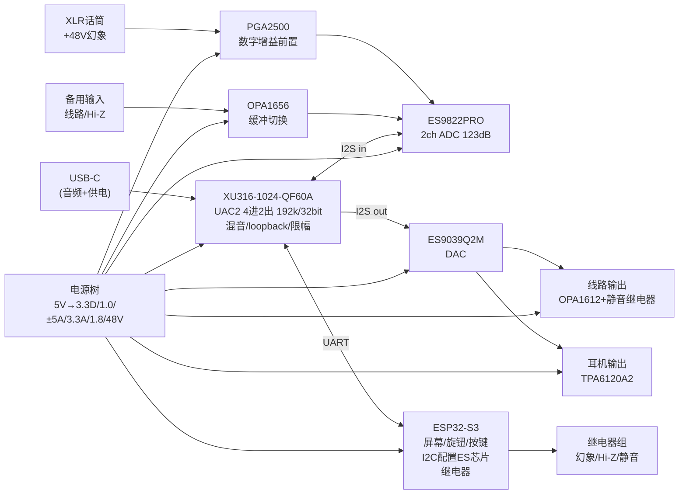

# 直播声卡 ASIO-CARD 分模块原理图设计总纲

> 版本 v1.0 — 设计阶段：原理图级。所有 IC 引脚号/引脚名**以对应 datasheet 为准**，本文给出的是**电路拓扑、器件取值、网络连接关系与设计约束**。转画到立创EDA/KiCad 时请逐页核对 datasheet 引脚定义。

## 1. 顶层框图

## 2. 模块文档

| 模块 | 文件 | 内容 |
|---|---|---|
| 0 | README.md（本文） | 命名规范、顶层互联、关键决策 |
| 1 | [01-power.md](01-power.md) | USB输入保护、全部电源轨、时序、功率预算 |
| 2 | [02-xu316-core.md](02-xu316-core.md) | XU316 电源/晶振/Flash/xSYS/USB/I2S/UART 连接 |
| 3 | [03-adc-frontend.md](03-adc-frontend.md) | 话筒前置+幻象、备用输入、ES9822 |
| 4 | [04-dac-outputs.md](04-dac-outputs.md) | ES9039Q2M、LPF、线路输出、耳机放大 |
| 5 | [05-control.md](05-control.md) | ESP32-S3、屏幕、旋钮、继电器、UART协议 |
| 6 | [06-system.md](06-system.md) | 整机互联、地策略、上电时序、测试点、打样验证 |
| - | [BOM.csv](../BOM.csv) | 全机物料（含立创编号/替代型号） |

## 3. 网络命名规范

| 前缀 | 含义 | 说明 |
|---|---|---|
| `VUSB` | USB VBUS 5V（保护前） | |
| `V5D` | 保护后 5V 主轨 | eFuse/PTC 之后 |
| `V3V3D` | 3.3V 数字轨 | SGM2036，供 XU316 IO/ESP32/ES 数字 |
| `V1V0` | 1.0V XU316 核 | SY8089 |
| `V1V8` | 1.8V | TPS7A20，ES9822 DVDD（按手册取舍） |
| `+5VA` / `-5VA` | ±5V 模拟轨 | LM27762，供前置/运放/耳放 |
| `V3V3A` | 3.3V 模拟轨 | LT3045，供 ES9822 AVDD、ES9039 AVCC/VCCA、100M 晶振 |
| `V48` | +48V 幻象 | XL6019，经 K1 继电器后为 `PH48` |
| `AGND` | 模拟地 | 与数字地单平面（见 06-system） |
| `ADC_*` | ES9822 I2S | BCLK/LRCK/MCLK/DOUT |
| `DAC_*` | ES9039 I2S | BCLK/LRCK/DIN |
| `I2C_SDA/SCL` | ESP32 主 I2C | 接 ES9822 + ES9039（PGA2500 用独立 SPI 位段） |
| `CTRL_TX/RX` | XU316↔ESP32 UART | 921600-8N1 |
| `K1..K4` | 继电器位号 | 见 05-control |

## 4. 关键设计决策（ADR）

| # | 决策 | 理由 |
|---|---|---|
| D1 | 单地平面 + 分区布局，不做地分割 | 现代 ADC/DAC 布局实践；分割地易引入回流问题。模拟/数字区域物理隔离，地平面连续，电源分区 |
| D2 | **ESP32 承担全部慢速控制**（I2C 配置 ES 芯片、PGA2500 增益、继电器、音量 ramp），XU316 只做音频+USB+UART | XU316 QF60A 引脚有限；固件免去 I2C/SPI 库；音量/增益调节逻辑集中在一处 |
| D3 | 主控用 XU316-1024-QF60A（立创 ¥41.07） | 立创价格比 XU208（¥70）还低；8 核足够 4进2出+混音；引脚预算见 02 |
| D4 | 话筒前置用 PGA2500（数字增益）而非 THAT1512+继电器 | "智能管理"需求；0~65dB 数控；EIN 约 -126dBu 略逊 THAT1512 的 -129dBu，但可用性高得多 |
| D5 | 耳机主音量用**模拟电位器**（保底）+ ES9039 数字音量（智能调节）双保险 | 固件死机时物理旋钮仍能降音量 |
| D6 | 供电仍以 USB 500mA 描述符为准，实际典型 0.6~0.9A；预留 DC 5V 备份输入 | 见 01-power 功率预算 |
| D7 | 100MHz 有源晶振直供 ES9039（ASRC 模式），ADC 用 XU316 PLL 出 MCLK | 免双频点晶振切换；ES9822 端 MCLK 随采样率族自动切换 |

## 5. 参考资料（画图时逐引脚核对）

- XU316 电源/复位/Flash/xSYS/USB 接线：官方硬件设计文件 **xmos/xk_audio_316_mc**（GitHub 公开），引脚与去耦以它为金标准；
- 固件：**xmos/sw_usb_audio**（GitHub 公开），端口映射在其 `xua_conf.h`/应用源码中定义；
- ES9822 初始化配置：E1DA Cosmos ADC 社区资料（ASR 论坛有公开讨论，其测量结果证明 123dB 可用）；
- THAT/PGA2500 幻象与 EMI 接法：THAT1510 datasheet 应用电路（幻象电阻/耦合/EMI 结构通用）；
- TPA6120A2：TI datasheet 推荐布局（电源去耦 1µF 贴身、输出串阻）；
- LM27762 / XL6019 / SY8089 / SGM2036 / LT3045：各自 datasheet 典型应用图。

> ⚠️ 画图红线：本文所有"引脚名"均为功能名；**落库前必须打开 datasheet 把每个引脚号核对一遍**，尤其是 XU316 QF60A、ES9822PRO、ES9039Q2M、PGA2500、TPA6120A2 五个大芯片。
