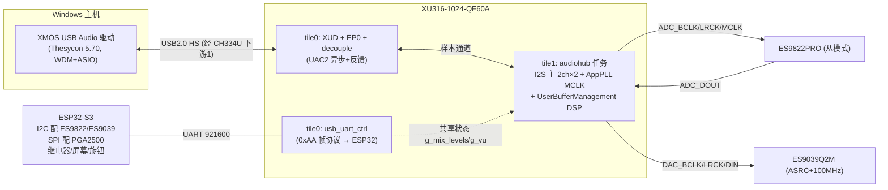
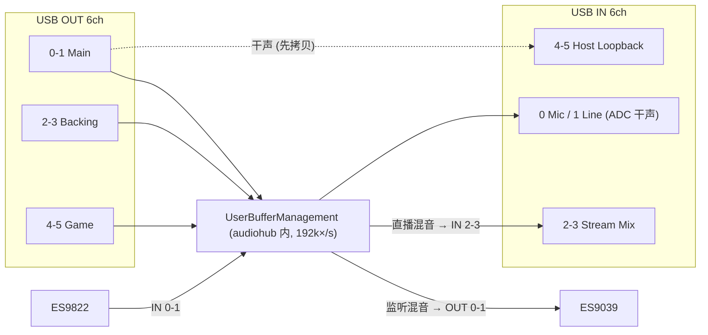
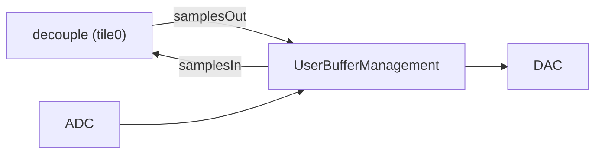

# ASIO-CARD 固件设计文档（XU316 · sw_usb_audio v9.2.0）

> 状态：**设计基线 v0.2**——框架源码级验证完成，阶段 1.5/3/4 代码初稿已落地（未编译，待 XTC 15.3.1）。
> 定制应用：`firmware/sw_usb_audio/app_usb_aud_asiocard`（分支 `asiocard-dev`）。
> 上游基线：官方 [xmos/sw_usb_audio](https://github.com/xmos/sw_usb_audio) v9.2.0（官方用 XTC Tools 15.3.1 构建测试）。
> 参考库（本地只读）：`tools/ref/lib_xua`、`lib_xud`、`lib_sw_pll`、`lib_board_support`、`lib_uart`。

---

## 1. 架构总览

**与官方 316-MC 应用的差异**（文件级）：

| 文件 | 官方行为 | 本设计 |
|---|---|---|
| `src/extensions/audiohw.xc` | 板级支持库：codec I2C 初始化（PCM5122/PCM1865/CS2100） | 无 I2C；仅开机 `sw_pll_fixed_clock()` 出初始 MCLK；记录采样率到共享状态 |
| `src/extensions/user_buffer_management.xc` | 仅 `USB_LOOPBACK` 调试实现（弱默认） | **Track A 全部 DSP**：监听混音/直播混音/宿主回环/限幅/VU |
| `src/extensions/usb_uart_ctrl.xc` | 不存在 | **新增**：ESP32 控制 UART 任务（协议 0xAA 帧 + CRC8 + VU/状态上报） |
| `src/extensions/asiocard_shared.h` | 不存在 | **新增**：跨任务共享状态 |
| `src/core/xua_conf.h` | I2S 8×8，MIXER=1 | I2S 2×2，USB 6×6，**MIXER=0**（Track A），评估 VID/PID |
| `src/core/asiocard.xn` | TQ128 + 4MB Flash | QF60A + W25Q16JV 2MB + 全端口占位 |
| `CMakeLists.txt` | 依赖 lib_board_support | 依赖 lib_uart 3.2.0（传递 lib_gpio/xassert/logging） |

---

## 2. 音频数据流（6进6出虚拟通道）

- **IN 0-1（Mic/Line 干声）**：ADC 样本由 audiohub 直接写入 `samplesIn`，本函数原样保留（VU 取点）。
- **IN 2-3（Stream Mix）**：5 源混音（电平 `g_mix_levels[5..9]`）回灌。
- **IN 4-5（Host Loopback）**：OUT 0-1（Main）干声拷贝——**在监听混音覆盖 OUT 0-1 之前取**（代码顺序保证）。
- **OUT 0-1 → DAC**：监听混音（电平 `g_mix_levels[0..4]`）覆盖 Main 后送 ES9039。
- **OUT 2-5（Backing/Game）**：仅作为混音源，不直接出声（虚拟通道架构）。
- 带宽：12ch×192k×32bit ≈ 74Mbps ≈ USB2.0 HS 的 15%，无需 HiBW 配置。

### 2.1 实现路线（Track A，已按框架源码验证）

**验证过的框架事实**（依据 `tools/ref/lib_xua` 源码，v9.2.0 依赖 lib_xua 5.2.0）：

| # | 事实 | 出处 |
|---|---|---|
| 1 | `MIXER=0` 时 `AUDIO_CHANNEL = c_aud_in`：decouple **直连** audiohub，`UserBufferManagement` 是 USB↔I2S 唯一处理点 | main.xc:347-352 |
| 2 | 调用顺序：收到 samplesOut → `UserBufferManagement(samplesOut, samplesIn)` → samplesIn 送出；**两个方向都可改写** | xua_audiohub_st.h:59 |
| 3 | ADC 样本由 audiohub 直接写入 `samplesIn[buffIndex][chanIndex]` | xua_audiohub.xc:352 |
| 4 | `XUA_USE_SW_PLL` 在 XS3 默认 1：采样率切换时 lib_xua 自动 `sw_pll_fixed_clock(mClk)` | xua_conf_default.h:390, xua_audiohub.xc:926 |
| 5 | 依赖的 lib_sw_pll 为 **1 参版本**（`sw_pll_fixed_clock(freq)`）；develop 分支已是 2 参，勿混用 | xua_audiohub.xc:927 |
| 6 | `PORT_MCLK_COUNT` 在异步模式**必须存在**（`xassert(!isnull(p_off_mclk))`），仅用 `getts` 取时间戳 → **1-bit 端口即可**（官方 316-MC 用 16-bit 是历史原因） | ep_buffer.xc:266,563-611 |
| 7 | 双 tile 布局（XUD tile0 ≠ audio tile1）→ `SECOND_MCLK_REQUIRED=1` → **`PORT_MCLK_IN_USB` 必须存在**，且该引脚物理上要接 MCLK 网络（`set_clock_src(clk_audio_mclk_usb, p_mclk_in_usb)`） | xua_conf_default.h:1930, main.xc:563 |
| 8 | `PORT_PLL_REF`/`PORT_MCLK_COUNT_2` 仅在 SPDIF-RX/ADAT-RX/SYNC 模式需要 → 本设计**不需要** | main.xc:150-158 |
| 9 | `UserBufferManagement` 有弱默认实现，app 无条件定义即覆盖；另有 `UserBufferManagementInit(sampFreq)` 初始化钩子 | xua_buffman_default.c, xua_audiohub.xc:254 |
| 10 | UART 侧 gpio glue：RX 必须用 **`input_gpio_1bit_with_events`**（`input_gpio` 无事件版会被 uart_rx 的事件调用 trap）；TX 用 `output_gpio`。已按官方 app_uart_demo 核对 | lib_gpio 2.2.0 gpio.h, lib_uart examples |
| 11 | 框架默认值（与硬件匹配，无需改）：`XUA_PCM_FORMAT=I2S`、`XUA_I2S_N_BITS=32`（ES9822/ES9039 均支持 32-bit I2S）、`I2S_CHANS_PER_FRAME=2`、`CODEC_MASTER=0`（I2S 主）、`XUA_DFU_EN=1`（DFU 默认开启）、`XUA_QUAD_SPI_FLASH=1`（匹配 W25Q16JV 四线） | xua_conf_default.h |
| 12 | **通道语义命名限制**：v9 描述符字符串表共享同一字符串（`XUA_PRODUCT_A2_DEFAULT_STRING = PRODUCT_STR_A2`，xua_endpoint0.c 注明不可分设）→ 开发期设备名统一为 "ASIO-CARD (UAC2.0)"，各立体声对由 Windows 自动加 "(2- ...)" 后缀区分；语义化命名（Main Monitor/Backing/…）两条路：① 量产定制 Thesycon 驱动侧命名（推荐，本来就要买）；② fork `xua_ep0_descriptors.h` 字符串表为每对 alt-setting 分设字符串（自研替代） | xua_ep0_descriptors.h:35,360-363, xua_endpoint0.c:338 |
| 13 | **QF60A 端口资源图（实测确认）**：tile0 可用 1-bit = 1A/1B/1C/1L/1M/1N/1O/1P（1E..1K 未引出）；**tile1 仅 7 个 1-bit = 1A/1B/1C/1D/1F/1G/1K**（全被 I2S/MCLK/调试串口占用，无剩余）；另有 4B/4F/8D/16B（tile0）、4D=XL0 链接（tile1） | xmap 警告 + 官方 QF60A datasheet 信号表 |
| 14 | **xSYS2（非老 xSYS）**：1.27mm 2×5/2×10、1.8V 电平（VREF 接 VDDIOB18）、仅 XTAG4；完整接法已写入 docs/schematic/02 §2.2 | 官方 QF60A datasheet（JTAG, xSCOPE and Debugging 章节） |
| 15 | 调试控制台已实现：tile1 独立任务对（`dbg_console_tx`/`dbg_logic`，经 unsafe 指针直读跨 tile 共享状态），上电横幅 + 1Hz 状态行 → CH343P-B COM 口；横幅与 VID/PID 已从 .xe 二进制核验 | 本轮实测 |
| 16 | **xsim 冒烟测试**（无硬件最深层验证）：`xsim --max-cycles 2000000 --trace-to` 运行 .xe → 处理器跟踪证实 tile0/tile1 双核启动、`dbg_logic`(262 次)/`dbg_puts`(821 次)/`ctrl_logic`(8926 次)/`UserBufferManagement`(630 次)/`AudioHwInit`(6 次)/`XUD_Main`/`XUA_AudioHub` 全部执行；唯一退出 = 周期上限（预期）。`send_vu` 0 次属正常（33ms 周期 > 3.3ms 仿真时长） | 第 6 轮实测 |

**Track B（备选，二期）**：`MIXER=1` + `MAX_MIX_COUNT=6`，用框架混音器 + `samples_to_host_map`（IN3-4 ← 混音输出）。代价：UART 无法直接写框架混音系数（`c_mix_ctl` 由 Endpoint0 独占，main.xc:441/617），需 main.xc 级改造；且混音控制走 Thesycon 面板而非 ESP32。Track A 更贴合"ESP32 集中控制"的硬件决策（D2）。

---

## 3. 时钟方案（与硬件 D7 一致）

| 项 | 值 | 固件位置 |
|---|---|---|
| 系统时钟 | 24MHz 晶振 → 600MHz | XN `Oscillator="24MHz" SystemFrequency="600MHz"` |
| MCLK 输出 | `PORT_MCLK_IN`（tile1）→ ES9822 | AppPLL；开机 `AudioHwInit`，切换由 lib_xua 自动（事实 #4） |
| MCLK 频率 | 512fs：24.576 / 22.5792 MHz | `xua_conf.h` `MCLK_48/MCLK_441`（官方默认） |
| MCLK 反馈 | 同一 MCLK 网络另接 tile0 引脚（`PORT_MCLK_IN_USB`）+ 计数端口 `PORT_MCLK_COUNT` | 事实 #6/#7，**硬件接线要求见 docs/schematic/02 §2.2** |
| ES9039 | 100MHz 晶振 + ASRC，无需 MCLK | 固件无操作（ESP32 管寄存器） |

---

## 4. UART 控制协议实现（阶段 4 代码已落地）

实现：`src/extensions/usb_uart_ctrl.xc`（任务 `usb_uart_ctrl`，经 `xua_conf_tasks.h` 注入 tile0）。

- **传输层**：lib_uart 3.2.0 的 `uart_rx`/`uart_tx_buffered` + lib_gpio glue，921600-8N1；全部 combinable，不额外占核。
- **帧**：`0xAA|CMD|LEN|PAYLOAD|CRC8(0x07, MSB-first, init 0x00, 含 CMD..PAYLOAD)|0x55`；接收状态机 6 态，CRC 错或帧尾错即重同步（帧尾字节若为 0xAA 直接视为新帧头）。
- **收**：0x01 混音矩阵（10 电平+阈值+使能）→ `g_mix_levels/g_limiter_*`；0x02 → 回 0x12（USB 状态/采样率族/速率/固件版本）；0x03 恢复默认；0x04 预设（直通/直播标准/纯监听 3 组电平表）。
- **发**：0x11 VU 每 33ms（30Hz）：DSP 侧累积峰值 → 本任务换算 dBFS×100（整数 log2 近似）并清零；0x12 状态回包（**速率字段为 Hz/100 编码**，2B 装不下 192000——已修并同步 docs 05-control §5.4 与 `scripts/esp32_protocol_ref.py`）；0x13 事件预留（`UserAudioStreamState` 钩子 + XUD 断连回调，阶段 4 联调时接）。
- **共享状态**：`asiocard_shared.h`，单字原子读写；电平参数慢速写/DSP 读，VU DSP 写/慢速读清零——无锁、无临界区。
- ⚠️ **联调前必核对**（与 ESP32 侧）：CRC 初值/字节序、预设电平表、VU 刻度、事件触发点。

---

## 5. DSP（`user_buffer_management.xc`）

| 模块 | 实现 | 说明 |
|---|---|---|
| 5 源混音 ×2 总线 | `mix_5()`：Q8 电平 × 样本，int64 累加 → 钳位 | 每帧 20 MAC，192k 下 ≈ 0.6% 核 |
| 限幅器 | `soft_limit()`：Q31 4:1 软拐点 + 阈值表 0~6dB | 默认 -3dBFS；阶段 5 可换 lib_dsp limiter（软拐点+前瞻） |
| 宿主回环 | `in[4..5] = out[0..1]` | 干声，先于监听混音覆盖 |
| VU | `vu_peak()`：帧峰值累积，clip 近满幅置位 | 上报周期 33ms |

资源占用：全部在 audiohub 核（tile1）内联执行，约 40~60 指令/帧 × 192k ≈ 2~3% 核负载，无跨核样本拷贝。

---

## 6. 资源预算（XU316-1024：2 tile × 8 核）

| 任务 | tile | 核 | 备注 |
|---|---|---|---|
| XUD + Endpoint0 + decouple | 0 | 3 | 官方同款 |
| usb_uart_ctrl（uart_rx/tx/gpio/ctrl_logic combinable 合并） | 0 | 1-2 | lib_uart combinable |
| audiohub（I2S + PLL + Track A DSP） | 1 | 1 | DSP 内联 ~3% |
| **合计** | | **5-6/16** | 余量 >60%；若编译报 tile0 核数超限（XUD+EP0+decouple 已占 3 核），预案：把 `usb_uart_ctrl` 移到 tile1，或将 gpio/uart/ctrl 显式 [[combine]] |

---

## 7. 阶段计划与验证点

| 阶段 | 内容 | 验证标准 | 状态 |
|---|---|---|---|
| 0 | 环境 + 上游基线 + 设计文档 | — | ✅ |
| 1 | 官方 `2AMi8o8xxxxxx` 构建 + 烧录 + Windows 出声（可用 XK-AUDIO-316-MC 板或自板最小系统） | UAC2 枚举、ASIO 出声 | 🟡 编译 ✅（XTC 15.3.1，约束检查全过）；烧录/出声待 XTAG4 |
| 1.5 | `app_usb_aud_asiocard` 首次编译 | 编译通过（XN 端口/去 I2C/新任务全绿） | ✅ **三个配置全部编译通过**（基础/mix6/usblb，tile 约束 PASS）；**xsim 冒烟测试通过**（2M 周期无崩溃：双 tile 启动、调试串口横幅已发出、ctrl_logic/UserBufferManagement/XUD/AudioHwInit 全部执行——固件启动级验证） |
| 2 | XN 引脚回填（原理图 S3 定稿）+ W25Q16JV 实测烧录 | 自板出声、48/192k 切换 | ⏳ 阻塞：原理图+板子+XTAG4 |
| 3 | Track A DSP 联调（混音/双回环/限幅） | OBS 采 Stream Mix 得全混合流；DAW 采 Mic 得干声 | 代码初稿 ✅（联调待硬件） |
| 4 | UART 协议联调（电平/VU/预设/事件） | ESP32 联调全通 | 代码初稿 ✅（联调待硬件） |
| 5 | 通道命名（见事实 #12：开发期共享产品名+Windows 后缀；语义名走定制驱动）、lib_dsp 限幅升级、DFU 升级镜像（XUA_DFU_EN 默认已开）、稳定性 | 硬件 6.5 验证清单全绿 | 未开始 |

---

## 8. 待办清单（阻塞项与依赖）

| # | 事项 | 依赖 |
|---|---|---|
| 1 | ~~注册 xmos.com → 装 XTC Tools 15.3.1 + USB Audio 驱动~~ **XTC 已装 ✅（驱动下载待用户登录）** | 用户 |
| 2 | 购买 XTAG4（XU316 不支持 XTAG3）；用户计划硬件完成后购买——**注意：第一块板回来就需要它烧首版固件** | 用户 |
| 3 | **原理图新增接线**：ADC_MCLK 网络同时连 tile0（`PORT_MCLK_IN_USB`=1P）与 tile1（`PORT_MCLK_IN`=1D）各一个引脚；其余端口→引脚映射按 QF60A datasheet 端口表回填（XN 端口编号已按官方 QF60A XN 校验） | 用户画图 |
| 4 | ~~首次编译核对~~ **完成**：Package `XS3-UnA-1024-QF60A` ✅（工具内置目标确认）、lib_uart 3.2.0 兼容 ✅、端口全部换为 QF60A 有效端口 ✅ | — |
| 5 | W25Q16JVSNIQ xflash 支持实测（QE 位/规格） | #2+板子 |
| 6 | UART 协议与 ESP32 侧对齐（CRC 初值/预设表/VU 刻度） | #2+硬件 |

### 8.1 首编译修复记录（XTC 15.3.1 实测）

| 问题 | 修复 |
|---|---|
| xC 关键字冲突：`in`/`out` 不能作变量名 | 指针改名 `inp`/`outp` |
| xC 无 `clz` 内建 | 手写 `clz32()` |
| 跨任务共享全局违反 xC 并行使用规则（变量级 `volatile` 非法） | 官方 mixer.xc 模式：普通全局 + `unsafe volatile` 指针 + `unsafe{}` 访问 |
| tile0 逻辑核 9/8、定时器 11/10 超限 | UART 改 lib_uart 流式 API（rx/tx/ctrl 固定 3 核，免 gpio/combine），tile0 实占 7/8 |
| 占位端口在 QF60A 不存在（1E/1G/1I/1P 等） | 按官方 QF60A XN（xk-voice-l71）重选端口；EVK 是 FB265 封装不能照抄 |
| cmake 找不到 ninja（PATH 旧环境） | build.ps1 显式传 `-DCMAKE_MAKE_PROGRAM` + SetEnv.bat 包装 |

---

## 9. 许可与合规（提醒）

- 源码：XMOS Public Licence v1，开发免费。
- **量产前必须**：向 XMOS（或其 VAR）购买 USB Audio 商用授权与 PID；向 Thesycon 购买定制驱动（自有 VID/PID 签名、通道命名）。评估驱动（0x20B1/0x0016）仅限开发。
- ASIO 由 Thesycon 驱动提供；固件侧保持标准 UAC2。不要用 ASIO4ALL（官方已知问题 #120）。

---

## 10. 参考文件索引

- 定制应用：`firmware/sw_usb_audio/app_usb_aud_asiocard/`（CMakeLists.txt / src/core/xua_conf.h / asiocard.xn / xua_conf_tasks.h / xua_conf_globals.h / src/extensions/audiohw.xc / user_buffer_management.xc / usb_uart_ctrl.xc / asiocard_shared.h）
- 上游对照：`app_usb_aud_xk_316_mc`（未改动）、`app_usb_aud_xk_evk_xu316`（QF60A 内置目标参照）
- 框架源码（验证依据）：`tools/ref/lib_xua`（main.xc / audiohub / ep_buffer / mixer / endpoint0）、`tools/ref/lib_xud`、`tools/ref/lib_sw_pll`、`tools/ref/lib_uart`、`tools/ref/lib_gpio`
- 环境与操作：`firmware/README.md`、`scripts/*`（含 `check-consistency.ps1` 静态一致性检查，12 项全绿）、`host/README.md`
